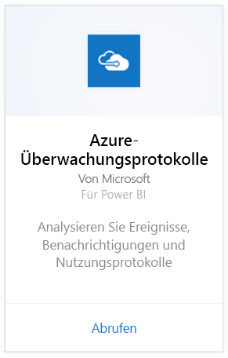
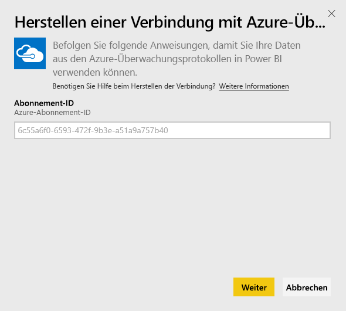
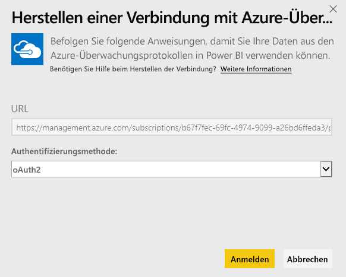
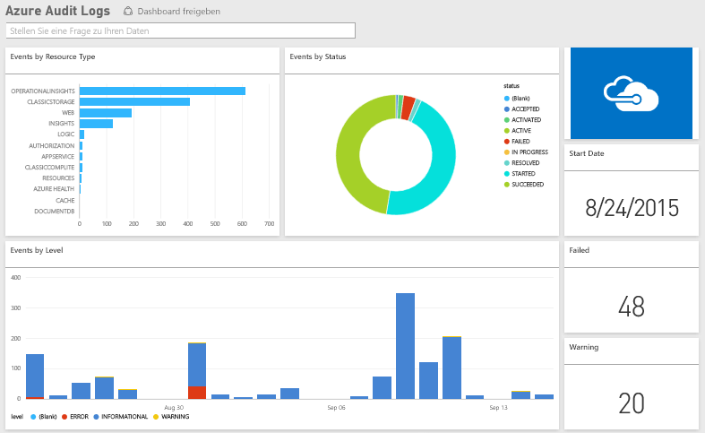

# Herstellen einer Verbindung mit Azure-Überwachungsprotokollen mithilfe von Power BI
Mit dem Azure-Überwachungsprotokoll-Inhaltspaket können Sie die in den Überwachungsprotokollen gespeicherten Informationen analysieren und visualisieren. Power BI ruft Ihre Daten ab und erstellt ein Standard-Dashboard sowie Berichte basierend auf diesen Daten.

Stellen Sie eine Verbindung mit dem [Azure-Überwachungsprotokoll-Inhaltspaket](https://app.powerbi.com/getdata/services/azure-audit-logs) her, oder informieren Sie sich über die [Integration von Azure-Überwachungsprotokollen](https://powerbi.microsoft.com/integrations/azure-audit-logs) in Power BI.

## Herstellen der Verbindung
1. Wählen Sie unten im linken Navigationsbereich **Daten abrufen** aus.  
   
    
2. Wählen Sie im Feld **Dienste** die Option **Abrufen**aus.  
   
     
3. Wählen Sie **Azure-Überwachungsprotokolle**  >  **Abrufen** aus.  
   
   
4. Wenn Sie dazu aufgefordert werden, geben Sie Ihre **Azure-Abonnement-ID**ein. Informationen zum Suchen Ihrer [Abonnement-ID](#FindingParams) finden Sie weiter unten.   
   
    
5. Wählen Sie als **Authentifizierungsmethode** die Option **oAuth2** \> **Anmelden** aus.
   
    
6. Geben Sie die Anmeldeinformationen für Ihr Konto ein, um den Anmeldevorgang abzuschließen.
   
    
7. Power BI ruft Ihre Azure-Überwachungsprotokolldaten ab und erstellt für Sie ein gebrauchsfertiges Dashboard und einen Bericht. 
   
    

**Was nun?**

* Versuchen Sie, am oberen Rand des Dashboards [im Q&A-Feld eine Frage zu stellen](power-bi-q-and-a.md).
* [Ändern Sie die Kacheln](service-dashboard-edit-tile.md) im Dashboard.
* [Wählen Sie eine Kachel aus](service-dashboard-tiles.md), um den zugrunde liegenden Bericht zu öffnen.
* Ihr Dataset ist auf eine tägliche Aktualisierung festgelegt. Sie können jedoch das Aktualisierungsintervall ändern oder es über **Jetzt aktualisieren** nach Bedarf aktualisieren.

## Systemanforderungen
Das Azure-Überwachungsprotokolle-Inhaltspaket erfordert Zugriff auf Überwachungsprotokolle im Azure-Portal. Weitere Informationen finden Sie [hier](https://azure.microsoft.com/documentation/articles/insights-debugging-with-events/).

## Suchen von Parametern
Es gibt zwei einfache Möglichkeiten, Ihre Abonnement-ID zu suchen.

1. Über https://portal.azure.com -&gt; Durchsuchen &gt; Abonnements &gt; Abonnement-ID
2. Über https://manage.windowsazure.com -&gt; Einstellungen &gt; Abonnement-ID

Ihre Abonnement-ID besteht aus einer langen Abfolge von Zahlen und Zeichen, ähnlich wie in dem Beispiel in Schritt 4 oben. 

## Problembehandlung
Wenn ein Fehler aufgrund der Anmeldeinformationen oder beim Versuch der Aktualisierung aufgrund ungültiger Anmeldeinformationen angezeigt wird, löschen Sie alle Instanzen der Azure-Überwachungsprotokolle, und stellen Sie die Verbindung erneut her.

## Nächste Schritte
[Erste Schritte mit Power BI](service-get-started.md)  
[Power BI – Grundkonzepte](service-basic-concepts.md)  

