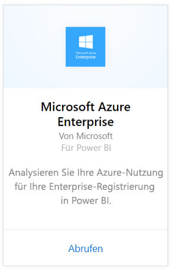
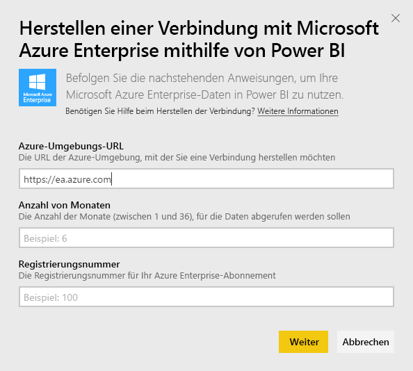
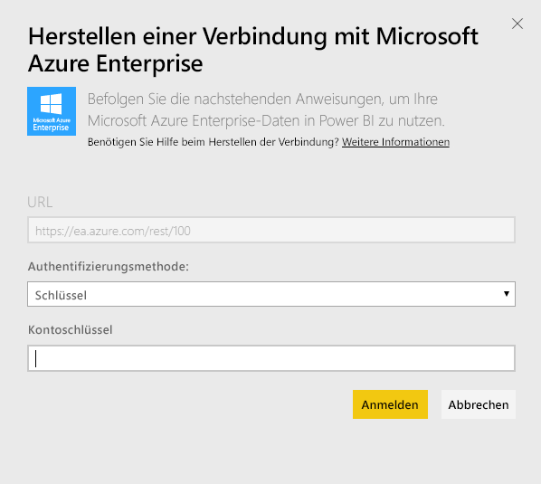
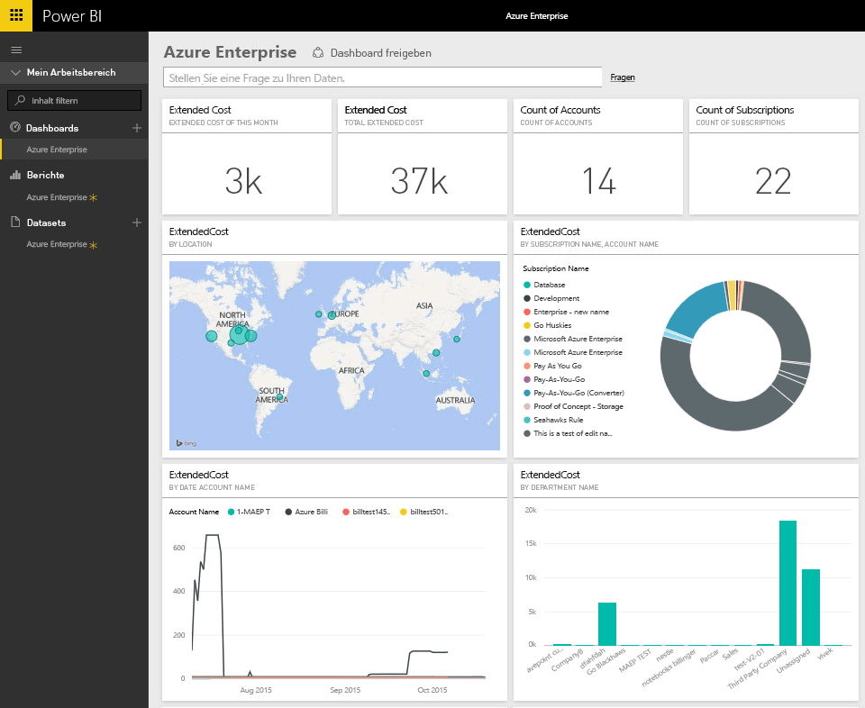
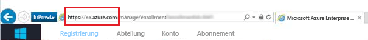
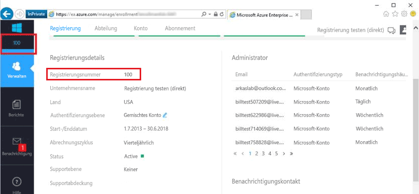
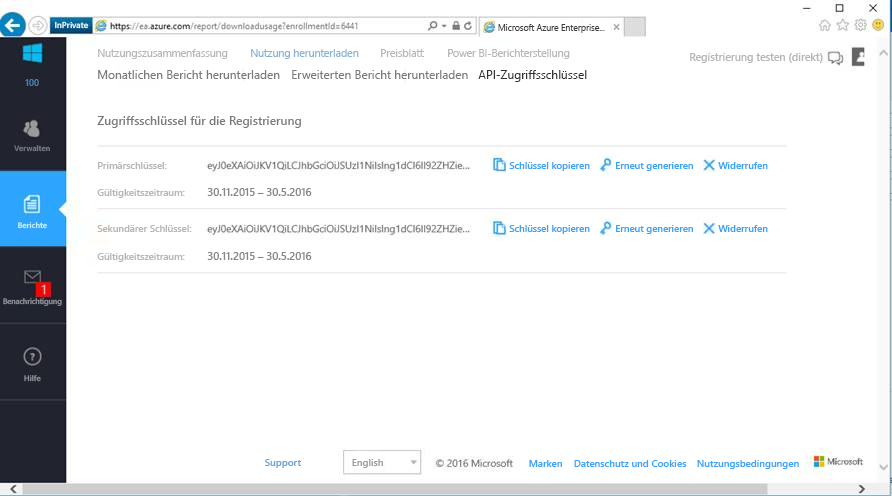

# Herstellen einer Verbindung mit Microsoft Azure Enterprise mithilfe von Power BI
Untersuchen und überwachen Sie Ihre Microsoft Azure Enterprise-Daten in Power BI mit dem Power BI-Inhaltspaket. Die Daten werden automatisch einmal täglich aktualisiert.

Stellen Sie eine Verbindung mit dem [Microsoft Azure Enterprise-Inhaltspaket](https://app.powerbi.com/getdata/services/azure-enterprise) für Power BI her.

## Herstellen der Verbindung
1. Wählen Sie unten im linken Navigationsbereich **Daten abrufen** aus.
   
    
2. Wählen Sie im Feld **Dienste** die Option **Abrufen**aus.
   
   
3. Wählen Sie **Microsoft Azure Enterprise** \> **Abrufen** aus.
   
   
4. Geben Sie die Azure-Umgebungs-URL, die Anzahl der Monate, für die Sie Daten importieren möchten, und Ihre Azure Enterprise-Registrierungsnummer ein. Ihre Azure-Umgebungs-URL lautet `https://ea.azure.com` oder `https://ea.windowsazure.cn`. Nachstehend finden Sie weitere Informationen zum [Suchen dieser Parameter](#FindingParams).
   
    
5. Geben Sie zum Herstellen der Verbindung Ihren Zugriffsschlüssel ein. Den Schlüssel für Ihre Registrierung finden Sie in Ihrem Azure EA-Portal.
   
    
6. Der Importvorgang startet automatisch. Nach Abschluss des Vorgangs werden im Navigationsbereich ein neues Dashboard, ein Bericht und ein Modell angezeigt. Wählen Sie das Dashboard aus, um die importierten Daten anzuzeigen.
   
   

**Was nun?**

* Versuchen Sie, am oberen Rand des Dashboards [im Q&A-Feld eine Frage zu stellen](consumer/end-user-q-and-a.md).
* [Ändern Sie die Kacheln](service-dashboard-edit-tile.md) im Dashboard.
* [Wählen Sie eine Kachel aus](consumer/end-user-tiles.md), um den zugrunde liegenden Bericht zu öffnen.
* Zwar ist Ihr Dataset auf tägliche Aktualisierung festgelegt, jedoch können Sie das Aktualisierungsintervall ändern oder über **Jetzt aktualisieren** nach Bedarf aktualisieren.

## Inhalt
Der Azure Enterprise-Inhaltspaket enthält monatliche Berichtsdaten für den Bereich der Monate, den Sie während des Verbindungsflows angeben. Der Bereich ist ein bewegliches Fenster, sodass die enthaltenen Datumgangaben bei Aktualisierung des Datasets aktualisiert werden.

## Systemanforderungen
Das Inhaltspaket erfordert Zugriff auf die Enterprise-Features im Azure-Portal.

## Suchen von Parametern
Die Power BI-Berichterstellung steht für direkte EA, Partner und indirekte Kunden zur Verfügung, die Abrechnungsinformationen anzeigen können. Im folgenden Abschnitt finden Sie Informationen dazu, wie Sie die zum Herstellen der Verbindung erforderlichen Werte ermitteln können.

**Azure-Umgebungs-URL**

* Dieser Wert lautet i. d. R. https://ea.azure.com. Sie können die URL jedoch bei der Anmeldung zur Bestätigung überprüfen.
  
    

**Anzahl Monate**

* Dies sollte eine Zahl zwischen 1 und 36 sein, die die Anzahl der Monate (ab heute) darstellt, für die Sie Daten importieren möchten.

**Registrierungsnummer**

* Dies ist Ihre Azure Enterprise-Registrierungsnummer, die sich auf dem Startbildschirm des [Azure Enterprise-Portals](https://ea.azure.com/) unter „Registrierungsdetails“ befindet.
  
    

**Zugriffsschlüssel**

* Ihren Schlüssel finden Sie im Azure Enterprise Portal unter „Nutzung herunterladen“ > „API-Zugriffsschlüssel“.
  
    

**Zusätzliche Hilfe**

* Um zusätzliche Hilfe zum Einrichten des Azure Enterprise Power BI-Pakets zu erhalten, melden Sie sich am Azure Enterprise-Portal an, um unter „Hilfe“ die API-Hilfedatei sowie weitere Anweisungen unter „Berichte -> Nutzung herunterladen -> API-Zugriffsschlüssel“ anzuzeigen.

## Nächste Schritte
[Erste Schritte mit Power BI](service-get-started.md)

[Abrufen von Daten in Power BI](service-get-data.md)

