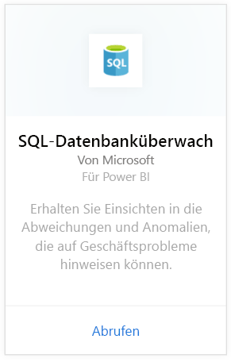
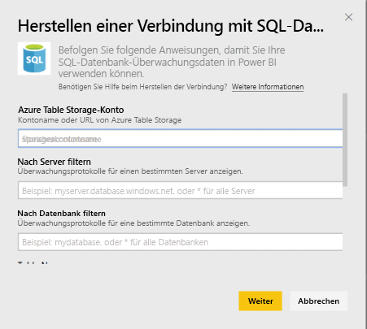
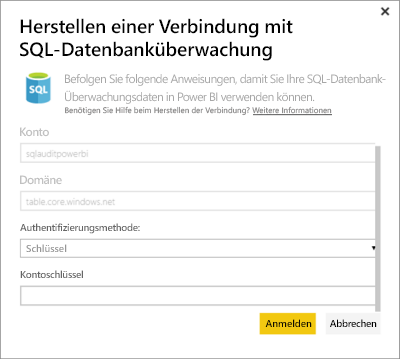
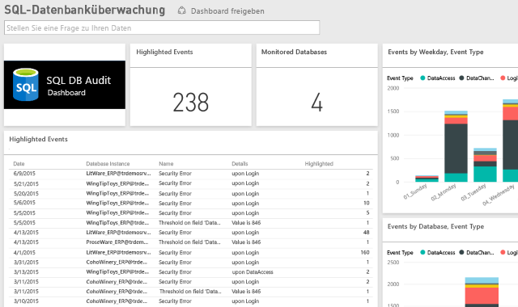

# Inhaltspaket für Power BI für die SQL-Datenbanküberwachung
Dieses Power BI-Inhaltspaket für die Azure [SQL-Datenbanküberwachung](http://azure.microsoft.com/documentation/articles/sql-database-auditing-get-started/) kann Sie beim Verstehen der Datenbankaktivität und dem Gewinnen von Einsichten in Abweichungen und Anomalien unterstützen, die auf Geschäftsprobleme oder vermutete Sicherheitsverletzungen hinweisen können. 

Stellen Sie eine Verbindung mit dem [Inhaltspaket für die SQL-Datenbanküberwachung](https://app.powerbi.com/getdata/services/sql-db-auditing) für Power BI her.

>[!NOTE]
>Das Inhaltspaket importiert Daten aus allen Tabellen, die „AuditLogs“ in deren Namen enthalten, und fügt diese an eine Datenmodelltabelle namens „AuditLogs“ an. Die letzten 250 KB an Ereignissen werden einbezogen, und die Daten werden täglich aktualisiert.

## Herstellen der Verbindung
1. Wählen Sie unten im linken Navigationsbereich **Daten abrufen** aus.
   
    
2. Wählen Sie im Feld "Dienste" die Option "Abrufen" aus.
   
    
3. Wählen Sie **SQL-Datenbanküberwachung** \> **Abrufen** aus.
   
   
4. Führen Sie im Fenster „Mit der SQL-Datenbanküberwachung verbinden“ die folgenden Aktionen aus:
   
   - Geben Sie den Kontonamen für den Azure-Tabellenspeicher oder die URL ein, in dem bzw. unter der die Protokolle gespeichert sind.
   
   - Geben Sie den Namen des SQL Servers ein, der Sie interessiert. Geben Sie „\*“ ein, um Überwachungsprotokolle für alle Server zu laden.
   
   - Geben Sie den Namen der gewünschten SQL-Datenbank ein. Geben Sie „\*“ ein, um Überwachungsprotokolle für alle Datenbanken zu laden.
   
   - Geben Sie den Namen der Azure-Tabelle ein, die die gewünschten Protokolle enthält. Geben Sie „\*“ ein, um Überwachungsprotokolle aus allen Tabellen zu laden, deren Name „AuditLogs“ enthält.
   
   >[!IMPORTANT]
   >Aus Leistungsgründen empfiehlt es sich, immer einen expliziten Tabellennamen anzugeben, selbst wenn alle Überwachungsprotokolle in einer einzelnen Tabelle gespeichert sind.
   
   - Geben Sie das Startdatum der gewünschten Überwachungsprotokolle ein. Geben Sie „\*“ ein, um Überwachungsprotokolle ohne untere Zeitgrenze zu laden, oder geben Sie „1d“ ein, um die Überwachungsprotokolle des letzten Tags zu laden.
   
   - Geben Sie das Enddatum für die Sie interessierenden Überwachungsprotokolle ein. Geben Sie „\*“ ein, um Überwachungsprotokolle ohne obere Zeitgrenze zu laden.
   
   
5. Wählen Sie als Authentifizierungsmethode **Schlüssel** aus, geben Sie Ihren **Kontoschlüssel** ein, und wählen Sie anschließend **Anmelden** ein.
   
   
6. Nachdem die Daten von Power BI importiert wurden, werden im linken Navigationsbereich ein neues Dashboard, ein Bericht und ein Dataset angezeigt. Neue Elemente werden mit einem gelben Sternchen \* markiert.
   
   

**Was nun?**

* Versuchen Sie, am oberen Rand des Dashboards [im Q&A-Feld eine Frage zu stellen](power-bi-q-and-a.md).
* [Ändern Sie die Kacheln](service-dashboard-edit-tile.md) im Dashboard.
* [Wählen Sie eine Kachel aus](service-dashboard-tiles.md), um den zugrunde liegenden Bericht zu öffnen.
* Ihr Dataset ist auf eine tägliche Aktualisierung festgelegt. Sie können jedoch das Aktualisierungsintervall ändern oder es über **Jetzt aktualisieren** nach Bedarf aktualisieren.

## Nächste Schritte
[Abrufen von Daten für Power BI](service-get-data.md)
[Erste Schritte mit Power BI](service-get-started.md)