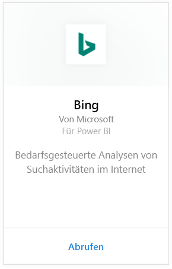
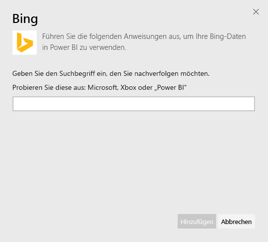
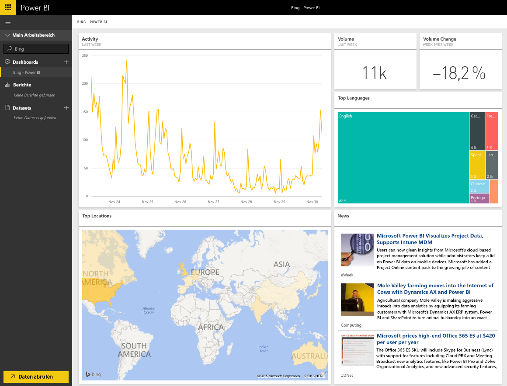

# Herstellen einer Verbindung mit Bing mithilfe von Power BI
Mit dem Bing-Inhaltspaket erhalten Sie die Möglichkeit, sich Analytics über Suchvorgänge im Internet nach einem Begriff Ihrer Wahl anzeigen zu lassen.

Stellen Sie eine Verbindung zum [Bing-Inhaltspaket](https://app.powerbi.com/groups/me/getdata/services/bing) für Power BI her.

>[!NOTE]
>Bing-Kacheln werden ca. alle 5 Minuten automatisch aktualisiert, und die einzige Kachel, die ausgewählt werden kann, ist die News-Kachel, über die Sie zu dem entsprechenden Nachrichtenartikel gelangen. 

>[!NOTE]
>Kacheln aus dem Bing-Inhaltspaket werden in den mobilen Anwendungen derzeit nicht gerendert. Wir arbeiten daran, dieses Problem zu beheben.

1. Wählen Sie unten im linken Navigationsbereich **Daten abrufen** aus.
   
    
2. Wählen Sie im Feld **Dienste** die Option **Abrufen**aus.
   
    
3. Wählen Sie **Bing** > **Abrufen** aus.
   
    
4. Geben Sie den Suchbegriff ein, den Sie verfolgen möchten, und klicken Sie auf „Hinzufügen“.
   
        
5. Auf der linken Seite sehen Sie einen neuen Eintrag in der Dashboardliste, mit dem Namen „Bing“ und dem eingegebenen Suchbegriff. Beachten Sie, dass diesem Dashboard kein Dataset oder Bericht zugeordnet ist. Das Laden der Kacheln kann etwas dauern – anschließend erscheint in etwa folgendes Layout:
   
    

Sobald der Ladevorgang abgeschlossen ist, können Sie mit dem Erkunden der Daten beginnen und Kacheln aus diesem Dashboard an andere Dashboards des Kontos anheften.

