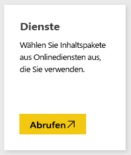
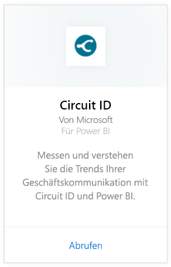
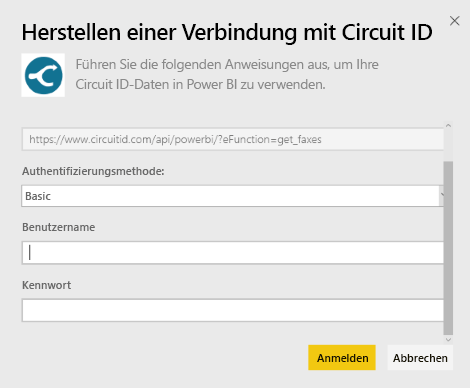
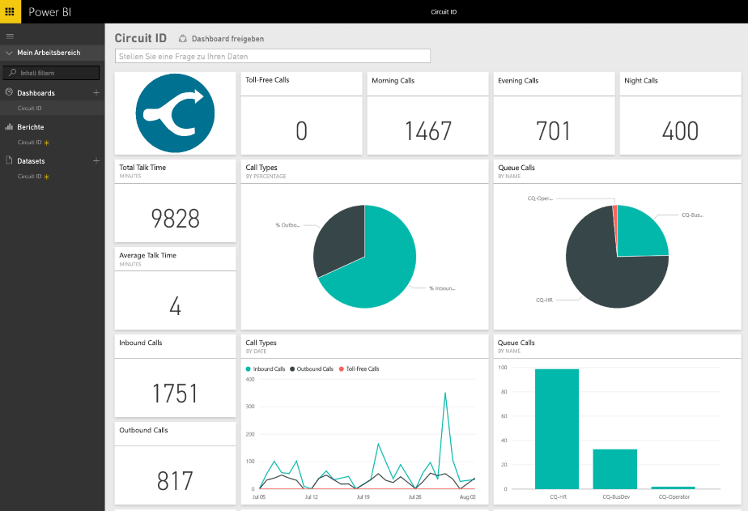

# Herstellen einer Verbindung mit Circuit ID mithilfe von Power BI
Das Analysieren Ihrer Kommunikationsdaten aus Circuit ID ist mit Power BI ganz einfach. Power BI ruft Ihre Daten ab und erstellt auf Basis dieser Daten ein Standarddashboard und zugehörige Berichte. Nachdem eine Verbindung besteht, können Sie Ihre Daten untersuchen und das Dashboard gemäß Ihren Anforderungen anpassen. Die Daten werden täglich automatisch aktualisiert.

Stellen Sie die Verbindung zum [Circuit ID-Inhaltspaket](https://app.powerbi.com/getdata/services/circuitid) für Power BI her.

## Herstellen der Verbindung
1. Wählen Sie unten im linken Navigationsbereich **Daten abrufen** aus.
   
    
2. Wählen Sie im Feld **Dienste** die Option **Abrufen**aus.
   
    
3. Wählen Sie **Circuit ID** \> **Abrufen** aus.
   
    
4. Wählen Sie als Authentifizierungsmethode „Standard“ aus, und geben Sie Ihren Benutzernamen und Ihr Kennwort ein. Klicken Sie dann auf „Anmelden“.
   
    
5. Nachdem die Daten von Power BI importiert wurden, werden im linken Navigationsbereich ein neues Dashboard, ein Bericht und ein Dataset angezeigt. Neue Elemente werden mit einem gelben Sternchen markiert.
   
    

**Was nun?**

* Versuchen Sie, am oberen Rand des Dashboards [im Q&A-Feld eine Frage zu stellen](consumer/end-user-q-and-a.md).
* [Ändern Sie die Kacheln](service-dashboard-edit-tile.md) im Dashboard.
* [Wählen Sie eine Kachel aus](consumer/end-user-tiles.md), um den zugrunde liegenden Bericht zu öffnen.
* Zwar ist Ihr Dataset auf tägliche Aktualisierung festgelegt, jedoch können Sie das Aktualisierungsintervall ändern oder über **Jetzt aktualisieren** nach Bedarf aktualisieren.

## Nächste Schritte
[Was ist Power BI?](power-bi-overview.md)

[Abrufen von Daten in Power BI](service-get-data.md)

