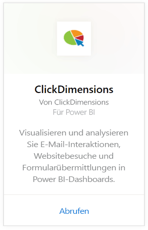
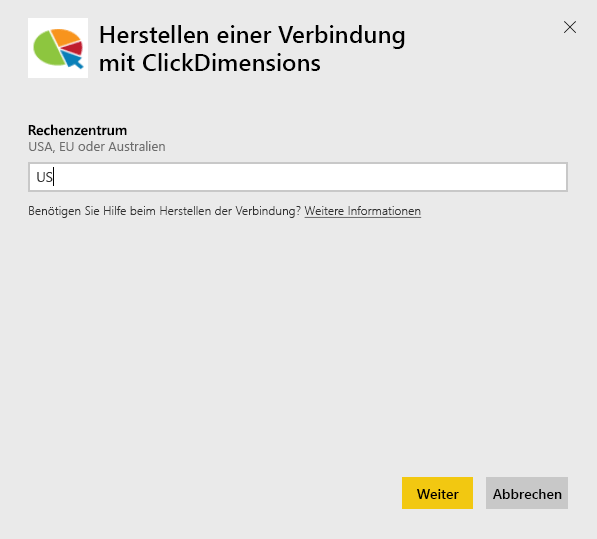
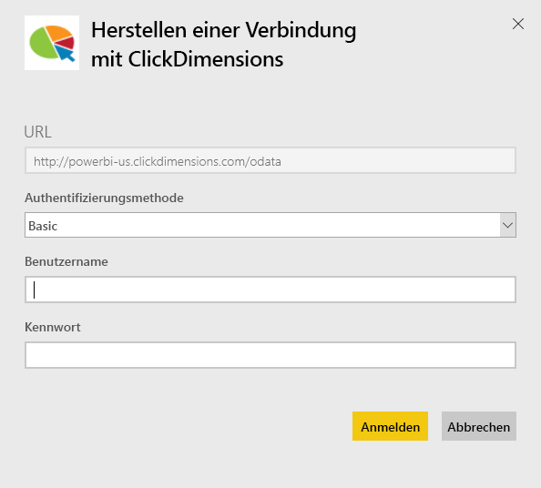
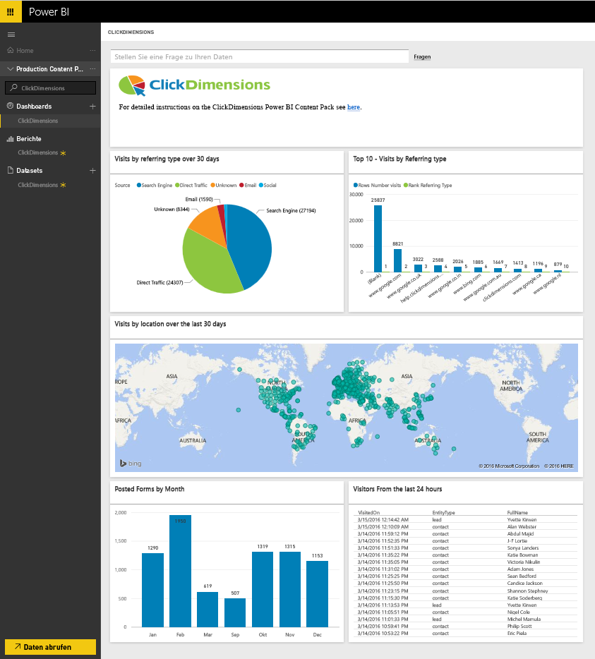
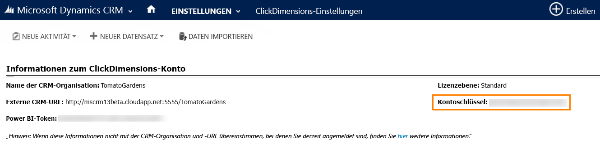
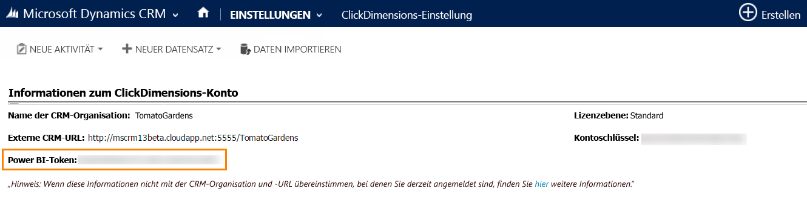

# Herstellen einer Verbindung mit ClickDimensions mithilfe von Power BI
Das ClickDimensions-Inhaltspaket für Power BI ermöglicht es Benutzern, ClickDimensions-Marketingdaten in Power BI zu verwenden. Dadurch erhalten Management-Teams bessere Einblicke in den Erfolg ihrer Vertriebs- und Marketingbemühungen. Visualisieren und analysieren Sie E-Mail-Interaktionen, Webseitenbesuche und Formularübermittlungen in Power BI-Dashboards und -Berichten.

Stellen Sie eine Verbindung mit dem [ClickDimensions-Inhaltspaket](https://app.powerbi.com/getdata/services/click-dimensions) für Power BI her.

## Herstellen der Verbindung
1. Wählen Sie unten im linken Navigationsbereich **Daten abrufen** aus.
   
   
2. Wählen Sie im Feld **Dienste** die Option **Abrufen**aus.
   
   
3. Wählen Sie **ClickDimensions** \> **Abrufen** aus.
   
   
4. Geben Sie den Ort Ihres Rechenzentrums an (USA, EU oder Australien), und wählen Sie **Weiter** aus.
   
   
5. Wählen Sie als **Authentifizierungsmethode** **Standard** \> **Anmelden** aus. Geben Sie Ihre ClickDimensions-Anmeldeinformationen ein, wenn Sie dazu aufgefordert werden. Nachstehend finden Sie weitere Informationen zum [Suchen dieser Parameter](#FindingParams).
   
    
6. Nach der Genehmigung wird der Importvorgang automatisch gestartet. Nach Abschluss des Vorgangs werden im Navigationsbereich ein neues Dashboard, ein Bericht und ein Modell angezeigt. Wählen Sie das Dashboard aus, um die importierten Daten anzuzeigen.
   
     

**Was nun?**

* Versuchen Sie, am oberen Rand des Dashboards [im Q&A-Feld eine Frage zu stellen](power-bi-q-and-a.md).
* [Ändern Sie die Kacheln](service-dashboard-edit-tile.md) im Dashboard.
* [Wählen Sie eine Kachel aus](service-dashboard-tiles.md), um den zugrunde liegenden Bericht zu öffnen.
* Ihr Dataset ist auf eine tägliche Aktualisierung festgelegt. Sie können jedoch das Aktualisierungsintervall ändern oder es über **Jetzt aktualisieren** nach Bedarf aktualisieren.

## Systemanforderungen
Zum Verbinden mit dem Power BI-Inhaltspaket müssen Sie das entsprechende Rechenzentrum für Ihr Konto bereitstellen und sich mit Ihrem ClickDimensions-Konto anmelden. Wenn Sie nicht sicher sind, welches Rechenzentrum Sie bereitstellen müssen, überprüfen Sie dies zusammen mit Ihrem Administrator.

## Suchen von Parametern
Der Kontoschlüssel befindet sich in den CRM-Einstellungen \> ClickDimensions-Einstellungen. Kopieren Sie den Kontoschlüssel aus den ClickDimensions-Einstellungen, und fügen Sie ihn in das Feld „Benutzername“ ein.  

  

Kopieren Sie das Power BI-Token aus den ClickDimensions-Einstellungen, und fügen Sie es in das Feld „Kennwort“ ein. Das Power BI-Token befindet sich in den CRM-Einstellungen \> ClickDimensions-Einstellungen.  

  

## Nächste Schritte
[Erste Schritte mit Power BI](service-get-started.md)

[Abrufen von Daten in Power BI](service-get-data.md)

