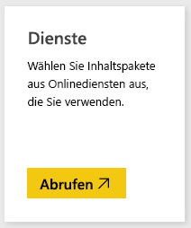
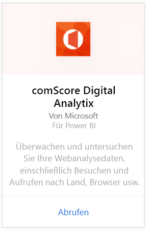
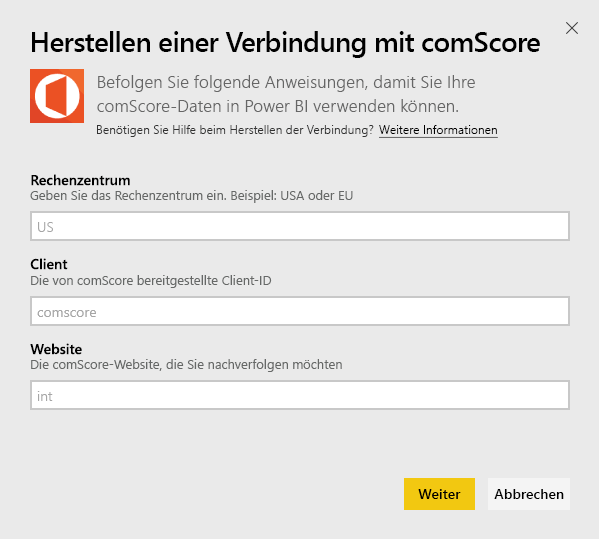
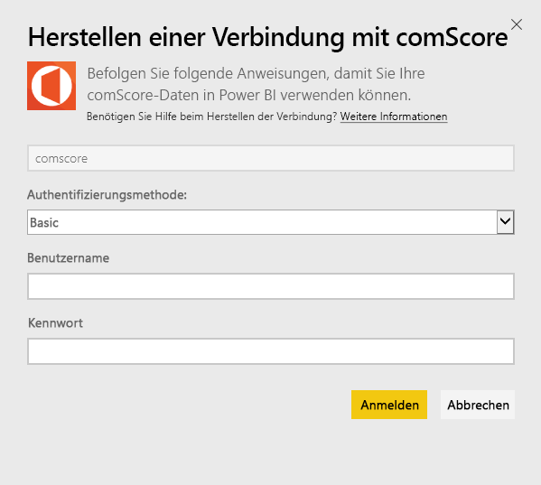
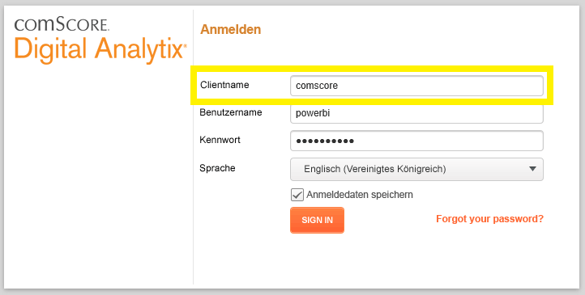
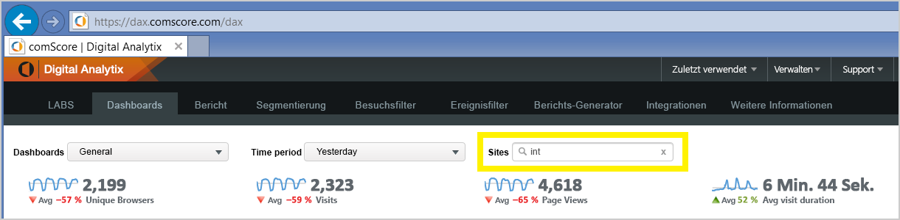

# Herstellen einer Verbindung mit comScore Digital Analytix mithilfe von Power BI
Visualisieren und durchsuchen Sie Ihre comScore Digital Analytix-Daten in Power BI mit dem Power BI-Inhaltspaket. Die Daten werden automatisch einmal täglich aktualisiert.

Stellen Sie eine Verbindung mit dem [comScore-Inhaltspaket](https://app.powerbi.com/getdata/services/comscore) für Power BI her.

>[!NOTE]
>Zum Herstellen einer Verbindung zum Inhaltspaket benötigen Sie ein comScore DAx-Benutzerkonto und Zugriff auf die comScore-API. Weitere [Details](#Requirements) finden Sie unten.

## Herstellen der Verbindung
1. Wählen Sie unten im linken Navigationsbereich „Daten abrufen“ aus.
   
   
2. Wählen Sie im Feld **Dienste** die Option **Abrufen**aus.
   
   
3. Wählen Sie **comScore Digital Analytix** \> **Abrufen** aus.
   
   
4. Geben Sie das Datacenter, die comScore-Client-ID und die Website an, mit denen Sie eine Verbindung herstellen möchten. Details dazu, wie Sie diese Werte finden, finden Sie unten unter [Ermitteln Ihrer comScore-Parameter](#FindingParams).
   
   
5. Geben Sie Ihren comScore-Benutzernamen und das Kennwort ein, um die Verbindung herzustellen. Einzelheiten zum Ermitteln dieses Werts finden Sie unten.
   
   
6. Der Importvorgang startet automatisch. Nach Abschluss des Vorgangs werden im Navigationsbereich ein neues Dashboard, ein Bericht und ein Modell angezeigt. Wählen Sie das Dashboard aus, um die importierten Daten anzuzeigen.

**Was nun?**

* Versuchen Sie, am oberen Rand des Dashboards [im Q&A-Feld eine Frage zu stellen](consumer/end-user-q-and-a.md).
* [Ändern Sie die Kacheln](service-dashboard-edit-tile.md) im Dashboard.
* [Wählen Sie eine Kachel aus](consumer/end-user-tiles.md), um den zugrunde liegenden Bericht zu öffnen.
* Zwar ist Ihr Dataset auf tägliche Aktualisierung festgelegt, jedoch können Sie das Aktualisierungsintervall ändern oder über **Jetzt aktualisieren** nach Bedarf aktualisieren.

## Systemanforderungen
Ein comScore DAx-Benutzerkonto und Zugriff auf die comScore DAx-API sind für das Herstellen der Verbindung erforderlich. Wenden Sie sich an Ihren comScore DAx-Administrator, um Ihr Konto zu bestätigen.

## Suchen von Parametern
Details zum Ermitteln Ihrer einzelnen comScore-Parameter finden Sie unten.

**Rechenzentrum**

Das Rechenzentrum, mit dem Sie eine Verbindung herstellen, wird durch die URL bestimmt, zu der Sie in comScore navigieren.

Wenn Sie https://dax.comscore.com, verwenden, geben Sie „US“ ein, wenn Sie https://dax.comscore.eu verwenden, geben Sie „EU“ ein.

 

**Client**

Der Client ist der gleiche, den Sie auch bei der Anmeldung bei comScore DAx übergeben.

 

**Website**

Die comScore-Website bestimmt die Website, deren Daten verwendet werden. Die Liste der Websites können Sie in Ihrem comScore-Konto finden.

## Nächste Schritte
[Erste Schritte mit Power BI](service-get-started.md)

[Abrufen von Daten in Power BI](service-get-data.md)

