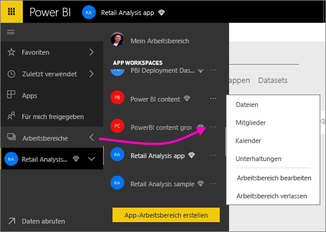
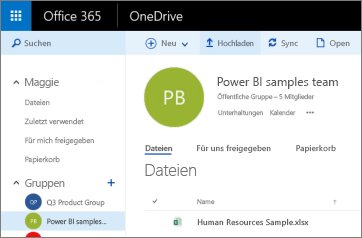
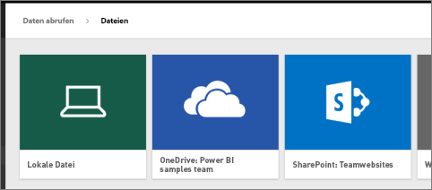
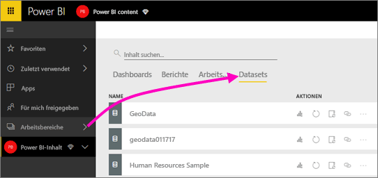
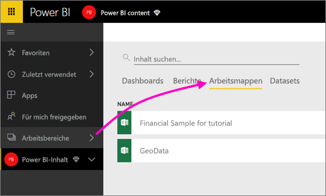

# Herstellen einer Verbindung mit in OneDrive gespeicherten Dateien für Ihren Power BI-App-Arbeitsbereich
Nachdem Sie einen [App-Arbeitsbereich in Power BI erstellt haben](service-create-distribute-apps.md), können Sie Ihre Excel-, CSV- und Power BI Desktop-Dateien in OneDrive for Business für Ihren Power BI-App-Arbeitsbereich speichern. Sie können weiterhin in OneDrive gespeicherte Dateien aktualisieren, und diese Updates werden automatisch in den auf diesen Dateien basierenden Power BI-Berichten und -Dashboards widergespiegelt. 

Das Hinzufügen von Dateien zu Ihrem Power BI-App-Arbeitsbereich erfolgt in zwei Schritten: 

1. Zunächst [laden Sie Dateien in OneDrive for Business](service-connect-to-files-in-app-workspace-onedrive-for-business.md#1-upload-files-to-the-onedrive-for-business-for-your-app-workspace) für Ihren App-Arbeitsbereich hoch.
2. Anschließend [stellen Sie eine Verbindung mit diesen Dateien aus Power BI her](service-connect-to-files-in-app-workspace-onedrive-for-business.md#2-import-excel-files-as-datasets-or-as-excel-online-workbooks).

> [!NOTE]
> App-Arbeitsbereiche sind nur in [Power BI Pro](service-free-vs-pro.md) verfügbar.
> 
> 

## 1. Hochladen von Dateien in OneDrive for Business für Ihren App-Arbeitsbereich
1. Wählen Sie im Power BI-Dienst den Pfeil neben „Arbeitsbereiche“ aus, und wählen Sie dann die Auslassungspunkte (**...**) neben dem Namen Ihres Arbeitsbereichs aus. 
   
   
2. Wählen Sie **Dateien** aus, um OneDrive for Business für Ihren App-Arbeitsbereich in Office 365 zu öffnen.
   
   > [!NOTE]
   > Wenn **Dateien** im Menü des App-Arbeitsbereichs nicht angezeigt wird, wählen Sie **Mitglieder** aus, um den OneDrive for Business-Speicher des App-Arbeitsbereichs zu öffnen. Wählen Sie dort **Dateien**aus. Office 365 richtet einen OneDrive-Speicherort für die Dateien des Gruppenarbeitsbereichs Ihrer App ein. Dies kann einige Zeit dauern. 
   > 
   > 
3. Hier können Sie Ihre Dateien in OneDrive for Business für Ihren App-Arbeitsbereich hochladen. Wählen Sie **Hochladen**aus, und navigieren Sie zu Ihren Dateien.
   
   

## 2. Importieren von Excel-Dateien als Datasets oder Excel Online-Arbeitsmappen
Jetzt, da sich die Dateien im OneDrive for Business Ihres App-Arbeitsbereichs befinden, haben Sie zwei Möglichkeiten. Sie können: 

* [Die Daten aus der Excel-Arbeitsmappe als Datasets importieren](service-get-data-from-files.md) und die Daten zum Erstellen von Berichten und Dashboards verwenden, die Sie in einem Webbrowser und auf mobilen Geräten anzeigen können.
* Oder [eine Verbindung mit einer kompletten Excel-Arbeitsmappe in Power BI herstellen](service-excel-workbook-files.md) und sie genauso anzeigen, wie sie in Excel Online dargestellt wird.

### Importieren von Dateien in Ihrem App-Arbeitsbereich oder Herstellen einer Verbindung mit diesen Dateien
1. Wechseln Sie in Power BI zum App-Arbeitsbereich, sodass der Name des App-Arbeitsbereichs oben links angezeigt wird. 
2. Wählen Sie unten im linken Navigationsbereich **Daten abrufen** aus. 
   
   
3. Wählen Sie im Feld **Dateien** die Option **Abrufen**aus.
   
   
4. Wählen Sie **OneDrive** - *Name Ihres App-Arbeitsbereichs* aus.
   
    
5. Wählen Sie die gewünschte Datei und dann **Verbinden** aus.
   
    Dies ist der Punkt, an dem Sie entscheiden, ob Sie die [Daten aus der Excel-Arbeitsmappe importieren](service-get-data-from-files.md) oder [eine Verbindung mit den kompletten Excel-Arbeitsmappen herstellen](service-excel-workbook-files.md).
6. Wählen Sie **Importieren** oder **Verbinden**aus.
   
    
7. Wenn Sie **Importieren** auswählen, wird die Arbeitsmappe auf der Registerkarte **Datasets** angezeigt. 
   
    
   
    Wenn Sie **Verbinden** auswählen, wird die Arbeitsmappe auf der Registerkarte **Arbeitsmappen** angezeigt.
   
    

## Nächste Schritte
* [Erstellen von Apps und App-Arbeitsbereichen in Power BI](service-create-distribute-apps.md)
* [Importieren von Daten aus Excel-Arbeitsmappen](service-get-data-from-files.md)
* [Verbinden mit gesamten Excel-Arbeitsmappen](service-excel-workbook-files.md)
* Weitere Fragen? [Wenden Sie sich an die Power BI-Community](http://community.powerbi.com/)
* Feedback? Besuchen Sie [Power BI Ideas](https://ideas.powerbi.com/forums/265200-power-bi).

