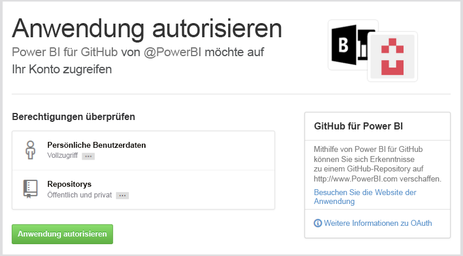
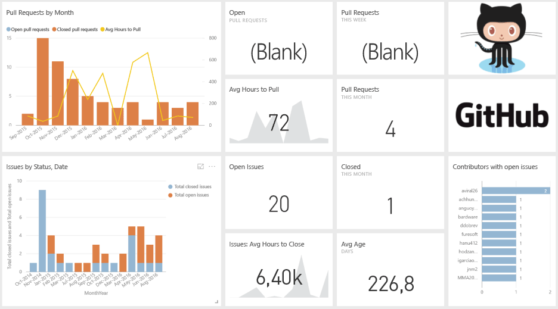
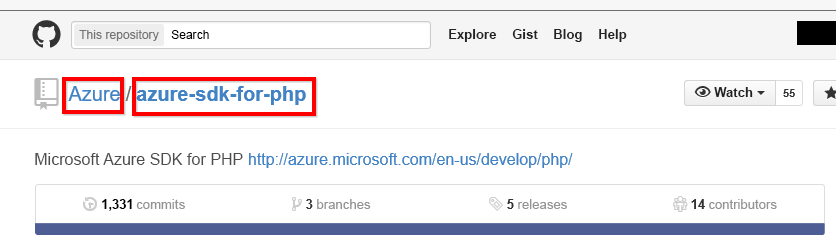

# Herstellen einer Verbindung mit GitHub mithilfe von Power BI
Das GitHub-Inhaltspaket für Power BI bietet Ihnen Einblicke in ein GitHub-Repository mit Daten zu Beiträgen, Problemen, Pullanforderungen und aktiven Benutzern.

Stellen Sie eine Verbindung mit dem [GitHub-Inhaltspaket](https://app.powerbi.com/getdata/services/github) her, oder erfahren Sie mehr über die [GitHub-Integration](https://powerbi.microsoft.com/integrations/github) in Power BI.

>[!NOTE]
>Das Inhaltspaket erfordert, dass das GitHub-Konto auf das Repository zugreifen kann. Es folgen weitere Informationen zu den Anforderungen.

## Herstellen der Verbindung
1. Wählen Sie unten im linken Navigationsbereich **Daten abrufen** aus.
   
    
2. Wählen Sie im Feld **Dienste** die Option **Abrufen**aus.
   
    
3. Wählen Sie **GitHub** \> **Abrufen** aus.
   
   
4. Geben Sie den Namen und Besitzer des Repositorys ein. Nachstehend finden Sie weitere Informationen zum [Suchen dieser Parameter](#FindingParams).
   
   
5. Geben Sie Ihre GitHub-Anmeldeinformationen ein (dieser Schritt kann übersprungen werden, wenn Sie bereits mit Ihrem Browser angemeldet sind). 
6. Wählen Sie als **Authentifizierungsmethode** die Option **oAuth2** \> **Anmelden** aus. 
7. Befolgen Sie die Anweisungen auf den Bildschirmen der Github-Authentifizierung. Gewähren Sie dem GitHub-Inhaltspaket für Power BI die Berechtigung für den Zugriff auf die GitHub-Daten.
   
   
   
   Dadurch wird Power BI mit GitHub verbunden und Power BI darf die Verbindung zu den Daten herstellen.  Die Daten werden einmal täglich aktualisiert.
8. Nach dem Herstellen der Verbindung mit Ihrem Repository importiert Power BI die Daten. Im linken Navigationsbereich werden ein [GitHub-Dashboard](https://powerbi.microsoft.com/integrations/github), ein Bericht und ein Dataset angezeigt. Neue Elemente werden mit einem gelben Sternchen \* markiert.
   
   

**Was nun?**

* Versuchen Sie, am oberen Rand des Dashboards [im Q&A-Feld eine Frage zu stellen](power-bi-q-and-a.md).
* [Ändern Sie die Kacheln](service-dashboard-edit-tile.md) im Dashboard.
* [Wählen Sie eine Kachel aus](service-dashboard-tiles.md), um den zugrunde liegenden Bericht zu öffnen.
* Ihr Dataset ist auf eine tägliche Aktualisierung festgelegt. Sie können jedoch das Aktualisierungsintervall ändern oder es über **Jetzt aktualisieren** nach Bedarf aktualisieren.

## Inhalt
Die folgenden Daten sind über GitHub in Power BI verfügbar:     

| Tabellenname | Beschreibung |
| --- | --- |
| Beiträge |Die Tabelle für „Beiträge“ bietet die vom Mitwirkenden erstellten gesamten Zugänge, Abgänge und Commits, die wöchentlich aggregiert werden. Die Top 100-Mitwirkenden sind inklusive. |
| Probleme |Listet alle Probleme für das ausgewählte Repository auf und enthält Berechnungen wie die gesamte und durchschnittliche Zeit zum Schließen eines Problems, die Gesamtzahl offener Probleme sowie die Gesamtzahl geschlossener Probleme. Diese Tabelle ist leer, wenn im Repository keine Probleme vorliegen. |
| Pullanforderungen |Diese Tabelle enthält alle Pullanforderungen für das Repository und die Information, welcher Benutzer den Pullvorgang für die Anforderung ausgeführt hat. Sie enthält auch Berechnungen dazu, wie viele geöffnete, geschlossene und insgesamt verfügbare Pullanforderungen vorliegen, wie lange die Pullanforderungen und die durchschnittliche Pullanforderung gedauert haben. Diese Tabelle ist leer, wenn im Repository keine Probleme vorliegen. |
| Benutzer |Diese Tabelle enthält eine Liste von GitHub-Benutzern oder Mitwirkenden, die Beiträge geleistet, Probleme gemeldet oder Pullanforderungen für das ausgewählte Repository gelöst haben. |
| Meilensteine |Diese Tabelle enthält alle Meilensteine für das ausgewählte Repository. |
| DateTable |Diese Tabellen enthält Datumsangaben von heute und für vergangene Jahre, die es Ihnen ermöglichen, Ihre GitHub-Daten nach Datum zu analysieren. |
| ContributionPunchCard |Diese Tabelle kann als Lochkarte für Beiträge für das ausgewählte Repository verwendet werden. Es zeigt die Commits nach Wochentag und Tagesstunde an. Diese Tabelle ist nicht mit anderen Tabellen im Modell verbunden. |
| RepoDetails |Diese Tabelle enthält die Details für das ausgewählte Repository. |

## Systemanforderungen
* Das GitHub-Konto, das Zugriff auf das Repository hat  
* Berechtigung für die Power BI für GitHub-App während der erstmaligen Anmeldung Nachstehend finden Sie Details zum Sperren des Zugriffs.  
* Ausreichende Anzahl verfügbarer API-Aufrufe zum Abrufen und Aktualisieren der Daten  

### Aufheben der Autorisierung von Power BI
Sie können den Zugriff in GitHub widerrufen, um die Autorisierung von Power BI zur Verbindung mit Ihrem GitHub-Repository aufzuheben. Weitere Informationen finden Sie in diesem [GitHub-Hilfe](https://help.github.com/articles/keeping-your-ssh-keys-and-application-access-tokens-safe/#reviewing-your-authorized-applications-oauth)thema.

## Suchen von Parametern
Sie können den Besitzer und das Repository ermitteln, indem Sie das Repository in GitHub betrachten:

Der erste Teil „Azure“ ist der Besitzer und der zweite Teil „azure-sdk-for-php“ ist das Repository selbst.  Dieselben beiden Elemente werden in der URL des Repositorys angezeigt:

    <https://github.com/Azure/azure-sdk-for-php> .

## Problembehandlung
Bei Bedarf können Sie Ihre GitHub-Anmeldeinformationen überprüfen.  

1. Navigieren Sie in einem anderen Browserfenster zur GitHub-Website, und melden Sie sich in GitHub an. Sie können in der oberen rechten Ecke der GitHub-Website sehen, dass Sie angemeldet sind.    
2. Navigieren Sie in GitHub zur URL des Repositorys, auf das Sie in Power BI zugreifen möchten. Beispiel: https://github.com/dotnet/corefx.  
3. Versuchen Sie anschließend in Power BI, die Verbindung zu GitHub herzustellen. Verwenden Sie im Dialogfeld zum Konfigurieren von GitHub den Namen und Besitzer des Repositorys für dasselbe Repository.  

## Nächste Schritte
* [Erste Schritte mit Power BI](service-get-started.md)
* [Abrufen von Daten](service-get-data.md)

