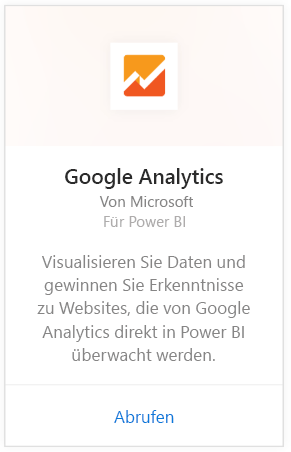
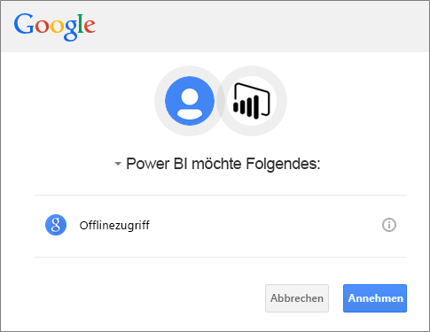
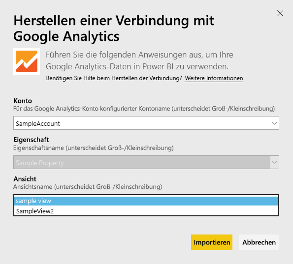
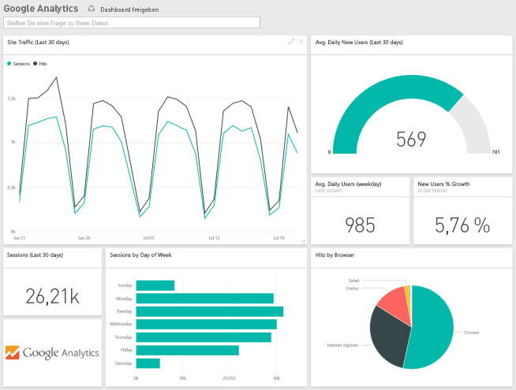
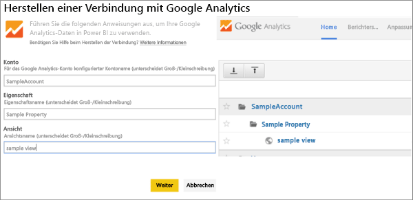

# Herstellen einer Verbindung mit Google Analytics mithilfe von Power BI
Das Herstellen einer Verbindung mit Google Analytics über Power BI beginnt mit dem Herstellen einer Verbindung mit Ihrem Google Analytics-Konto. Sie erhalten ein Power BI-Dashboard und eine Reihe von Power BI-Berichten, die Erkenntnisse zum Datenverkehr Ihrer Website und zu Benutzerdimensionen bieten. Sie können mit dem Dashboard und den Berichten interagieren, jedoch keine Änderungen speichern. Die Daten werden automatisch einmal täglich aktualisiert.

Stellen Sie eine Verbindung mit [Google Analytics](https://app.powerbi.com/getdata/services/google-analytics) für Power BI her. Erfahren Sie mehr über die [Integration von Google Analytics](https://powerbi.microsoft.com/integrations/google-analytics) in Power BI.

Sie können beginnend mit dem [Google Analytics-Connector](service-google-analytics-connector.md) in Power BI Desktop angepasste Dashboards und Berichte erstellen. Stellen Sie einfach eine Verbindung mit Ihrem Google Analytics-Konto her, und erstellen Sie benutzerdefinierte Berichte, die Sie im Power BI-Dienst veröffentlichen können.

## Herstellen der Verbindung
[!INCLUDE [powerbi-service-apps-get-more-apps](./includes/powerbi-service-apps-get-more-apps.md)]

1. Wählen Sie **Google Analytics** \> **Abrufen** aus.
   
   
2. Geben Sie nach der entsprechenden Aufforderung Ihre Google Analytics-Anmeldeinformationen ein. Wählen Sie **oAuth 2** als Authentifizierungsmechanismus aus, und klicken Sie dann auf **Anmelden**. Befolgen Sie die Anweisungen der Google-Authentifizierung, die möglicherweise eine 2-Faktor-Authentifizierung umfasst, wenn diese konfiguriert ist.
   
   
3. Klicken Sie auf **Annehmen** , um Power BI den Zugriff auf die Google Analytics-Daten zu gestatten.
   
   
4. Power BI stellt eine Verbindung mit einer bestimmten Google Analytics-Ansicht her. Wählen Sie den Kontonamen, Eigenschaftennamen und Ansichtnamen für die Verbindung aus. Diese Informationen finden Sie in Ihrem Google Analytics-Konto, entweder in der oberen linken Ecke oder auf der Registerkarte **Start** . Weitere Details finden Sie unten. 
   
   
5. Klicken Sie auf **Verbinden** , um den Importvorgang zu starten. 

## Anzeigen des Dashboards und der Berichte von Google Analytics
[!INCLUDE [powerbi-service-apps-open-app](./includes/powerbi-service-apps-open-app.md)]

      

[!INCLUDE [powerbi-service-apps-open-app](./includes/powerbi-service-apps-what-now.md)]

## Systemanforderungen
Zum Herstellen der Verbindung über Power BI benötigen Sie ein [Google Analytics](https://www.google.com/analytics/)-Konto. Bei anderen Google-Konten, die mit keinem Google Analytics-Konto verbunden sind, wird ein Authentifizierungsfehler angezeigt.

## Problembehandlung
**Anmeldeinformationen** Wenn Sie über mehrere Google-Konten verfügen, verwenden Sie während der Verbindung ein Inkognito- oder ein privates Browserfenster, um sicherzustellen, dass das richtige Konto verwendet wird.

Sollte eine Fehlermeldung aufgrund ungültiger Anmeldeinformationen ausgegeben werden, obwohl die Anmeldung bei Google erfolgreich war, überprüfen Sie, ob Sie über ein [Google Analytics](https://www.google.com/analytics/)-Konto verfügen.

**Parameter** Eindeutige Namen werden derzeit für die Parameter benötigt. Sollte eine Fehlermeldung ausgegeben werden, der zufolge der von Ihnen ausgewählte Wert doppelt ist, wählen Sie bitte einen anderen Wert, oder ändern Sie die Namen der Parameter in Google Analytics, um diese eindeutig zuordnen zu können. Wir arbeiten derzeit daran, dies zu verbessern.

>[!NOTE]
>Bei Parametern wird die Groß-/Kleinschreibung beachtet. Geben Sie die Parameter genau so ein, wie sie in Ihrem Google Analytics-Konto angezeigt werden.

Immer noch Probleme? Öffnen Sie ein Support-Ticket, um das Power BI-Team zu kontaktieren:

* Wählen Sie in der Power BI-App das Fragezeichen \> **Support kontaktieren** aus.
* Wählen Sie auf der Power BI-Supportwebsite (auf der Sie diesen Artikel lesen) auf der rechten Seite die Option **Support kontaktieren** aus.

## Nächste Schritte
* [Was sind Apps in Power BI?](service-install-use-apps.md)
* [Abrufen von Daten in Power BI](service-get-data.md)
* Weitere Fragen? [Stellen Sie Ihre Frage in der Power BI-Community.](http://community.powerbi.com/)

