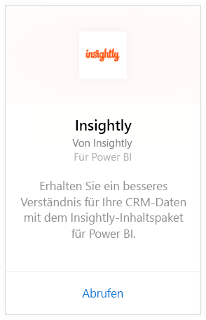
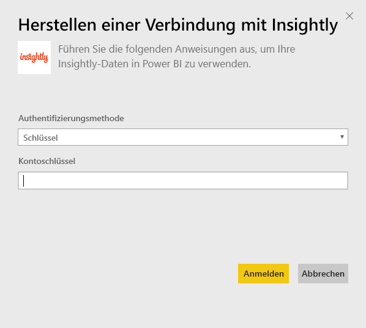
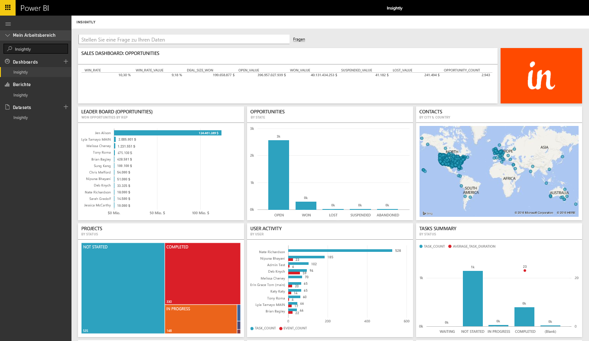
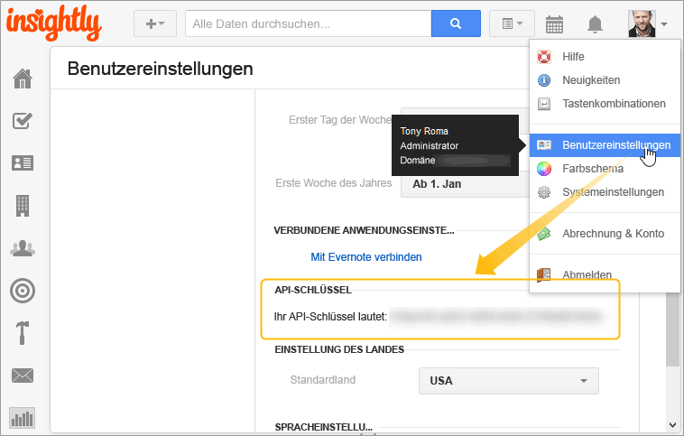

# Herstellen einer Verbindung mit Insightly mithilfe von Power BI
Visualisieren und teilen Sie Ihre Insightly CRM-Daten in Power BI mit dem Insightly-Inhaltspaket. Verbinden Sie sich über Ihren Insightly-API-Schlüssel mit Power BI, um Berichte und Dashboards aus Ihren CRM-Daten zu erstellen und anzuzeigen. Mit Power BI können Sie Ihre Daten auf neue Weise analysieren, leistungsstarke Graphen und Diagramme erstellen und Kontakte, Leads und Organisationen auf einer Karte anzeigen.

Stellen Sie eine Verbindung mit dem [Insightly-Inhaltspaket](https://app.powerbi.com/getdata/services/insightly) für Power BI her.

## Herstellen der Verbindung
1. Wählen Sie unten im linken Navigationsbereich **Daten abrufen** aus.
   
   
2. Wählen Sie im Feld **Dienste** die Option **Abrufen**aus.
   
   
3. Wählen Sie **Insightly** \> **Abrufen** aus.
   
   
4. Wählen Sie als Authentifizierungstyp **Schlüssel** aus, geben Sie Ihren Insight-API-Schlüssel an, und wählen Sie dann **Anmelden**aus. Einzelheiten zum [Ermitteln dieses Werts](#FindingParams) finden Sie unten.
   
   
5. Nach der Genehmigung wird der Importvorgang automatisch gestartet. Nach Abschluss des Vorgangs werden im Navigationsbereich ein neues Dashboard, ein Bericht und ein Modell angezeigt. Wählen Sie das Dashboard aus, um die importierten Daten anzuzeigen.
   
     

**Was nun?**

* Versuchen Sie, am oberen Rand des Dashboards [im Q&A-Feld eine Frage zu stellen](consumer/end-user-q-and-a.md).
* [Ändern Sie die Kacheln](service-dashboard-edit-tile.md) im Dashboard.
* [Wählen Sie eine Kachel aus](consumer/end-user-tiles.md), um den zugrunde liegenden Bericht zu öffnen.
* Zwar ist Ihr Dataset auf tägliche Aktualisierung festgelegt, jedoch können Sie das Aktualisierungsintervall ändern oder über **Jetzt aktualisieren** nach Bedarf aktualisieren.

## Inhalt
Das Inhaltspaket enthält die folgenden Tabellen mit Feldern aus den entsprechenden Datensätzen:

| Tabellen |  |  |  |
| --- | --- | --- | --- |
| Kontakte |Verkaufschancen |Pipelinestufen |Aufgabenabschlusstermin |
| Benutzerdefinierte Felder |Abschlusstermin der Verkaufschance |Projektabschlusstermin |Aufgaben |
| Ereignisse |Geplanter Abschlusstermin der Verkaufschance |Projekte |Teams/Mitglieder |
| Leads |Organisationen |Tags |Benutzer |

Viele Tabellen und Berichte enthalten zudem eindeutige berechnete Felder, z. B.:  

* Tabellen mit „gruppierten“ geplanten Abschlussterminen von Verkaufschancen, tatsächlichen Abschlussterminen von Verkaufschancen, Projektabschlussterminen und Aufgabenabschlussterminen, die nach Monat, Quartal oder Jahr analysiert werden können.  
* Ein gewichtetes Wertfeld für Verkaufschancen (Wert der Verkaufschance x Wahrscheinlichkeit des Abschlusses).  
* Felder mit der Durchschnitts- und Gesamtdauer von Aufgaben basierend auf dem Anfangs- und Abschlussdatum.  
* Berichte mit berechneten Feldern für die Abschlussquote von Verkaufschancen (Anzahl der Abschlüsse im Vergleich mit der Gesamtanzahl der Verkaufschancen) und den Wert der Abschlussquote (Wert der Abschlüsse im Vergleich mit dem Wert aller Verkaufschancen).  

## Systemanforderungen
Ein Insightly-Konto mit Zugriff auf die Insightly-API ist erforderlich. Anzeigeberechtigungen basieren auf dem API-Schlüssel zum Herstellen der Verbindung mit Power BI. Insightly-Datensätze, die Sie anzeigen können, werden auch in Power BI-Berichten und -Dashboards angezeigt, die Sie für andere freigeben.

## Suchen von Parametern
**API-Schlüssel**

Um Ihren API-Schlüssel von Insightly zu kopieren, wählen Sie „Benutzereinstellungen“ im Insightly-Menü „Profil“ aus und scrollen dann nach unten. Diese Zeichenfolge wird zum Verbinden Ihrer Daten mit Power BI verwendet.

## Problembehandlung
Ihre Daten werden über die Insightly-API importiert und unterliegen einem täglichen Grenzwert, der auf dem Typ Ihres Insightly-Abonnements basiert. Die Grenzwerte sind im Abschnitt „Rate Limiting/Throttling Requests“ (Übertragungsratenlimits/Drosselung bei Anfragen) in der API-Dokumentation aufgeführt: https://api.insight.ly/v2.2/Help#!/Overview/Introduction#ratelimit

Die bereitgestellten Berichte nutzen Standardfelder aus Insightly und enthalten ggf. nicht Ihre Anpassungen. Bearbeiten Sie den Bericht, um alle verfügbaren Felder anzuzeigen.

## Nächste Schritte
[Erste Schritte mit Power BI](service-get-started.md)

[Abrufen von Daten in Power BI](service-get-data.md)

