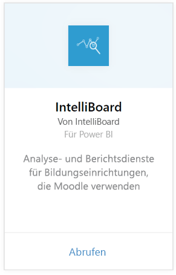
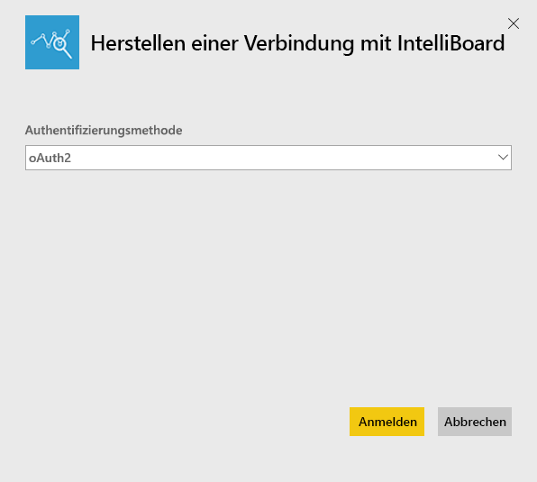
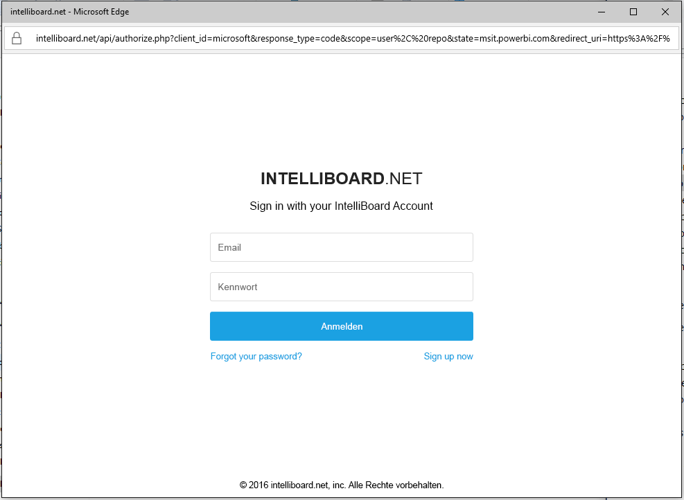
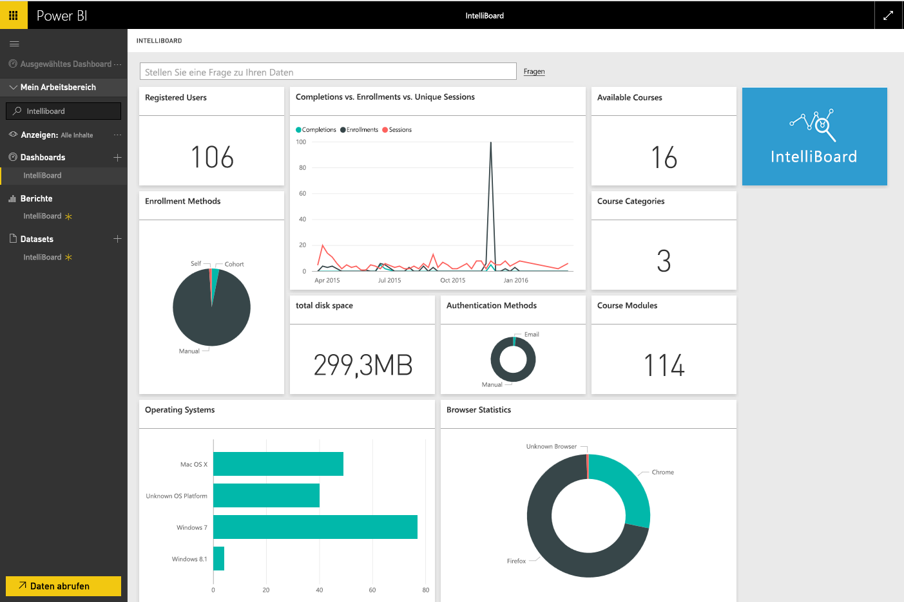

# Herstellen einer Verbindung mit IntelliBoard mithilfe von Power BI
IntelliBoard bietet vereinfachten Zugriff auf Ihre Moodle-Lernmanagementsystem-Daten über Reporting Services. Das IntelliBoard-Inhaltspaket für Power BI bietet zusätzliche Analysen, einschließlich Metriken auf Ihre Kurse, registrierter Benutzer, der Gesamtleistung und Ihrer LMS-Aktivität.

Stellen Sie eine Verbindung mit dem [IntelliBoard-Inhaltspaket](https://app.powerbi.com/getdata/services/intelliboard) für Power BI her.

## Herstellen der Verbindung
1. Wählen Sie unten im linken Navigationsbereich **Daten abrufen** aus.  
   
    
2. Wählen Sie im Feld **Dienste** die Option **Abrufen**aus.  
   
    
3. Wählen Sie **IntelliBoard** und anschließend **Abrufen** aus.  
   
    
4. Wählen Sie **OAuth 2** und anschließend **Anmelden** aus. Geben Sie Ihre IntelliBoard-Anmeldeinformationen an, wenn Sie dazu aufgefordert werden.
   
    
   
    
5. Sobald Sie verbunden sind, werden ein Dashboard, ein Bericht und ein Dataset automatisch geladen. Anschließend werden die Kacheln mit Daten aus Ihrem IntelliBoard-Konto aktualisiert.
   
    

**Was nun?**

* Versuchen Sie, am oberen Rand des Dashboards [im Q&A-Feld eine Frage zu stellen](power-bi-q-and-a.md).
* [Ändern Sie die Kacheln](service-dashboard-edit-tile.md) im Dashboard.
* [Wählen Sie eine Kachel aus](service-dashboard-tiles.md), um den zugrunde liegenden Bericht zu öffnen.
* Ihr Dataset ist auf eine tägliche Aktualisierung festgelegt. Sie können jedoch das Aktualisierungsintervall ändern oder es über **Jetzt aktualisieren** nach Bedarf aktualisieren.

## Inhalt
Das Inhaltspaket umfasst Daten aus den folgenden Tabellen:  

    - Activity  
    - Agents  
    - Auth (Authentifizierung)  
    - Länder  
    - CoursesProgress (Kursfortschritt)  
    - Enrollments (Registrierungen)
    - Lang (Sprache)  
    - Platform (Plattform)  
    - Totals (Gesamtergebnisse)  
    - UsersProgress (Benutzerfortschritt)    

## Systemanforderungen
Ein IntelliBoard-Konto mit Berechtigungen für die obigen Tabellen wird benötigt, um dieses Inhaltspaket zu instanziieren.

## Nächste Schritte
[Erste Schritte mit Power BI](service-get-started.md)

[Power BI – Grundkonzepte](service-basic-concepts.md)

