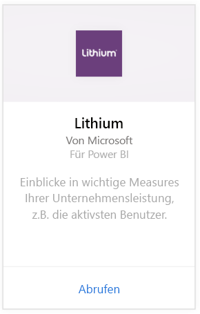
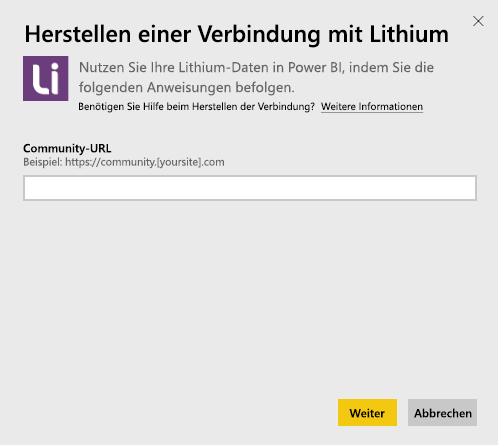
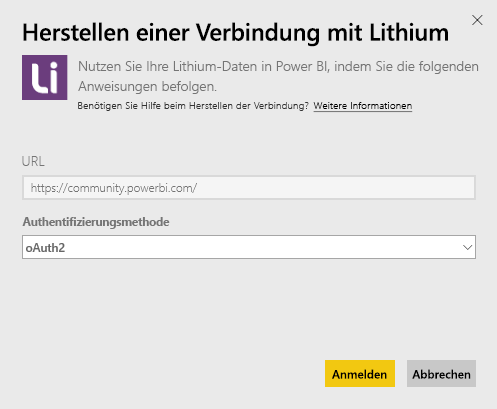
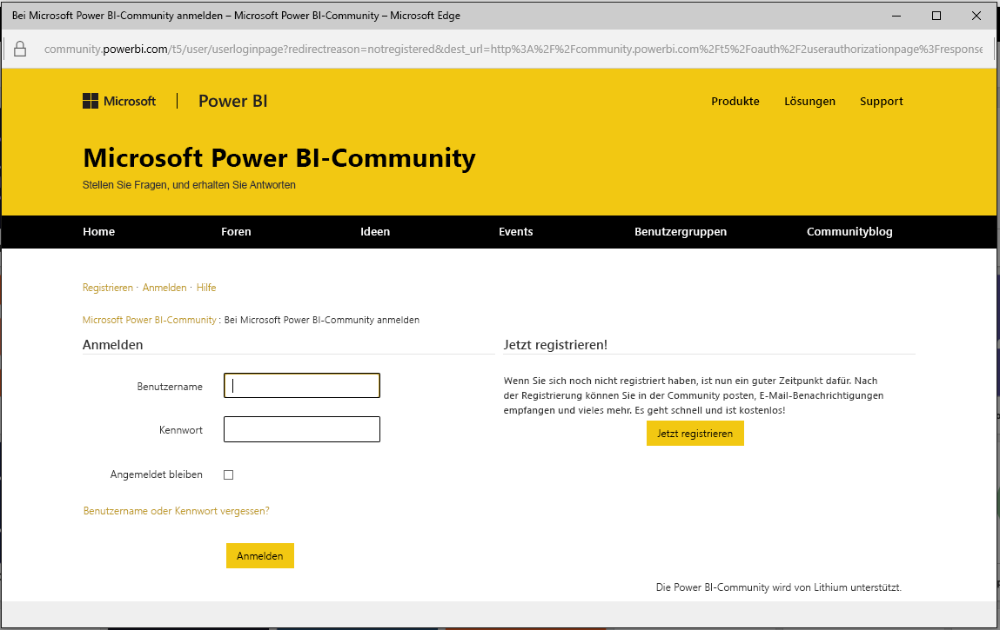
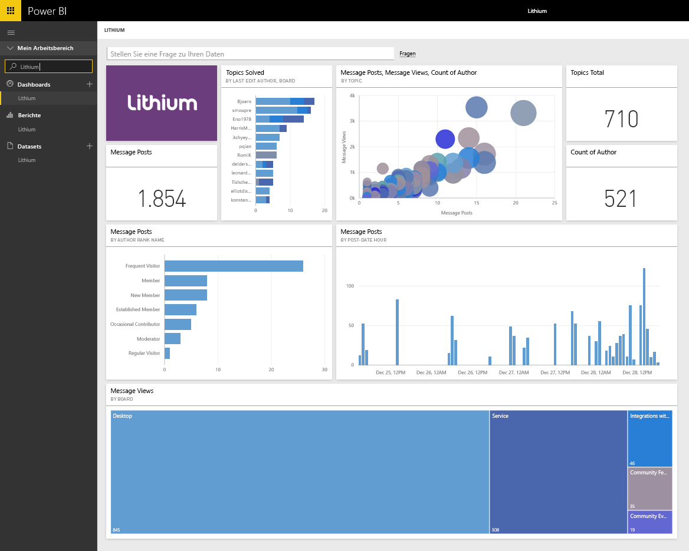

# Herstellen einer Verbindung mit Lithium mithilfe von Power BI
Lithium dient zum Aufbauen von Vertrauensverhältnissen zwischen weltweit führenden Herstellern und ihren Kunden und hilft beim Erhalten von Antworten und Weitergeben von Erfahrungen. Durch Verbinden des Lithium-Inhaltspakets mit Power BI können Sie wichtige Metriken in Ihrer Onlinecommunity messen, um den Verkauf anzukurbeln, Servicekosten zu senken und die Kundentreue zu steigern. 

Stellen Sie die Verbindung mit dem [Lithium-Inhaltspaket](https://app.powerbi.com/getdata/services/lithium) für Power BI her.

>[!NOTE]
>Das Power BI-Inhaltspaket verwendet die Lithium-API. Übermäßig viele Aufrufe der API führen möglicherweise zu zusätzlichen Lithium-Kosten. Sprechen Sie sich Sie mit Ihrem Lithium-Administrator ab.

## Herstellen der Verbindung
1. Wählen Sie unten im linken Navigationsbereich **Daten abrufen** aus.
   
    
2. Wählen Sie im Feld **Dienste** die Option **Abrufen**aus.
   
    
3. Wählen Sie **Lithium** \> **Abrufen** aus.
   
   
4. Geben Sie die URL Ihrer Lithium-Community an. Sie hat das Format *https://community.IhreWebsite.com*.
   
   
5. Geben Sie bei Aufforderung Ihre Lithium-Anmeldeinformationen ein. Wählen Sie als Authentifizierungsmethode **oAuth 2** aus. Klicken Sie auf **Anmelden**, und befolgen Sie die Schritte zur Lithium-Authentifizierung.
   
   
   
   
6. Nach Abschluss der Anmeldung wird den Importvorgang gestartet. Nach Abschluss des Vorgangs werden im Navigationsbereich ein neues Dashboard, ein Bericht und ein Modell angezeigt. Wählen Sie das Dashboard aus, um die importierten Daten anzuzeigen.
   
    

**Was nun?**

* Versuchen Sie, am oberen Rand des Dashboards [im Q&A-Feld eine Frage zu stellen](power-bi-q-and-a.md).
* [Ändern Sie die Kacheln](service-dashboard-edit-tile.md) im Dashboard.
* [Wählen Sie eine Kachel aus](service-dashboard-tiles.md), um den zugrunde liegenden Bericht zu öffnen.
* Ihr Dataset ist auf eine tägliche Aktualisierung festgelegt. Sie können jedoch das Aktualisierungsintervall ändern oder es über **Jetzt aktualisieren** nach Bedarf aktualisieren.

## Systemanforderungen
Das Lithium-Inhaltspaket erfordert mindestens die Lithium Community-Version 15.9. Konsultieren Sie zur Überprüfung Ihren Lithium-Administrator.

## Nächste Schritte
[Erste Schritte mit Power BI](service-get-started.md)

[Power BI – Grundkonzepte](service-basic-concepts.md)

