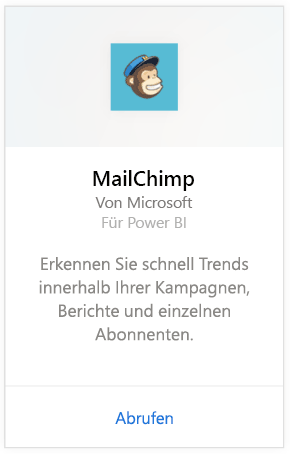
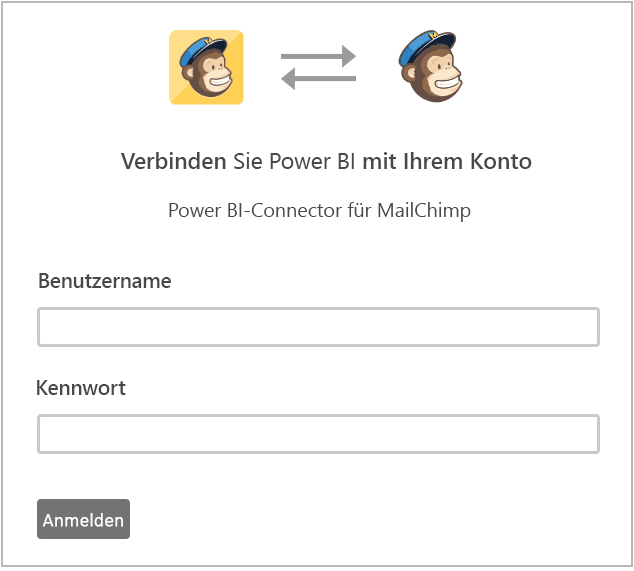

# Herstellen einer Verbindung mit MailChimp mithilfe von Power BI
Das Power BI-Inhaltspaket ruft Daten aus Ihrem MailChimp-Konto ab und generiert ein Dashboard, eine Reihe von Berichten sowie ein Dataset, damit Sie Ihre Daten analysieren können. Beziehen Sie Analysen ein, um [MailChimp-Dashboards](https://powerbi.microsoft.com/integrations/mailchimp) zu erstellen und innerhalb Ihrer Kampagnen, Berichte und einzelnen Abonnenten schnell Trends zu erkennen. Die Daten werden täglich aktualisiert, um sicherzustellen, dass sie auf dem neuesten Stand sind.

Stellen Sie eine Verbindung mit dem [MailChimp-Inhaltspaket](https://app.powerbi.com/getdata/services/mailchimp) für Power BI her.

## Herstellen der Verbindung
1. Wählen Sie unten im linken Navigationsbereich **Daten abrufen** aus.
   
    
2. Wählen Sie im Feld **Dienste** die Option **Abrufen**aus.
   
   
3. Wählen Sie **MailChimp** \> **Abrufen** aus.
   
   
4. Wählen Sie als Authentifizierungsmethode die Option **oAuth2** \> **Anmelden** aus.
   
    Geben Sie bei der entsprechenden Aufforderung Ihre MailChimp-Anmeldeinformationen ein, und führen Sie den Authentifizierungsvorgang aus.
   
    Wenn Sie die Verbindung zum ersten Mal herstellen, werden Sie aufgefordert, Power BI den Lesezugriff für Ihr Konto zu gewähren. Wählen Sie **Zulassen** aus, um den Importvorgang zu starten, der je nach der Datenmenge in Ihrem Konto einige Minuten dauern kann.
   
    
5. Nachdem die Daten von Power BI importiert wurden, werden im linken Navigationsbereich ein neues Dashboard, ein Bericht und ein Dataset angezeigt. Dies ist der Standarddashboard, das Power BI zum Anzeigen Ihrer Daten erstellt hat. Sie können dieses Dashboard anpassen, damit Ihre Daten auf die gewünschte Weise angezeigt werden.
   
   

**Was nun?**

* Versuchen Sie, am oberen Rand des Dashboards [im Q&A-Feld eine Frage zu stellen](power-bi-q-and-a.md).
* [Ändern Sie die Kacheln](service-dashboard-edit-tile.md) im Dashboard.
* [Wählen Sie eine Kachel aus](service-dashboard-tiles.md), um den zugrunde liegenden Bericht zu öffnen.
* Ihr Dataset ist auf eine tägliche Aktualisierung festgelegt. Sie können jedoch das Aktualisierungsintervall ändern oder es über **Jetzt aktualisieren** nach Bedarf aktualisieren.

## Nächste Schritte
[Erste Schritte mit Power BI](service-get-started.md)

[Power BI – Grundkonzepte](service-basic-concepts.md)

