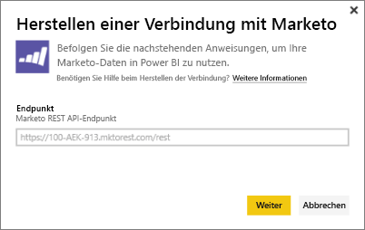
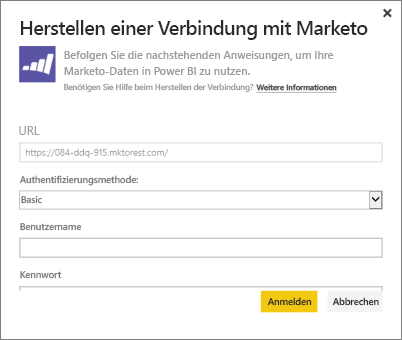
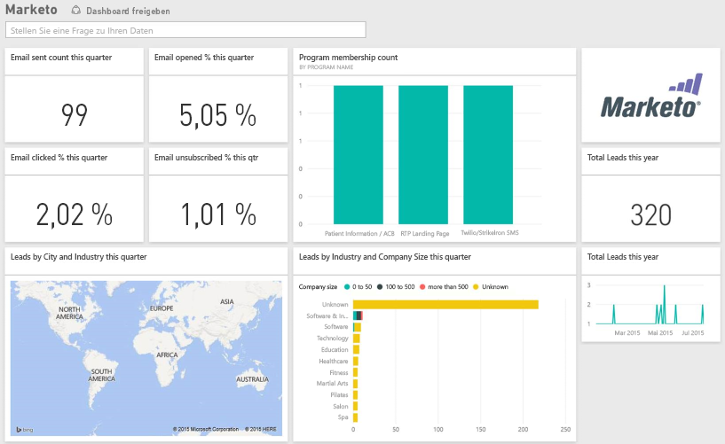

# Herstellen einer Verbindung mit Marketo mithilfe von Power BI
Mit dem Power BI-Inhaltspaket für Marketo erhalten Sie Einblicke in Ihr Marketo-Konto mit Daten zu Leads und ihren Aktivitäten.Durch das Herstellen dieser Verbindung werden Ihre Daten abgerufen. Auf Basis dieser Daten werden dann ein Dashboard und zugehörige Berichte automatisch bereitgestellt.

Stellen Sie eine Verbindung mit dem [Marketo-Inhaltspaket](https://app.powerbi.com/getdata/services/marketo) für Power BI her.

## Herstellen der Verbindung
1. Wählen Sie unten im linken Navigationsbereich **Daten abrufen** aus.
   
   
2. Wählen Sie im Feld **Dienste** die Option **Abrufen**aus.
   
    
3. Wählen Sie **Marketo** \> **Abrufen** aus.
   
   
4. Geben Sie den von Marketo oder Ihrem Marketo-Administrator bereitgestellten Marketo-REST-Endpunkt ein, und wählen Sie „Weiter“ aus.
   
   
   
   Weitere Informationen zum Marketo-REST-Endpunkt finden Sie unter: [http://developers.marketo.com/documentation/rest/endpoint-url/ ](http://developers.marketo.com/documentation/rest/endpoint-url/).
5. Geben Sie mithilfe der Authentifizierungsmethode **Standard** die Client-ID als **Benutzername** und den geheimen Clientschlüssel als **Kennwort**ein. Die Client-ID und den geheimen Clientschlüssel erhalten Sie von Marketo oder Ihrem Marketo-Administrator ([http://developers.marketo.com/documentation/rest/custom-service/](http://developers.marketo.com/documentation/rest/custom-service/)). 
   
   
   
   Dadurch erhält das [Marketo-Inhaltspaket für Power BI](https://powerbi.microsoft.com/integrations/marketo) Zugriff auf Ihre *Marketo-Analysedaten*, und Sie können die Daten in Power BI analysieren. Die Daten werden einmal täglich aktualisiert.
6. Sobald die Verbindung zu Ihrem Marketo-Konto besteht, wird ein Dashboard mit Ihren gesamten Daten geladen:
   
   

**Was nun?**

* Versuchen Sie, am oberen Rand des Dashboards [im Q&A-Feld eine Frage zu stellen](power-bi-q-and-a.md).
* [Ändern Sie die Kacheln](service-dashboard-edit-tile.md) im Dashboard.
* [Wählen Sie eine Kachel aus](service-dashboard-tiles.md), um den zugrunde liegenden Bericht zu öffnen.
* Ihr Dataset ist auf eine tägliche Aktualisierung festgelegt. Sie können jedoch das Aktualisierungsintervall ändern oder es über **Jetzt aktualisieren** nach Bedarf aktualisieren.

## Inhalt
Die folgenden Daten sind über Marketo in Power BI verfügbar, wobei die Aktivität zwischen „heute“ und „vor einem Jahr“ aufgetreten ist:

| Tabellenname | Beschreibung |
| --- | --- |
| EmailActivities |Daten zu E-Mails, die an Leads/Kontakte gesendet wurden und Details zu Geräten, Kategorien, zurückgesendeter Anzahl und Prozentsatz, geklickter Anzahl und Prozentsatz, geöffneter Anzahl und Prozentsatz und Programmnamen enthalten. Die in Power BI angezeigten E-Mail-Aktivitäten stellen einen absoluten Bericht zur E-Mail-Zustellbarkeit dar. Es wird keine zusätzliche Logik auf die Daten angewendet. Aus diesem Grund sind die Ergebnisse zwischen dem Marketo-Client und Power BI möglicherweise verschieden. |
| ProgramActivites |Daten zu Programmen, die eine Statusänderung aufweisen. Dazu gehören folgende Details: Ursache, Erfolg, Anzahl und Prozentsatz von Programmanschaffungen sowie Anzahl und Prozentsatz des Programmerfolgs. |
| WebPageActivities |Daten über die Besuche von Benutzerwebseiten, einschließlich Such-Agent, Benutzer-Agent, Webseite und Tagesstunde. |
| Datetable |Daten von heute und dem vergangenen Jahr.  Ermöglicht die Analyse Ihrer Marketo-Daten nach Datum. |
| Leads |Leadinformationen wie Unternehmen, Umsatzvolumen, Anzahl von Mitarbeitern, Land, Branche, Leadbewertung und Leadstatus. Die Leads werden auf Basis ihres Vorkommens in den Daten von E-Mail-, Programm- und Webseitenaktivitäten abgerufen. |

Alle Datumsangaben erfolgen in UTC. In Abhängigkeit von der Zeitzone, in der sich Ihr Konto befindet, können die Datumsangaben variieren (ähnlich wie beim Marketo-Client).

## Systemanforderungen
* Das Marketo-Konto, das Sie zum Herstellen einer Verbindung verwenden, verfügt über die Berechtigung zum Zugriff auf Leads und Aktivitäten.
* Ausreichend verfügbare API-Aufrufe zum Herstellen der Verbindung zu den Daten.  Marketo verfügt für jedes Konto über eine API.  Wenn der Grenzwert erreicht wird, können Sie keine Daten in Power BI laden. 

**Details zum API-Limit**

Beim Importieren von Daten aus Marketo werden Marketo-APIs verwendet. Jeder Kunde von Marketo verfügt insgesamt über maximal 10.000 API-Aufrufe pro Tag, die von allen Anwendungen gemeinsam genutzt werden, die Marketo-APIs verwenden. Sie können die APIs für andere Integrationen sowie für die Power BI-Integration verwenden. Weitere Informationen zu den APIs finden Sie unter: <http://developers.marketo.com/documentation/rest/>.

Die Anzahl der API-Aufrufe die Power BI an Marketo sendet, hängen von der Menge der Daten in Ihrem Marketo-Konto ab. Power BI importiert alle Leads und Aktivitäten für das letzte Jahr. Hier ist ein Beispiel für Daten aus Marketo und die Anzahl der API-Aufrufe, die von Power BI beim Importieren verwendet werden:  

| Datentyp | Anzahl Zeilen | API-Aufrufe |
| --- | --- | --- |
| Leadsinformationen |15.000 |50 |
| E-Mail-Aktivitäten |150.000 |1.000 |
| Programmaktivitäten |15.000 |100 |
| Webaktivitäten |150.000 |1.000 |
| Programmänderungen |7.500 |50 |
| **API-Aufrufe insgesamt** | |**2.200** |

## Nächste Schritte
[Erste Schritte mit Power BI](service-get-started.md)

[Abrufen von Daten in Power BI](service-get-data.md)

[Power BI-Blog: Überwachen und Analysieren Ihrer Marketo-Daten mit Power BI](http://blogs.msdn.com/b/powerbi/archive/2015/03/19/monitor-and-analyze-your-marketo-data-with-power-bi.aspx)

