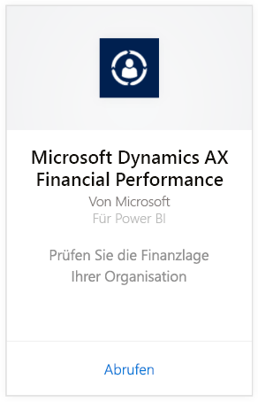
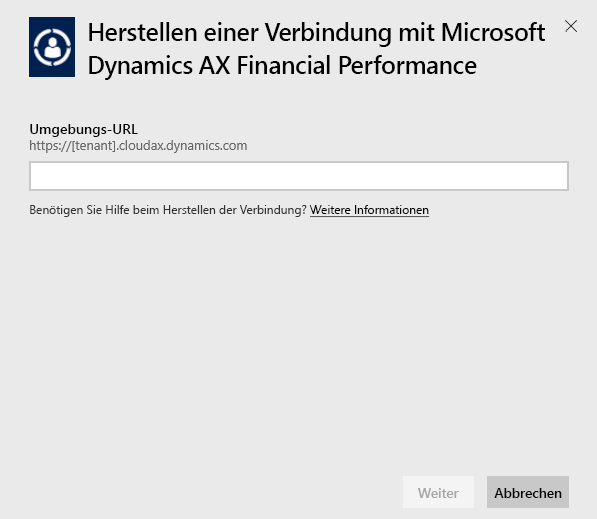
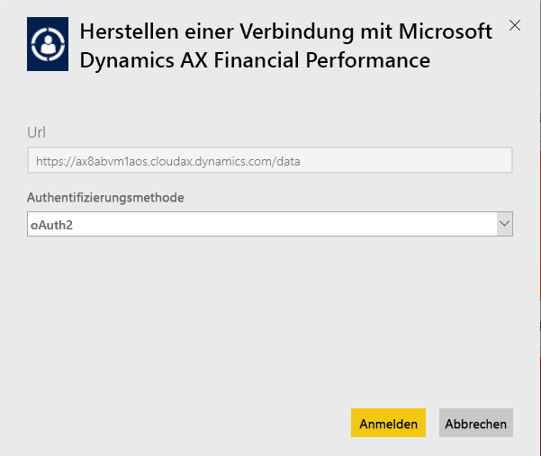
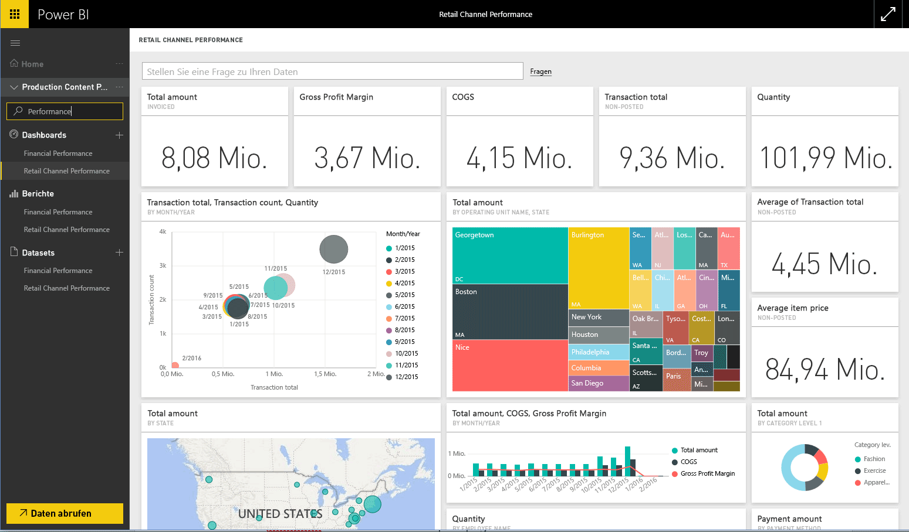

# Herstellen einer Verbindung mit einem Microsoft Dynamics AX-Inhaltspaket mithilfe von Power BI
Microsoft Dynamics AX bietet drei Power BI-Inhaltspakete, die jeweils auf bestimmte geschäftliche Benutzer zugeschnitten sind. Das Inhaltspaket für die Finanzleistung wurde eigens für CFOs entwickelt und erlaubt Einblicke in die Finanzlage Ihres Unternehmens. Das Inhaltspaket für die Handelskanalleistung ist auf Channel-Manager ausgerichtet und dient der Umsatzanalyse, um direkt aus den Handelsdaten Trends abzuleiten und Erkenntnisse zu gewinnen. Die Kostenverwaltung ist für COOs und CFOs bestimmt. Sie enthält Details zur Leistung von Vorgängen.

Stellen Sie eine Verbindung mit dem Microsoft Dynamics AX-Inhaltspaket für die [Handelskanalleistung](https://app.powerbi.com/getdata/services/dynamics-ax-retail-channel-performance), die [Finanzleistung](https://app.powerbi.com/getdata/services/dynamics-ax-financial-performance) oder die [Kostenverwaltung](https://app.powerbi.com/getdata/services/dynamics-ax-cost-management) für Power BI her.

## Herstellen der Verbindung
1. Wählen Sie unten im linken Navigationsbereich **Daten abrufen** aus.
   
   
2. Wählen Sie im Feld **Dienste** die Option **Abrufen**aus.
   
   
3. Wählen Sie eines der Dynamics AX-Inhaltspakete und dann **Abrufen** aus.
   
   
4. Geben Sie die URL Ihrer Dynamics AX 7-Umgebung an. Unten finden Sie Einzelheiten zum [Suchen dieser Parameter](#FindingParams).
   
   
5. Wählen Sie als **Authentifizierungsmethode** die Option **oAuth2** \> **Anmelden** aus. Wenn Sie dazu aufgefordert werden, geben Sie Ihre Dynamics AX-Anmeldeinformationen ein.
   
    
   
    
6. Nach der Genehmigung wird der Importvorgang automatisch gestartet. Nach Abschluss des Vorgangs werden im Navigationsbereich ein neues Dashboard, ein Bericht und ein Modell angezeigt. Wählen Sie das Dashboard aus, um die importierten Daten anzuzeigen.
   
     

**Was nun?**

* Versuchen Sie, am oberen Rand des Dashboards [im Q&A-Feld eine Frage zu stellen](power-bi-q-and-a.md).
* [Ändern Sie die Kacheln](service-dashboard-edit-tile.md) im Dashboard.
* [Wählen Sie eine Kachel aus](service-dashboard-tiles.md), um den zugrunde liegenden Bericht zu öffnen.
* Ihr Dataset ist auf eine tägliche Aktualisierung festgelegt. Sie können jedoch das Aktualisierungsintervall ändern oder es über **Jetzt aktualisieren** nach Bedarf aktualisieren.

## Inhalt
Das jeweilige Inhaltspaket nutzt den Dynamics AX 7-OData-Feed, um die nötigen Daten zur Leistungsanalyse für Handelskanäle, Finanzen oder zur Kostenverwaltung zu importieren.

## Systemanforderungen
Für dieses Inhaltspaket ist eine Dynamics AX 7-Umgebungs-URL erforderlich, und der Benutzer muss Zugriff auf den OData-Feed haben.

## Suchen von Parametern

Die Dynamics AX 7-Umgebungs-URL finden Sie im Browser, wenn Sie sich als Benutzer anmelden. Kopieren Sie einfach die URL der Dynamics AX-Stammumgebung in das Power BI-Dialogfeld.

## Problembehandlung
Je nach Größe Ihrer Instanz kann es eine gewisse Zeit dauern, bis die Daten geladen sind. Wenn in Power BI leere Berichte angezeigt werden, überprüfen Sie bitte, ob Sie Zugriff auf die für diese Berichte benötigten OData-Tabellen haben.

## Nächste Schritte
[Erste Schritte mit Power BI](service-get-started.md)

[Abrufen von Daten in Power BI](service-get-data.md)

