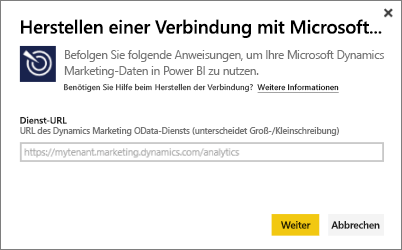
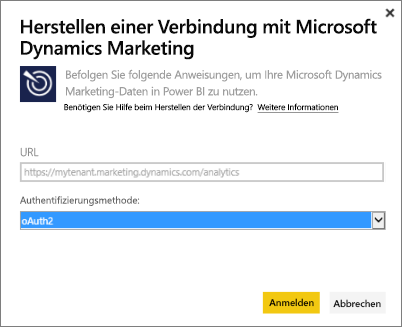
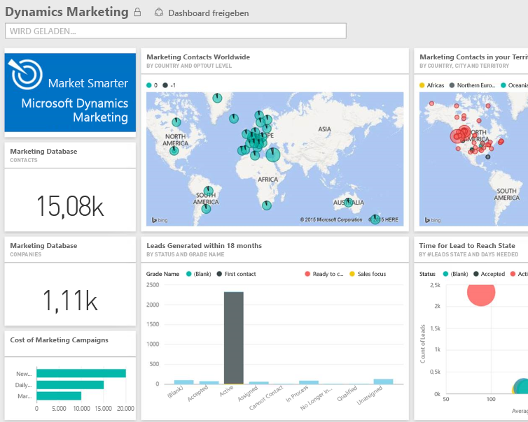

# Herstellen einer Verbindung mit Microsoft Dynamics Marketing mithilfe von Power BI
Mit dem Microsoft Dynamics Marketing-Inhaltspaket für Power BI können Sie ganz einfach auf Ihre Daten von Dynamics Marketing zugreifen und sie analysieren. Das Inhaltspaket verwendet zusätzlich zum OData-Feed ein anschauliches Modell mit allen erforderlichen Entitäten und Measures, z. B. Programme, Kampagnen, Marketingkontakten und Unternehmen, Leads, Leadinteraktionen und Leadbewertungen, E-Mail-Marketingtexten und -Websites, Verhaltensbeobachtungen, Budgets, Finanztransaktionen, Leistungs-KPIs und viele mehr. 

Stellen Sie die Verbindung mit dem [Dynamics Marketing-Inhaltspaket](https://app.powerbi.com/getdata/services/microsoft-dynamics-marketing) für Power BI her.

>[!NOTE]
>Sie müssen eine gültige OData-URL für eine Dynamics Marketing-Instanz angeben (das Inhaltspaket funktioniert nicht mit einer lokalen CRM-Version). Sehen Sie sich auch die zusätzlichen Anforderungen weiter unten an.

## Herstellen der Verbindung
1. Wählen Sie unten im linken Navigationsbereich „Daten abrufen“ aus.
   
    
2. Wählen Sie im Feld **Dienste** die Option **Abrufen**aus.
   
    
3. Wählen Sie **Microsoft Dynamics Marketing** \> **Abrufen** aus.
   
   
4. Stellen Sie die Ihrem Konto zugeordnete OData-URL bereit.  Diese hat das Format: „https://[Instanzname].marketing.dynamics.com/analytics“.
   
   
5. Geben Sie nach der entsprechenden Aufforderung Ihre Anmeldeinformationen ein (dieser Schritt kann übersprungen werden, wenn Sie bereits mit Ihrem Browser angemeldet sind). Geben Sie für die Authentifizierungsmethode **oAuth2** ein, und klicken Sie auf **Anmelden**:
   
   
6. Nachdem die Verbindung hergestellt wurde, wird ein Dynamics Marketing-Dashboard mit Ihren eigenen Daten angezeigt. Die gelben Sternchen im linken Navigationsbereich markieren die neuen Elemente.
   
   

**Was nun?**

* Versuchen Sie, am oberen Rand des Dashboards [im Q&A-Feld eine Frage zu stellen](service-q-and-a.md).
* [Ändern Sie die Kacheln](service-dashboard-edit-tile.md) im Dashboard.
* [Wählen Sie eine Kachel aus](service-dashboard-tiles.md), um den zugrunde liegenden Bericht zu öffnen.
* Ihr Dataset ist auf eine tägliche Aktualisierung festgelegt. Sie können jedoch das Aktualisierungsintervall ändern oder es über **Jetzt aktualisieren** nach Bedarf aktualisieren.

## Systemanforderungen
* Sie müssen eine gültige OData-URL für eine Dynamics Marketing-Instanz angeben (das Inhaltspaket funktioniert nicht mit einer lokalen CRM-Version).  
* Ein Administrator muss den OData-Endpunkt in den Websiteeinstellungen aktivieren. Die Adresse des OData-Endpunkts finden Sie, indem Sie im Abschnitt **Organisationsdatendienst** zu **Start \> Einstellungen \> Websiteeinstellungen** navigieren.  Die OData-URL hat das Format: „https://[Instanzname].marketing.dynamics.com/analytics“.  
* Das Benutzerkonto bzw. die Identität, mit dem/der Sie auf Microsoft Dynamics Marketing zugreifen, muss identisch mit dem/der sein, das/die Sie bei der Registrierung für Power BI verwendet haben. Wenn Sie sich bei Microsoft Dynamics Marketing anmelden, werden Sie automatisch mit derselben Identität angemeldet, die Sie für Power BI verwenden. Wenn Sie sich bei Microsoft Dynamics Marketing mit einem anderen Konto anmelden möchten, registrieren Sie sich mit diesem anderen Konto als Power BI-Benutzer. Wir hoffen, dieses Problem in einer der nächsten Versionen beheben zu können.   

## Problembehandlung
Wenn bei dem Versuch, eine Verbindung zum Dynamics CRM-Konto herzustellen, die Meldung „Anmeldefehler“ angezeigt wird, bestätigen Sie, dass Sie sich mit demselben Konto bei Power BI anmelden, mit dem Sie auf den OData-Feed von CRM Online zugreifen würden. Versuchen Sie sich auch im Browser bei diesem Feed anzumelden, um es von dort aus zu testen.

Bitten Sie Ihren Administrator zu bestätigen, dass die OData-URL richtig und der OData-Endpunkt aktiviert ist.

Überprüfen Sie die Version von Dynamics Marketing, die Sie benutzen. Es gab zusätzliche Fehlerbehebungen für die Versionen 18.0 und 18.1. Wenn also immer noch Probleme auftreten und Sie eine ältere Version haben, sollten Sie ein Upgrade in Betracht ziehen.

Wenn weiterhin Probleme auftreten, öffnen Sie ein Support-Ticket, um das Power BI-Team zu kontaktieren:

* Wählen Sie in der Power BI-App das Fragezeichen \> **Support kontaktieren** aus.
* Wählen Sie auf der Power BI-Supportwebsite (auf der Sie diesen Artikel lesen) auf der rechten Seite die Option **Support kontaktieren** aus.

## Nächste Schritte
[Abrufen von Daten in Power BI](service-get-data.md)

[Erste Schritte mit Power BI](service-get-started.md)

