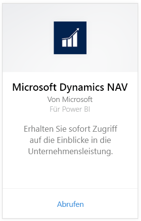
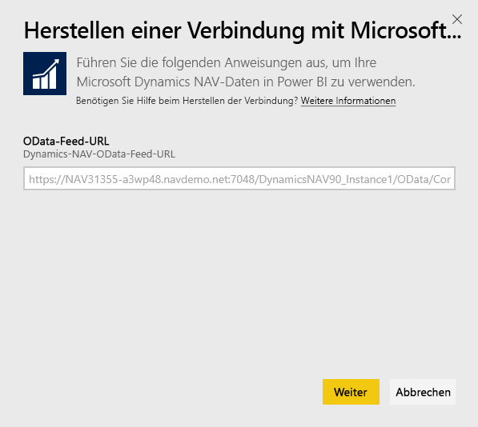
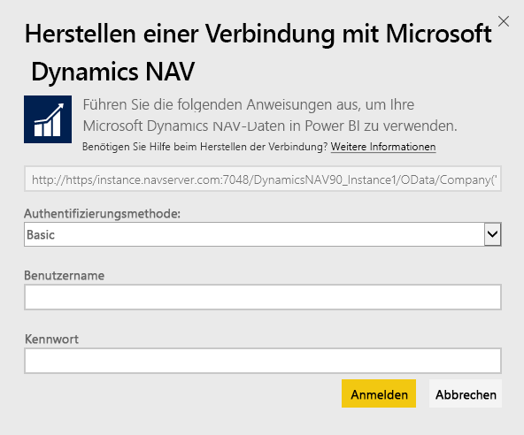
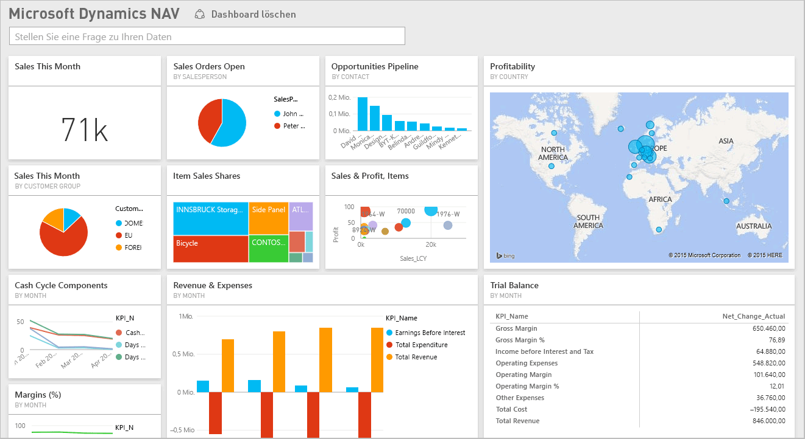

# Herstellen einer Verbindung mit Microsoft Dynamics NAV mithilfe von Power BI
Mit Power BI ist der Einblick in Ihre Microsoft Dynamics NAV-Daten einfach. Power BI ruft Ihre Daten, sowohl Umsatz- als auch Finanzdaten, ab und erstellt eine App mit einem Dashboard und Berichten basierend auf diesen Daten. Sie müssen Power BI Berechtigungen für die Tabellen erteilen, aus denen Daten abgerufen werden, in diesem Fall Tabellen mit Vertriebs- und Finanzdaten. Es folgen weitere Informationen zu den Anforderungen. Nachdem Sie die App installiert haben, können Sie das Dashboard und die Berichte im Power BI-Dienst ([https://powerbi.com](https://powerbi.com)) und in den mobilen Power BI-Apps anzeigen. 

[Stellen Sie eine Verbindung mit Microsoft Dynamics NAV für Power BI her](https://app.powerbi.com/getdata/services/microsoft-dynamics-nav), oder erfahren Sie mehr zur [Dynamics NAV-Integration](https://powerbi.microsoft.com/integrations/microsoft-dynamics-nav) in Power BI.

## Herstellen der Verbindung
[!INCLUDE [powerbi-service-apps-get-more-apps](./includes/powerbi-service-apps-get-more-apps.md)]

1. Wählen Sie **Microsoft Dynamics NAV** und dann **Abrufen** aus.  
   
2. Wenn Sie dazu aufgefordert werden, geben Sie Ihre Microsoft Dynamics NAV-OData-URL ein. Die URL sollte mit folgendem Muster übereinstimmen:
   
    `https//instance.navserver.com:7048/DynamicsNAV90_Instance1/OData/Company('CRONUS%20International%20Ltd.')`
   
   * „instance.navserver.com“ mit dem Namen Ihres NAV-Servers
   * „DynamicsNAV90\_Instance1“ mit dem Namen Ihrer NAV-Serverinstanz
   * „Company('CRONUS%20International%20Ltd.')“ mit dem Namen Ihres NAV-Unternehmens
     
     Eine einfache Möglichkeit zum Abrufen dieser URL besteht darin, in Dynamics NAV zu den Webdiensten zu wechseln, den Webdienst powerbifinance zu suchen und die OData-URL zu kopieren, jedoch „/powerbifinance“ in der URL-Zeichenfolge wegzulassen.  
     
3. Wählen Sie **Standard** aus, und geben Sie Ihre Microsoft Dynamics NAV-Anmeldeinformationen ein.
   
    Sie benötigen Administrator-Anmeldeinformationen (oder zumindest Berechtigungen für Umsatz- und Finanzdaten) für Ihr Microsoft Dynamics NAV-Konto.  Derzeit wird nur die Standardauthentifizierung (Benutzername und Kennwort) unterstützt.
   
    
4. Power BI ruft Ihre Microsoft Dynamics NAV-Daten ab und erstellt für Sie ein gebrauchsfertiges Dashboard und einen Bericht.   
   

## Anzeigen des Dashboards und der Berichte
[!INCLUDE [powerbi-service-apps-open-app](./includes/powerbi-service-apps-open-app.md)]

[!INCLUDE [powerbi-service-apps-open-app](./includes/powerbi-service-apps-what-now.md)]

## Inhalt
Die Dashboards und Berichte enthalten Daten aus den folgenden Tabellen (die Groß-/Kleinschreibung wird beachtet):  

* ItemSalesAndProfit  
* ItemSalesByCustomer  
* powerbifinance  
* SalesDashboard  
* SalesOpportunities  
* SalesOrdersBySalesPerson  
* TopCustomerOverview  

## Systemanforderungen
Um Ihre Microsoft Dynamics NAV-Daten in Power BI zu importieren, müssen Sie über Berechtigungen für die Tabellen mit Umsatz- und Finanzdaten verfügen, aus denen die Daten abgerufen werden (oben aufgelistet). Die Tabellen müssen auch einige Daten enthalten, da leere Tabellen derzeit nicht importiert werden können.

## Problembehandlung
Power BI verwendet die Webdienste von Microsoft Dynamics NAV, um Ihre Daten abzurufen. Wenn in Ihrer Instanz von Microsoft Dynamics NAV viele Daten enthalten sind, besteht eine Möglichkeit zur Minimierung der Auswirkung auf Ihre Webdienstnutzung darin, die Aktualisierungshäufigkeit in Abhängigkeit von Ihren Anforderungen zu ändern. Eine andere Möglichkeit besteht darin, einen Administrator die App erstellen und freigeben zu lassen, sodass nicht jeder Administrator eine eigene App erstellen muss.

**„Fehler beim Überprüfen der Parameter – stellen Sie sicher, dass alle Parameter gültig sind“.**  
Wenn dieser Fehler nach dem Eingeben der Microsoft Dynamics NAV-URL angezeigt wird, stellen Sie sicher, dass die folgenden Bedingungen erfüllt sind:

* Die URL stimmt genau mit diesem Muster überein:
  
    `https//instance.navserver.com:7048/DynamicsNAV90_Instance1/OData/Company('CRONUS%20International%20Ltd.')`
  
  * „instance.navserver.com“ mit dem Namen Ihres NAV-Servers
  * „DynamicsNAV90\_Instance1“ mit dem Namen Ihrer NAV-Serverinstanz
  * „Company('CRONUS%20International%20Ltd.')“ mit dem Namen Ihres NAV-Unternehmens
* Achten Sie darauf, nur Kleinbuchstaben zu verwenden.  
* Vergewissern Sie sich, dass die URL sich auf "https" bezieht.  
* Achten Sie darauf, dass am Ende der URL kein nachgestellter Schrägstrich vorkommt.

**„Anmeldefehler“**  
Wenn Sie die Fehlermeldung „Fehler bei der Anmeldung“ erhalten, nachdem Sie sich mit Ihren Microsoft Dynamics NAV-Anmeldeinformationen angemeldet haben, besteht möglicherweise eines der folgenden Probleme:

* Das verwendete Konto verfügt nicht über die erforderlichen Berechtigungen, um die Microsoft Dynamics NAV-Daten von Ihrem Konto abzurufen. Überprüfen Sie, ob es sich um ein Administratorkonto handelt, und versuchen Sie es erneut.
* Die Dynamics NAV-Instanz, mit der Sie eine Verbindung herstellen möchten, verfügt über kein gültiges SSL-Zertifikat. In diesem Fall wird eine ausführlichere Fehlermeldung angezeigt („Es konnte keine vertrauenswürdige SSL-Beziehung hergestellt werden“). Beachten Sie, dass selbstsignierte Zertifikate nicht unterstützt werden.

**„Entschuldigung“**  
Wenn das Fehlerdialogfeld „Entschuldigung“ angezeigt wird, nachdem Sie sich über das Authentifizierungsdialogfeld angemeldet haben, besteht in Power BI ein Problem beim Laden der Daten.

* Stellen Sie sicher, dass die URL dem oben angegebenen Muster folgt. Ein häufiger Fehler ist die Angabe von Folgendem:
  
    `https//instance.navserver.com:7048/DynamicsNAV90\_Instance1/OData`
  
    Sie müssen jedoch den Abschnitt „Company('CRONUS%20International%20Ltd.')“ mit dem Namen Ihres NAV-Unternehmens einschließen:
  
    `https//instance.navserver.com:7048/DynamicsNAV90\_Instance1/OData/Company('CRONUS%20International%20Ltd.')`

## Nächste Schritte
* [Was sind Apps in Power BI?](service-install-use-apps.md)
* [Abrufen von Daten in Power BI](service-get-data.md)
* Weitere Fragen? [Stellen Sie Ihre Frage in der Power BI-Community.](http://community.powerbi.com/)

