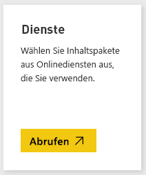
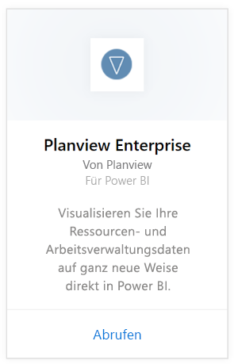
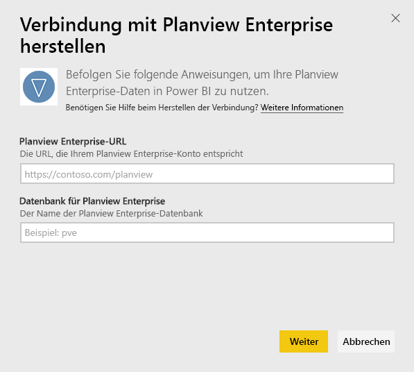
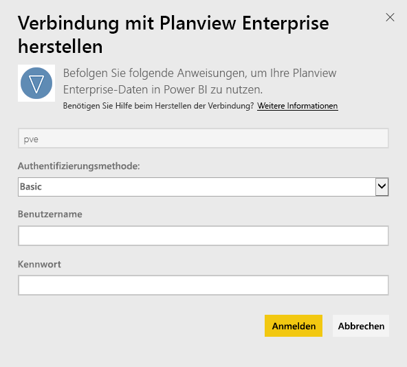
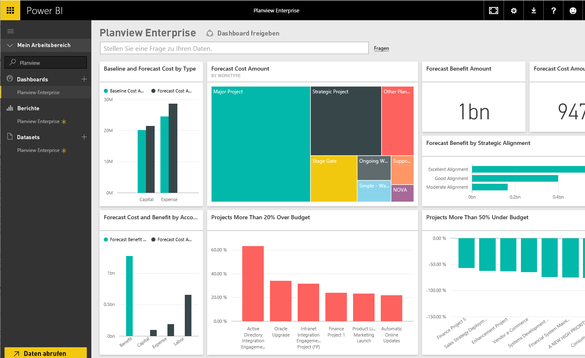

# Herstellen einer Verbindung mit Planview Enterprise mithilfe von Power BI
Mit dem Planview Enterprise-Inhaltspaket können Sie Ihre Ressourcen- und Arbeitsverwaltungsdaten auf ganz neue Weise direkt in Power BI visualisieren. Verwenden Sie Ihre Planview Enterprise-Anmeldeinformationen, um auf interaktive Weise Ihre Portfolio-Investitionsausgaben anzuzeigen und zu sehen, welche Ihrer Projekte sich oberhalb und welche unterhalb des Budgetrahmens befinden und wie gut sich diese im Einklang mit den strategischen Prioritäten des Unternehmens befinden. Sie können das Standarddashboard und die Berichte auch erweitern, um diejenigen Einblicke zu erhalten, die für Sie am wichtigsten sind.

Stellen Sie eine Verbindung mit dem [Planview Enterprise-Inhaltspaket](https://app.powerbi.com/getdata/services/planview-enterprise) für Power BI her.

>[!NOTE]
>Damit Sie Ihre Planview Enterprise-Daten in Power BI importieren können, müssen Sie ein Planview Enterprise-Benutzer sein, für dessen Rolle das Feature zum Anzeigen des Berichtsportals aktiviert ist. Sehen Sie sich auch die zusätzlichen Anforderungen weiter unten an.

## Herstellen der Verbindung
1. Wählen Sie unten im linken Navigationsbereich **Daten abrufen** aus.
   
    
2. Wählen Sie im Feld **Dienste** die Option **Abrufen**aus.
   
    
3. Wählen Sie auf der Power BI-Seite **Planview Enterprise** und dann **Abrufen** aus:  
    
4. Geben Sie im Textfeld „Planview Enterprise-URL“ die URL für den Planview Enterprise-Server ein, den Sie verwenden möchten. Geben Sie im Textfeld „Planview Enterprise-Datenbank“ den Namen der Planview Enterprise-Datenbank ein, und klicken Sie dann auf „Weiter“.  
    
5. Wählen Sie in der Liste „Authentifizierungsmethode“ die Option **Standard** aus, wenn diese nicht bereits ausgewählt ist. Geben Sie den **Benutzernamen** und das **Kennwort** für Ihr Konto ein, und wählen Sie **Anmelden**aus.  
   
6. Wählen Sie im linken Bereich in der Liste der Dashboards „Planview Enterprise“ aus.  
     Power BI importiert Planview Enterprise-Daten in das Dashboard. Beachten Sie, dass das Laden der Daten einige Zeit dauern kann.  
    

**Was nun?**

* Versuchen Sie, am oberen Rand des Dashboards [im Q&A-Feld eine Frage zu stellen](power-bi-q-and-a.md).
* [Ändern Sie die Kacheln](service-dashboard-edit-tile.md) im Dashboard.
* [Wählen Sie eine Kachel aus](service-dashboard-tiles.md), um den zugrunde liegenden Bericht zu öffnen.
* Ihr Dataset ist auf eine tägliche Aktualisierung festgelegt. Sie können jedoch das Aktualisierungsintervall ändern oder es über **Jetzt aktualisieren** nach Bedarf aktualisieren.

## Systemanforderungen
Damit Sie Ihre Planview Enterprise-Daten in Power BI importieren können, müssen Sie ein Planview Enterprise-Benutzer sein, für dessen Rolle das Feature zum Anzeigen des Berichtsportals aktiviert ist. Sehen Sie sich auch die zusätzlichen Anforderungen weiter unten an.

Dieses Verfahren setzt voraus, dass Sie sich bereits auf der Startseite von Microsoft Power BI mit einem Power BI-Konto angemeldet haben. Wenn Sie nicht über ein Power BI-Konto verfügen, erstellen Sie auf der Power BI-Startseite ein neues, kostenloses Power BI-Konto, und klicken Sie dann auf „Daten abrufen“.

## Nächste Schritte:

[Erste Schritte mit Power BI](service-get-started.md)

[Abrufen von Daten in Power BI](service-get-data.md)