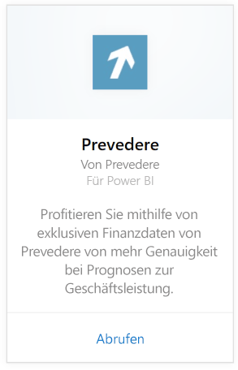
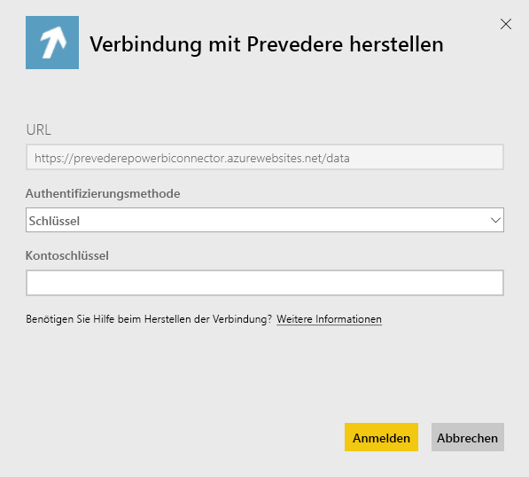

# Herstellen einer Verbindung mit Prevedere mithilfe von Power BI
Erhalten Sie Zugriff auf exklusive und kritische Finanzdaten, um Ihr Geschäft zuverlässig und proaktiv voranzutreiben.

Stellen Sie eine Verbindung mit dem [Prevedere-Inhaltspaket](https://app.powerbi.com/getdata/services/prevedere) für Power BI her.

>[!NOTE]
>Wenn Sie kein vorhandener Prevedere-Benutzer sind, verwenden Sie zum Ausprobieren den [Beispielschlüssel](https://prevederepowerbiconnector.azurewebsites.net/static/learnmore.html).

## Herstellen der Verbindung
1. Wählen Sie unten im linken Navigationsbereich **Daten abrufen** aus.
   
   
2. Wählen Sie im Feld **Dienste** die Option **Abrufen**aus.
   
   
3. Wählen Sie **Prevedere** und anschließend **Abrufen** aus.
   
   
4. Wählen Sie als **Authentifizierungsmethode** die Option **Schlüssel** aus, und geben Sie Ihren Prevedere-API-Schlüssel ein.
   
    
5. Wählen Sie **Anmelden** aus, um den Importvorgang zu starten. Nach Abschluss des Vorgangs werden im Navigationsbereich ein neues Dashboard, ein Bericht und ein Modell angezeigt. Wählen Sie das Dashboard aus, um die importierten Daten anzuzeigen.
   
     

**Was nun?**

* Versuchen Sie, am oberen Rand des Dashboards [im Q&A-Feld eine Frage zu stellen](consumer/end-user-q-and-a.md).
* [Ändern Sie die Kacheln](service-dashboard-edit-tile.md) im Dashboard.
* [Wählen Sie eine Kachel aus](consumer/end-user-tiles.md), um den zugrunde liegenden Bericht zu öffnen.
* Zwar ist Ihr Dataset auf tägliche Aktualisierung festgelegt, jedoch können Sie das Aktualisierungsintervall ändern oder über **Jetzt aktualisieren** nach Bedarf aktualisieren.

## Inhalt
Das Inhaltspaket erhält Einblick in Ihre Einzelhandelsprognosen, Vorhersagemodelle, Leitindikatoren und mehr.

## Systemanforderungen
Dieses Inhaltspaket benötigt den Zugriff auf einen Prevedere-API-Schlüssel oder den Beispielschlüssel (siehe unten).

## Suchen von Parametern

Bestehende Kunden können mithilfe ihrer API-Schlüssel auf ihre Daten zugreifen. Wenn Sie noch kein Kunde sind, sehen Sie ein Beispiel der Daten und Analysen, indem Sie den [Beispielschlüssel](https://prevederepowerbiconnector.azurewebsites.net/static/learnmore.html) verwenden.

## Problembehandlung
Je nach Größe Ihrer Instanz kann es eine gewisse Zeit dauern, bis die Daten geladen sind.

## Nächste Schritte
[Erste Schritte mit Power BI](service-get-started.md)

[Abrufen von Daten in Power BI](service-get-data.md)

