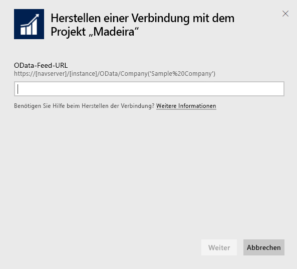
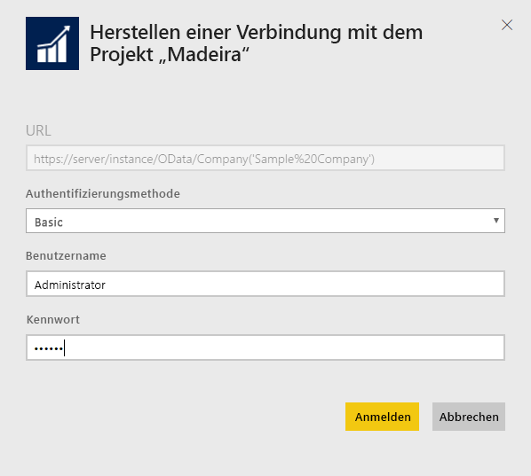
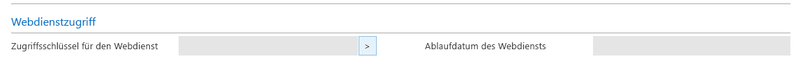
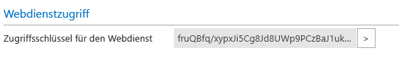

# Herstellen einer Verbindung mit Project „Madeira“ mithilfe von Power BI
Einblicke in Ihre Project „Madeira“-Daten sind jetzt problemlos mit Power BI und dem Project „Madeira“-Inhaltspaket möglich. Power BI ruft Ihre Daten, sowohl Umsatz- als auch Finanzdaten, ab und erstellt ein Standard-Dashboard sowie Berichte basierend auf diesen Daten.
Stellen Sie eine Verbindung mit dem Project „Madeira“-Inhaltspaket für Power BI her, oder erfahren Sie mehr über die Integration von Project „Madeira“ in Power BI.

>[!NOTE]
>Dieses Inhaltspaket erfordert Berechtigungen für die Tabellen, aus denen Daten abgerufen werden, in diesem Fall Tabellen mit Vertriebs- und Finanzdaten. Weitere Informationen zu den Anforderungen finden Sie weiter [unten](#Requirements).

Stellen Sie eine Verbindung mit dem [Project „Madeira“ Analytics-Inhaltspaket](https://app.powerbi.com/getdata/services/project-madeira) für Power BI her.

## Herstellen der Verbindung
1. Wählen Sie unten im linken Navigationsbereich **Daten abrufen** aus.  
    
2. Wählen Sie im Feld **Dienste** die Option **Abrufen**aus.  
    
3. Wählen Sie **Project „Madeira“** und dann **Abrufen** aus.  
    
4. Geben Sie Ihre Project „Madeira“-URL ein, wenn Sie aufgefordert werden. Die URL muss genau das folgende Muster aufweisen: https://mycronusus.projectmadeira.com:7048/NAV/OData/Company('CRONUS%20US') mit Ihrem Project „Madeira“-Firmennamen. Beachten Sie, dass am Ende kein Schrägstrich verwendet werden darf und dass die Verbindung per HTTPS erfolgen muss. Einzelheiten zum Ermitteln dieser URL finden Sie [weiter unten](#FindingParams).  
   
    
5. Wenn Sie aufgefordert werden, wählen Sie die Standardauthentifizierungsmethode aus und geben Ihre E-Mail-Adresse für Project „Madeira“ als Benutzernamen und die Webdienst-Zugriffsschlüssel für Ihr Project „Madeira“-Konto als Kennwort ein. Wenn Sie in Ihrem Browser bereits bei Project „Madeira“ angemeldet sind, werden Sie möglicherweise nicht zur Eingabe von Anmeldeinformationen aufgefordert. Einzelheiten zum Erstellen dieses Zugriffsschlüssels finden Sie [weiter unten](#FindingParams).  
   
    >[!NOTE]
    >Sie müssen in Project „Madeira“ Superuser sein.
   
   
6. Sobald Sie verbunden sind, werden ein Dashboard, ein Bericht und ein Dataset automatisch geladen. Anschließend werden die Kacheln mit Daten aus Ihrem Konto aktualisiert.  
   
    

**Was nun?**

* Versuchen Sie, am oberen Rand des Dashboards [im Q&A-Feld eine Frage zu stellen](power-bi-q-and-a.md).
* [Ändern Sie die Kacheln](service-dashboard-edit-tile.md) im Dashboard.
* [Wählen Sie eine Kachel aus](service-dashboard-tiles.md), um den zugrunde liegenden Bericht zu öffnen.
* Ihr Dataset ist auf eine tägliche Aktualisierung festgelegt. Sie können jedoch das Aktualisierungsintervall ändern oder es über **Jetzt aktualisieren** nach Bedarf aktualisieren.

## Systemanforderungen
Um Ihre Project „Madeira“-Daten in Power BI zu importieren, müssen Sie über Berechtigungen für die Tabellen mit Vertriebs- und Finanzdaten verfügen, aus denen die Daten abgerufen werden. Es folgen alle Tabellen (Groß-/Kleinschreibung beachten), die für das Inhaltspaket erforderlich sind:  
 
    ´´´ 
    - ItemSalesAndProfit  
    - ItemSalesByCustomer  
    - powerbifinance  
    - SalesDashboard  
    - SalesOpportunities  
    - SalesOrdersBySalesPerson  
    - TopCustomerOverview  
    ´´´ 

## Suchen von Parametern
**Abrufen der richtigen URL:** Eine einfache Möglichkeit zum Abrufen dieser URL besteht darin, in Project „Madeira“ zu den Webdiensten zu wechseln, den Webdienst „powerbifinance“ zu suchen und die OData-URL zu kopieren (verwenden Sie den Kontextmenübefehl „Kopieren“). Lassen Sie jedoch den Teil „/powerbifinance...“ in der URL-Zeichenfolge weg.

**Webdienst-Zugriffsschlüssel:** Um Daten aus Project „Madeira“ zu verwenden, müssen Sie einen Webdienst-Zugriffsschlüssel für Ihr Benutzerkonto erstellen. Suchen Sie in Project „Madeira“ die Seite „Benutzer“, und öffnen Sie die Registerkarte für Ihr Benutzerkonto. Hier können Sie einen neuen Webdienst-Zugriffsschlüssel generieren, den Sie dann auf der Power BI-Verbindungsseite in das Kennwortfeld kopieren.

Sie müssen mit Webdienst-Zugriffsschlüsseln beginnen, müssen Sie diese auch weiter verwenden. Wählen Sie deshalb in der angezeigten Nachricht „OK“ aus.
Sie können beim Erstellen des Schlüssels auswählen, ob dieser zu einem bestimmten Datum ablaufen soll.

Wenn Sie „OK“ auswählen, wird ein Schlüssel erstellt. Sie können diesen dann auf der Verbindungsseite von Power BI in das Feld „Kennwort“ kopieren.

## Problembehandlung
Das Power BI-Dashboard ist von den oben aufgeführten veröffentlichten Webdiensten abhängig. Es werden entweder Daten aus dem Beispielunternehmen oder aus Ihrem Unternehmen angezeigt, sofern Sie Daten aus Ihrer aktuellen Finanzlösung importieren. Wenn Fehler auftreten, finden Sie in diesem Abschnitt Problemumgehungen für die häufigsten Probleme.

**„Fehler beim Überprüfen der Parameter – stellen Sie sicher, dass alle Parameter gültig sind“.**

Wenn dieser Fehler angezeigt wird, nachdem Sie die URL vom Projekt „Madeira“ eingeben, stellen Sie sicher, dass die folgenden Bedingungen erfüllt sind:  

   - Die URL stimmt genau mit diesem Muster überein: „https://*mycronusus*.projectmadeira.com:7048/NAV/OData/Company('*CRONUS%20US*')“.  
   - Löschen Sie sämtlichen Text nach dem Unternehmensnamen in Klammern.  
   - Achten Sie darauf, dass am Ende der URL kein nachgestellter Schrägstrich vorkommt.  
   - Stellen Sie sicher, dass die URL eine sichere Verbindung verwendet. Dies wird durch „https“ am Anfang der URL gekennzeichnet.  

**„Fehler bei der Anmeldung“:** Wenn beim Anmelden beim Dashboard mit Ihren Project „Madeira“-Anmeldeinformationen ein „Fehler bei der Anmeldung“ auftritt, kann dies durch eines der folgenden Probleme verursacht worden sein:  

   - Das von Ihnen verwendete Konto verfügt nicht über die Berechtigungen zum Lesen der Project „Madeira“-Daten aus Ihrem Konto. Überprüfen Sie Ihr Benutzerkonto in Project „Madeira“, und vergewissern Sie sich, dass Sie den richtigen Webdienst-Zugriffsschlüssel als Kennwort verwendet haben. Wiederholen Sie den Vorgang dann noch einmal.  
   - Die Project „Madeira“-Instanz, mit der Sie eine Verbindung herzustellen versuchen, besitzt kein gültiges SSL-Zertifikat. In diesem Fall wird eine ausführlichere Fehlermeldung angezeigt („Es konnte keine vertrauenswürdige SSL-Beziehung hergestellt werden“). Beachten Sie, dass selbstsignierte Zertifikate nicht unterstützt werden.  

**„Entschuldigung“:** Wenn das Fehlerdialogfeld „Entschuldigung“ angezeigt wird, nachdem Sie sich über das Authentifizierungsdialogfeld angemeldet haben, besteht häufig ein Problem beim Herstellen einer Verbindung mit den Daten für das Inhaltspaket. Vergewissern Sie sich, dass die URL dem oben angegebenen Muster entspricht:  
    https://*mycronusus*.projectmadeira.com:7048/NAV/OData/Company('*CRONUS%20US*')

Ein häufiger Fehler besteht darin, die vollständige URL für einen bestimmten Webdienst anzugeben:  
    https://*mycronusus*.projectmadeira.com:7048/NAV/OData/Company('*CRONUS%20US*')/powerbifinance

Möglicherweise haben Sie auch vergessen, den Unternehmensnamen anzugeben:   
    https://*mycronusus*.projectmadeira.com:7048/NAV/OData/

## Nächste Schritte
[Erste Schritte mit Power BI](service-get-started.md)

[Power BI – Grundkonzepte](service-basic-concepts.md)

