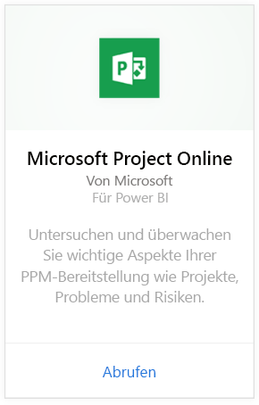
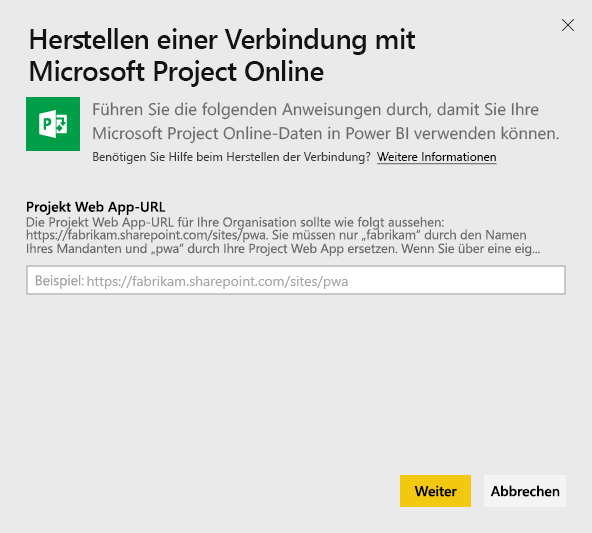
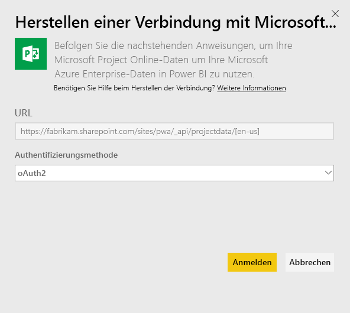
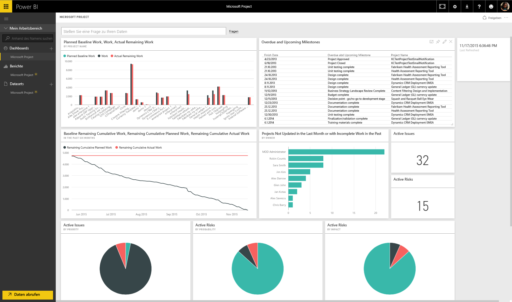
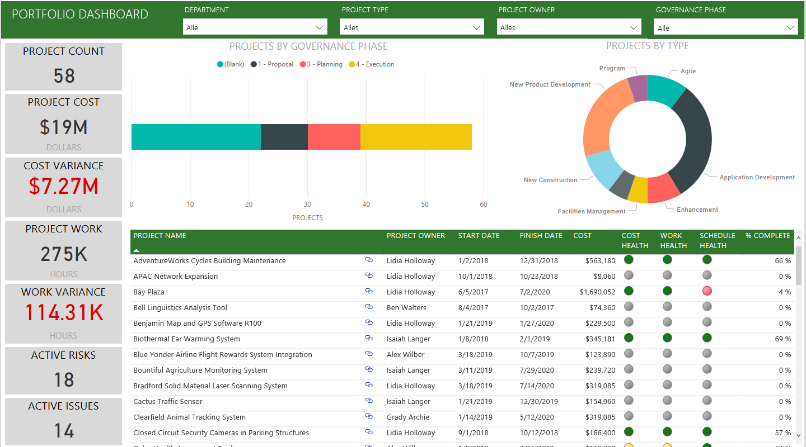
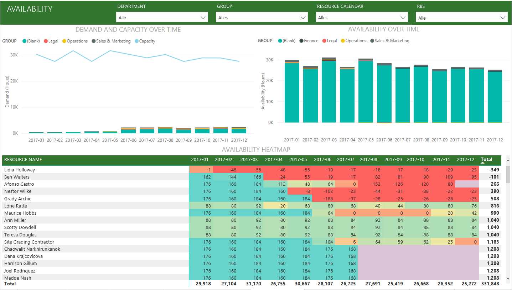
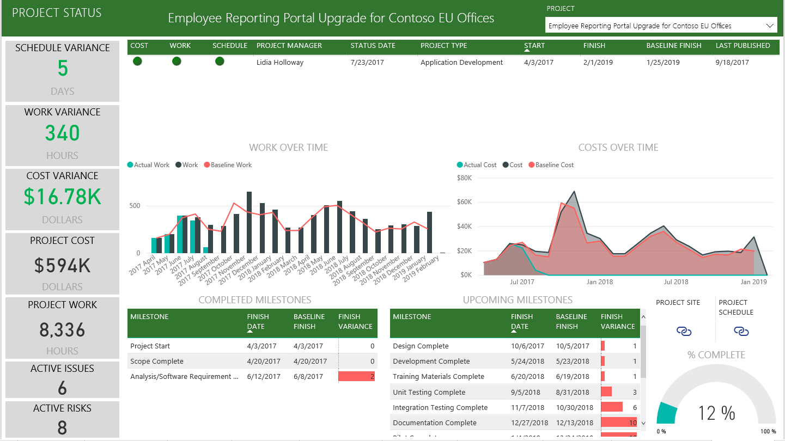

# Herstellen einer Verbindung mit Project Online mithilfe von Power BI
Microsoft Project Online ist eine flexible Onlinelösung für das Projektportfoliomanagement (PPM) und die tägliche Arbeit. Project Online versetzt Organisationen dazu in die Lage, die ersten Schritte zu unternehmen, Investitionen in Projektportfolios zu priorisieren und den beabsichtigten Geschäftserfolg zu realisieren. Mit dem Project Online-Inhaltspaket für Power BI können Sie Erkenntnisse von Project Online nutzen, um das Verwalten von Projekten, Portfolios und Ressourcen zu vereinfachen.

Stellen Sie eine Verbindung zum [Project Online-Inhaltspaket](https://app.powerbi.com/getdata/services/project-online) für Power BI her.

## Herstellen der Verbindung
1. Wählen Sie unten im linken Navigationsbereich **Daten abrufen** aus.
   
    
2. Wählen Sie im Feld **Dienste** die Option **Abrufen**aus.
   
   
3. Wählen Sie **Microsoft Project Online** \> **Abrufen** aus.
   
   
4. Geben Sie im Textfeld **Project Web App-URL** die URL für die Project Web App (PWA) ein, mit der Sie eine Verbindung herstellen möchten, und klicken Sie dann auf **Weiter**. Beachten Sie, dass dies bei Verwendung einer benutzerdefinierten Domäne vom Beispiel abweichen kann. Geben Sie im Textfeld **PWA Site Language** (PWA-Websitesprache) die Zahl ein, die der Sprache Ihrer PWA-Website entspricht. Geben Sie die einzelne Zahl „1“ für Englisch, „2“ für Französisch, „3“ für Deutsch, „4“ für Portugiesisch (Brasilien), „5“ für Portugiesisch (Portugal) oder „6“ für Spanisch ein. 
   
    
5. Wählen Sie als Authentifizierungsmethode die Option **oAuth2** \> **Anmelden** aus. Wenn Sie dazu aufgefordert werden, geben Sie Ihre Project Online-Anmeldeinformationen ein, und führen Sie den Authentifizierungsvorgang aus.
   
    
    
Beachten Sie, dass Sie über Portfolio Viewer-, Portfolio Manager- oder Administratorberechtigungen für die Projekt-Web-App verfügen müssen, mit der Sie sich verbinden.

6. Eine Benachrichtigung wird angezeigt, dass Ihre Daten geladen werden. Je nach Größe Ihres Kontos kann dies einige Zeit dauern. Nachdem die Daten von Power BI importiert wurden, werden im linken Navigationsbereich ein neues Dashboard, 13 Berichte und ein Dataset angezeigt. Dies ist der Standarddashboard, das Power BI zum Anzeigen Ihrer Daten erstellt hat. Sie können dieses Dashboard anpassen, damit Ihre Daten auf die gewünschte Weise angezeigt werden.

   

7. Sobald Ihr Dashboard und Ihre Berichte bereit sind, können Sie Ihre Project Online-Daten erkunden. Das Inhaltspaket enthält 13 umfangreiche und detaillierte Berichte für die Portfolio-Übersicht (sechs Berichtsseiten), die Ressourcen-Übersicht (fünf Berichtsseiten) und für den Projektstatus (zwei Berichtsseiten). 

   
   
   
   
   

**Was nun?**

* Versuchen Sie, am oberen Rand des Dashboards [im Q&A-Feld eine Frage zu stellen](consumer/end-user-q-and-a.md).
* [Ändern Sie die Kacheln](service-dashboard-edit-tile.md) im Dashboard.
* [Wählen Sie eine Kachel aus](consumer/end-user-tiles.md), um den zugrunde liegenden Bericht zu öffnen.
* Zwar ist Ihr Dataset auf tägliche Aktualisierung festgelegt, jedoch können Sie das Aktualisierungsintervall ändern oder über **Jetzt aktualisieren** nach Bedarf aktualisieren.

**Erweitern des Inhaltspakets**

Laden Sie die [PBIT-Datei von GitHub](https://github.com/OfficeDev/Project-Power-BI-Content-Packs) runter, um das Inhaltspaket weiter anzupassen und zu aktualisieren.

## Nächste Schritte
[Erste Schritte mit Power BI](service-get-started.md)

[Abrufen von Daten in Power BI](service-get-data.md)

