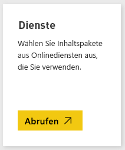
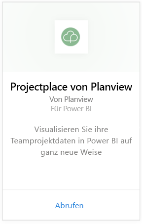
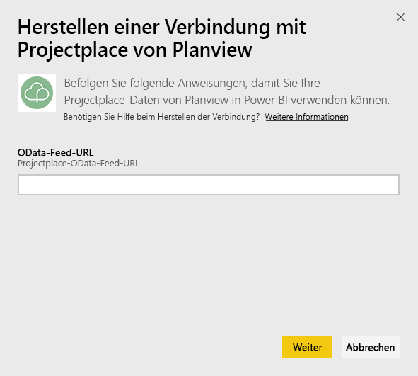
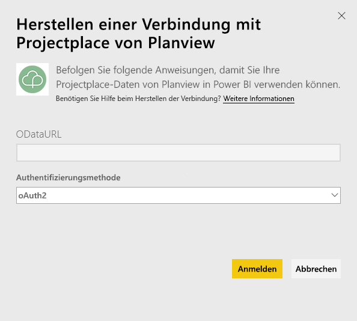
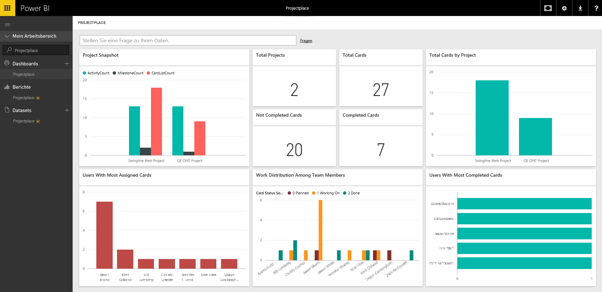

# Herstellen einer Verbindung mit Projectplace von Planview mithilfe von Power BI
Mit dem Projectplace by Planview-Inhaltspaket können Sie Ihre kooperativen Projektdaten auf ganz neue Weise direkt in Power BI visualisieren. Verwenden Sie Ihre Projectplace-Anmeldeinformationen, um auf interaktive Weise wichtige Projektstatistiken anzuzeigen, Ihre aktivsten und produktivsten Teammitglieder zu ermitteln und risikoreiche Karten und Aktivitäten über sämtliche Projekte in Ihrem Projectplace-Konto hinweg zu identifizieren. Sie können das Standarddashboard und die Berichte auch erweitern, um diejenigen Einblicke zu erhalten, die für Sie am wichtigsten sind.

[Herstellen einer Verbindung mit dem Projectplace-Inhaltspaket in Power BI](https://app.powerbi.com/getdata/services/projectplace)

>[!NOTE]
>Damit Sie Ihre Projectplace-Daten in Power BI importieren können, müssen Sie ein Projectplace-Benutzer sein. Sehen Sie sich auch die zusätzlichen Anforderungen weiter unten an.

## Herstellen der Verbindung
1. Wählen Sie unten im linken Navigationsbereich **Daten abrufen** aus.
   
    
2. Wählen Sie im Feld **Dienste** die Option **Abrufen**aus.
   
    
3. Wählen Sie auf der Power BI-Seite **Projectplace by Planview** und dann **Abrufen** aus:  
   
    
4. Geben Sie im Textfeld „OData-Feed-URL“ die URL für den zu verwendenden Projectplace-OData-Feed ein, wie in der folgenden Abbildung dargestellt:
   
    
5. Wählen Sie in der Liste „Authentifizierungsmethode“ die Option **OAuth** aus, wenn diese nicht bereits ausgewählt ist. Klicken Sie auf **Anmelden**, und befolgen Sie die Anweisungen bei der Anmeldung.  
   
   
6. Wählen Sie im linken Bereich in der Liste der Dashboards **Projectplace** aus. Power BI importiert Projectplace-Daten in das Dashboard. Beachten Sie, dass das Laden der Daten einige Zeit dauern kann.  
   
    Das Dashboard enthält Kacheln, auf denen Daten aus Ihrer Projectplace-Datenbank angezeigt werden. Die folgende Abbildung zeigt ein Beispiel des standardmäßigen Projectplace-Dashboards in Power BI.
   
    

**Was nun?**

* Versuchen Sie, am oberen Rand des Dashboards [im Q&A-Feld eine Frage zu stellen](power-bi-q-and-a.md).
* [Ändern Sie die Kacheln](service-dashboard-edit-tile.md) im Dashboard.
* [Wählen Sie eine Kachel aus](service-dashboard-tiles.md), um den zugrunde liegenden Bericht zu öffnen.
* Ihr Dataset ist auf eine tägliche Aktualisierung festgelegt. Sie können jedoch das Aktualisierungsintervall ändern oder es über **Jetzt aktualisieren** nach Bedarf aktualisieren.

## Systemanforderungen
Damit Sie Ihre Projectplace-Daten in Power BI importieren können, müssen Sie ein Projectplace-Benutzer sein. Dieses Verfahren setzt voraus, dass Sie sich bereits auf der Startseite von Microsoft Power BI mit einem Power BI-Konto angemeldet haben. Wenn Sie nicht über ein Power BI-Konto verfügen, erstellen Sie auf der Power BI-Startseite ein neues, kostenloses Power BI-Konto, und klicken Sie dann auf „Daten abrufen“.

## Nächste Schritte
[Erste Schritte mit Power BI](service-get-started.md)

[Power BI – Grundkonzepte](service-basic-concepts.md)

