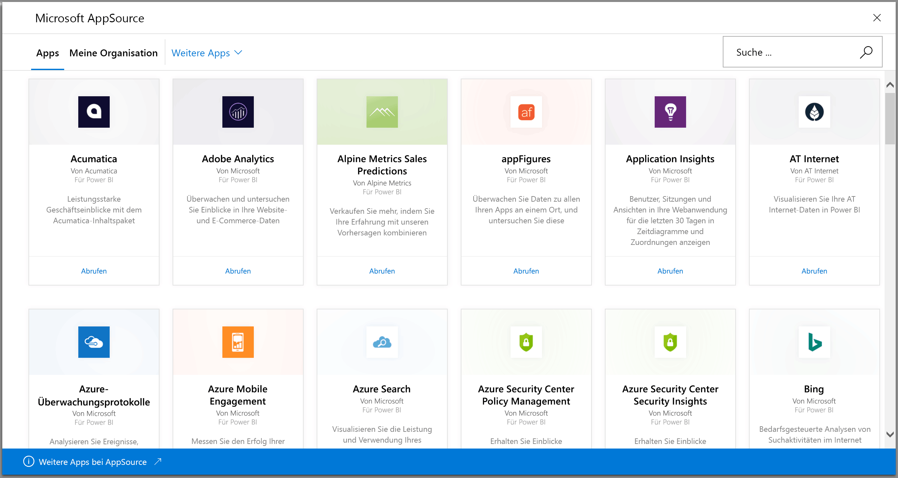
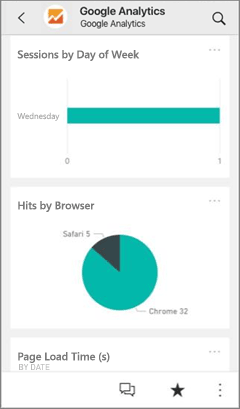
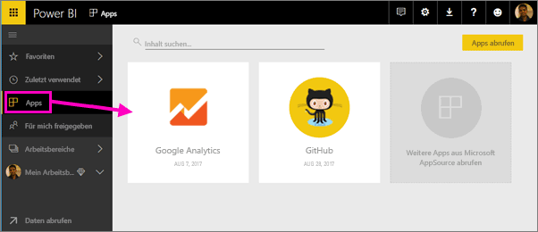
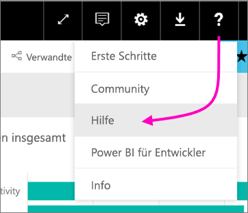

# Herstellung einer Verbindung mit den verwendeten Diensten mithilfe von Power BI
Mit Power BI können Sie zu viele Dienste verbinden, die Sie verwenden, um Ihre Geschäfte, z. B. Salesforce, Microsoft Dynamics und Google Analytics. Powerbi beginnt mit Ihren Anmeldeinformationen eine Verbindung mit dem Dienst herstellen. Erstellen einer Power BI *Arbeitsbereich* mit einem Dashboard und einen Satz von Power BI-Berichte, die automatisch Ihre Daten anzeigen und Ihnen visuell Erkenntnisse über Ihr Unternehmen.

Melden Sie sich bei Power BI zum Anzeigen aller dem [Services können Sie mit verbinden](https://app.powerbi.com/getdata/services). 

Nachdem Sie die app installiert haben, sehen Sie die Dashboards und Berichte in der app und den Arbeitsbereich in Power BI-Dienst ([https://app.powerbi.com](https://app.powerbi.com)). Sie können auch in den mobilen Power BI-apps anzeigen. Im Arbeitsbereich können Sie ändern die Dashboards und Berichte, um die Anforderungen Ihrer Organisation erfüllen, und klicken Sie dann an Ihre Kollegen als Verteilen einer *app*. 

## Erste Schritte
[!INCLUDE [powerbi-service-apps-get-more-apps](./includes/powerbi-service-apps-get-more-apps.md)]

## Bearbeiten Sie die Dashboards und Berichte
Wenn der Importvorgang abgeschlossen ist, wird die neue App auf der Seite „Apps“ angezeigt.

1. Wählen Sie im linken Navigationsbereich **Apps** und dann die App aus.
   
     
2. Sie können eine Frage im Bereich für Fragen und Antworten stellen oder auf eine Kachel klicken, um den zugrunde liegenden Bericht zu öffnen. 
   
    
   
    Ändern Sie das Dashboard und Bericht zu den Anforderungen Ihrer Organisation entsprechen. Klicken Sie dann [verteilen Sie Ihre app an Ihre Kollegen](service-create-distribute-apps.md)

## Inhalt
Nach dem Herstellen einer Verbindung mit einem Dienst, sehen Sie eine neu erstellte app und der Arbeitsbereich mit einem Dashboard, Berichte und Datasets. Die Daten aus dem Dienst beziehen sich auf ein bestimmtes Szenario und enthalten möglicherweise nicht alle Informationen aus dem Dienst. Die Daten werden automatisch einmal täglich aktualisiert. Sie können den Zeitplan für die Aktualisierung steuern, indem Sie das Dataset auswählen.

Sie können auch [Herstellen einer Verbindung zahlreiche Dienste in Power BI Desktop mit](desktop-data-sources.md), z.B. Google Analytics, und erstellen Sie eigene angepasste Dashboards und Berichte.  

Weitere Informationen zum Verbinden mit bestimmten Diensten finden Sie in den jeweiligen Hilfeseiten.

## Problembehandlung
**Leere Kacheln**  
Möglicherweise wird eine Reihe leerer Kacheln auf dem Dashboard angezeigt, während Power BI zunächst die Verbindung mit dem Dienst herstellt. Falls nach zwei Stunden immer noch ein leeres Dashboard angezeigt wird, ist die Verbindung wahrscheinlich fehlgeschlagen. Wenn eine Fehlermeldung mit Informationen zum Beheben des Problems nicht angezeigt wird, ein supportticket.

* Wählen Sie das Fragezeichen ( **?** ) in der rechten oberen Ecke und dann **Hilfe** aus.
  
    

**Fehlende Informationen**  
Die Dashboards und Berichte enthalten Inhalte aus dem Dienst mit Fokus auf ein bestimmtes Szenario. Wenn Sie für eine bestimmte Metrik in der app suchen und diese nicht angezeigt, hinzufügen, eine Vorstellung der [Power BI-Support](https://support.powerbi.com/forums/265200-power-bi) Seite.

## Vorschlagen von Diensten
Verwenden Sie einen Dienst, den Sie für eine Power BI-App vorschlagen möchten? Gehen Sie auf die Seite [Power BI-Support](https://support.powerbi.com/forums/265200-power-bi), und lassen Sie es uns wissen.

Wenn Sie daran interessiert sind, Ihre eigenen Vorlagen-Apps zu erstellen und zu verteilen, finden Sie Informationen dazu unter [Create a template app in Power BI (Erstellen einer Vorlagen-App in Power BI)](service-template-apps-create.md). Power BI-Partner können Power BI-apps mit nur wenig oder gar keinen Code erstellen und diese in Power BI-Kunden bereitstellen. 

## Nächste Schritte
* [Verteilen Sie apps an Ihre Kollegen](service-create-distribute-apps.md)
* [Erstellen Sie die neue Arbeitsbereiche in Power BI](service-create-the-new-workspaces.md)
* Haben Sie Fragen? [Stellen Sie Ihre Frage in der Power BI-Community.](http://community.powerbi.com/)
* Weitere Fragen? [Stellen Sie Ihre Frage in der Power BI-Community.](http://community.powerbi.com/)

