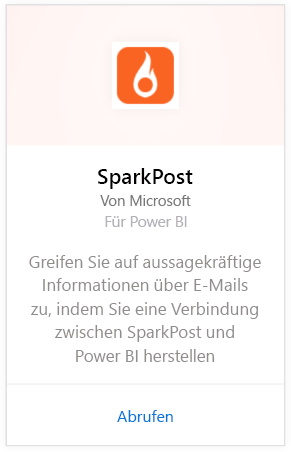
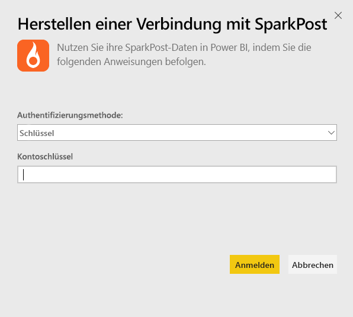
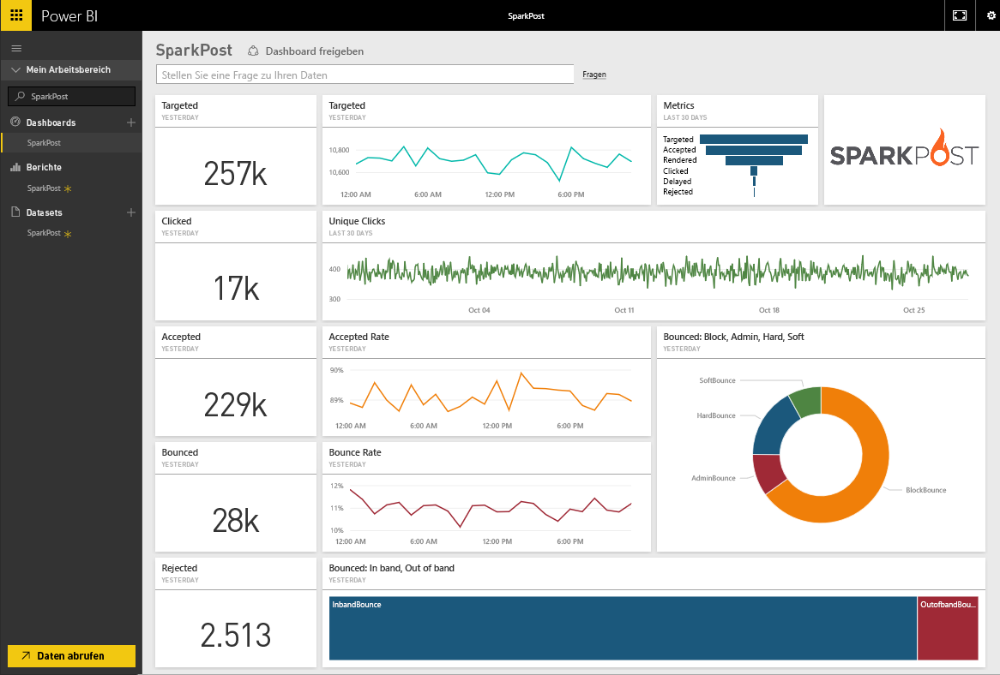
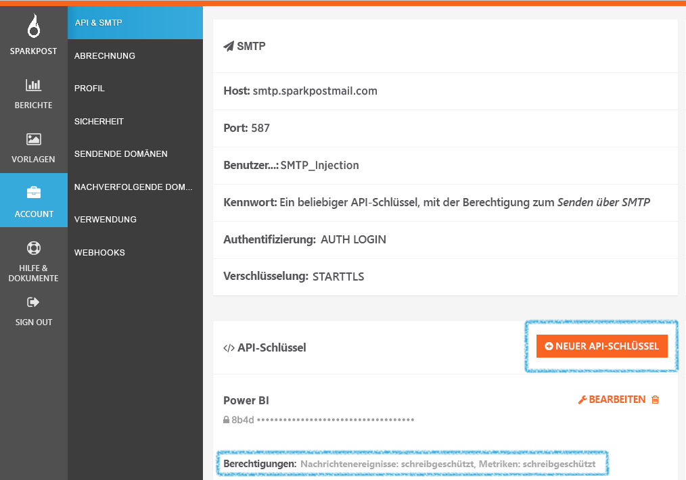

# Herstellen einer Verbindung mit SparkPost mithilfe von Power BI
Das Power BI-Inhaltspaket für SparkPost ermöglicht Ihnen, wertvolle Datasets aus Ihrem SparkPost-Konto in ein aussagekräftiges Dashboard zu extrahieren. Mit dem SparkPost-Inhaltspaket können Sie Ihre gesamte E-Mail-Statistik visualisieren, einschließlich Domänen, Kampagnen und Kundenbindung nach Internetdienstanbieter.

Stellen Sie eine Verbindung mit dem [SparkPost-Inhaltspaket für Power BI](https://app.powerbi.com/getdata/services/spark-post) her.

## Herstellen der Verbindung
1. Wählen Sie unten im linken Navigationsbereich **Daten abrufen** aus.
   
   
2. Wählen Sie im Feld **Dienste** die Option **Abrufen**aus.
   
   
3. Wählen Sie das **SparkPost**-Inhaltspaket aus, und klicken Sie auf **Abrufen**. 
   
   
4. Wenn Sie dazu aufgefordert werden, geben Sie Ihren SparkPost-API-Schlüssel an, und wählen Sie „Anmelden“ aus. Nachstehend finden Sie weitere Informationen zum [Suchen dieser Parameter](#FindingParams).
   
   
5. Das Laden Ihrer Daten beginnt. Je nach Größe Ihres Kontos kann dies einige Zeit dauern. Nachdem Power BI die Daten importiert hat, werden im linken Navigationsbereich das Standarddashboard, ein Bericht und ein Dataset mit Ihrer E-Mail-Statistik für die letzten 90 Tage angezeigt. Neue Elemente werden mit einem gelben Sternchen \* markiert.
   
   

**Was nun?**

* Versuchen Sie, am oberen Rand des Dashboards [im Q&A-Feld eine Frage zu stellen](power-bi-q-and-a.md).
* [Ändern Sie die Kacheln](service-dashboard-edit-tile.md) im Dashboard.
* [Wählen Sie eine Kachel aus](service-dashboard-tiles.md), um den zugrunde liegenden Bericht zu öffnen.
* Ihr Dataset ist auf eine tägliche Aktualisierung festgelegt. Sie können jedoch das Aktualisierungsintervall ändern oder es über **Jetzt aktualisieren** nach Bedarf aktualisieren.

## Inhalt
Das SparkPost-Inhaltspaket für Power BI enthält Informationen wie einmalige Klicks, die Anzahl akzeptierter Aufrufe, Absprungraten, die Anzahl verzögerter Aufrufe, die Anzahl abgelehnter Aufrufe und weitere.

## Suchen von Parametern
Das Inhaltspaket verwendet einen API-Schlüssel, um Ihr SparkPost-Konto mit Power BI zu verbinden. Sie finden Ihren API-Schlüssel in Ihrem Konto unter „Konto“ \> „API und SMTP“ (weitere Informationen finden Sie [hier](https://support.sparkpost.com/customer/portal/articles/1933377-create-api-keys)). Es wird empfohlen, einen API-Schlüssel mit Berechtigungen für `Message Events: Read-only ` und `Metrics: Read-only` zu verwenden.

