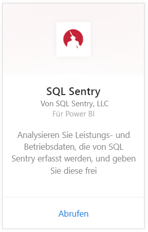
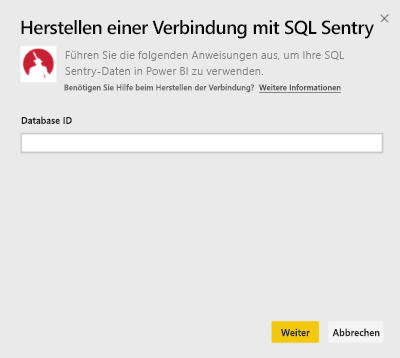
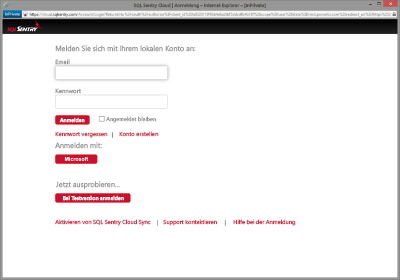
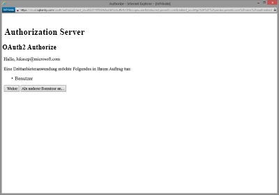
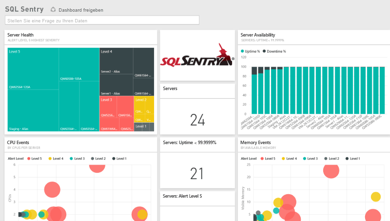
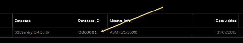
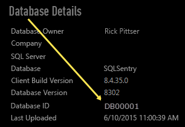

# Herstellen einer Verbindung mit SQL Sentry mithilfe von Power BI
Das Analysieren Ihrer mithilfe von SQL Sentry gesammelten Leistungsdaten ist mit Power BI ganz einfach. Power BI ruft Ihre Daten ab und erstellt auf Basis dieser Daten ein Standarddashboard und zugehörige Berichte.

Stellen Sie eine Verbindung zum [SQL Sentry-Inhaltspaket](https://app.powerbi.com/groups/me/getdata/services/sql-sentry) für Power BI her.

>[!NOTE]
>Für das Herstellen der Verbindung sind Zugriff auf ein SQL Sentry-Konto, das Sie für die Verbindung mit „http://cloud.sqlsentry.com“ verwenden, und die ID der zu überwachenden Datenbank erforderlich.  Hinweise, wie Sie die Datenbank-ID finden, sind unten aufgeführt.

## Herstellen der Verbindung
1. Wählen Sie unten im linken Navigationsbereich **Daten abrufen** aus.
   
   
2. Wählen Sie im Feld **Dienste** die Option **Abrufen**aus.
   
    
3. Wählen Sie **SQL Sentry \> Abrufen** aus.
   
   
4. Geben Sie die **Datenbank-ID** der Datenbank ein, die Sie in Power BI überwachen möchten. Weitere Einzelheiten zum [Ermitteln dieses Werts](#FindingParams) finden Sie unten.
   
   
5. Wählen Sie für die Authentifizierungsmethode **oAuth2 \> Anmelden** aus.
   
   Geben Sie bei der entsprechenden Aufforderung Ihre Anmeldeinformationen für „cloud.sqlsentry.com“ ein, und führen Sie den SQL Sentry-Authentifizierungsvorgang aus.
   
   
   
   Wenn Sie die Verbindung zum ersten Mal herstellen, werden Sie von Power BI aufgefordert, den Lesezugriff auf Ihr Konto zu erteilen. Klicken Sie auf „Erteilen“, um den Importvorgang zu starten.  Dies kann je nach der im Konto enthaltenen Datenmenge einige Minuten dauern.
   
   
6. Nachdem die Daten von Power BI importiert wurden, werden im linken Navigationsbereich ein neues Dashboard, ein Bericht und ein Dataset angezeigt. Neue Elemente werden mit einem gelben Sternchen (\*) markiert:
   
   
7. Wählen Sie das SQL Sentry-Dashboard aus.
   
   Dies ist der Standarddashboard, das Power BI zum Anzeigen Ihrer Daten erstellt. Sie können dieses Dashboard anpassen, damit Ihre Daten auf die gewünschte Weise angezeigt werden.
   
   

**Was nun?**

* Versuchen Sie, am oberen Rand des Dashboards [im Q&A-Feld eine Frage zu stellen](power-bi-q-and-a.md).
* [Ändern Sie die Kacheln](service-dashboard-edit-tile.md) im Dashboard.
* [Wählen Sie eine Kachel aus](service-dashboard-tiles.md), um den zugrunde liegenden Bericht zu öffnen.
* Ihr Dataset ist auf eine tägliche Aktualisierung festgelegt. Sie können jedoch das Aktualisierungsintervall ändern oder es über **Jetzt aktualisieren** nach Bedarf aktualisieren.

## Inhalt
Die folgenden Daten sind über SQL Sentry in Power BI verfügbar:

| Tabellenname | Beschreibung |
| --- | --- |
| Verbindung |Diese Tabelle enthält Informationen über Ihre definierten SQL Sentry-Verbindungen. |
| Datum (Date)  |Diese Tabelle enthält die Datumswerte von heute zurück zum frühesten Datum, an dem Leistungsdaten gesammelt und aufbewahrt wurden. |
| Downtime  |Diese Tabelle enthält Informationen über die Ausfallzeiten und Betriebszeiten für jeden überwachten Server in Ihrer Umgebung. |
| Memory Usage  |Diese Tabelle enthält Daten über den verfügbaren oder freien Arbeitsspeicher auf jedem Ihrer Server.  |
| Server  |Diese Tabelle enthält Datensätze für jeden Server in Ihrer Umgebung. |
| Server Health  |Diese Tabelle enthält Daten zu sämtlichen Ereignissen, die durch benutzerdefinierte Bedingungen in Ihrer Umgebung generiert wurden, einschließlich Schweregrad und Anzahl. |

## Suchen von Parametern
Die **Datenbank-ID** können Sie ermitteln, indem Sie sich in einem neuen Webbrowserfenster bei <https://cloud.sqlsentry.com> anmelden.  Die **Datenbank-ID** ist auf der Hauptübersichtsseite aufgelistet:

    

Die **Datenbank-ID** wird außerdem auf dem Bildschirm „Datenbankdetails“ angezeigt:

    

## Problembehandlung
Wenn Daten von einigen Ihrer Apps nicht in Power BI angezeigt werden, prüfen Sie nach, ob Sie die richtige Datenbank-ID verwenden und über die erforderliche Autorität zum Anzeigen der Daten verfügen. 

Wenn Sie nicht der Besitzer der SQL Sentry-Datenbank sind, die mit <https://cloud.sqlsentry.com>synchronisiert wird, wenden Sie sich an Ihren Administrator, um sicherzustellen, dass Sie die erforderlichen Rechte zum Anzeigen der gesammelten Daten besitzen.

## Nächste Schritte
[Erste Schritte mit Power BI](service-get-started.md)

[Abrufen von Daten in Power BI](service-get-data.md)

