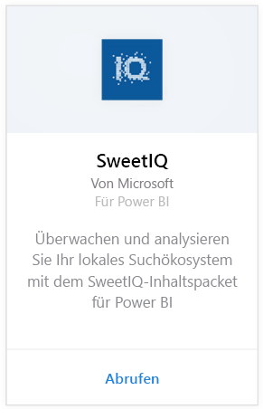
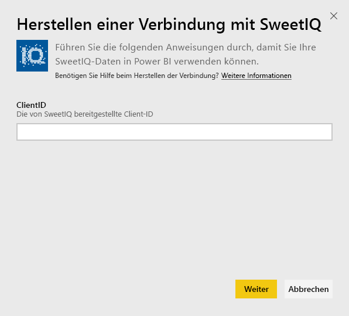
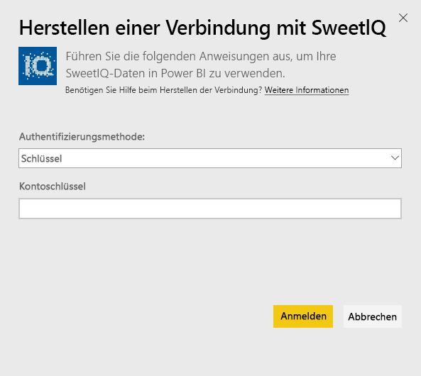
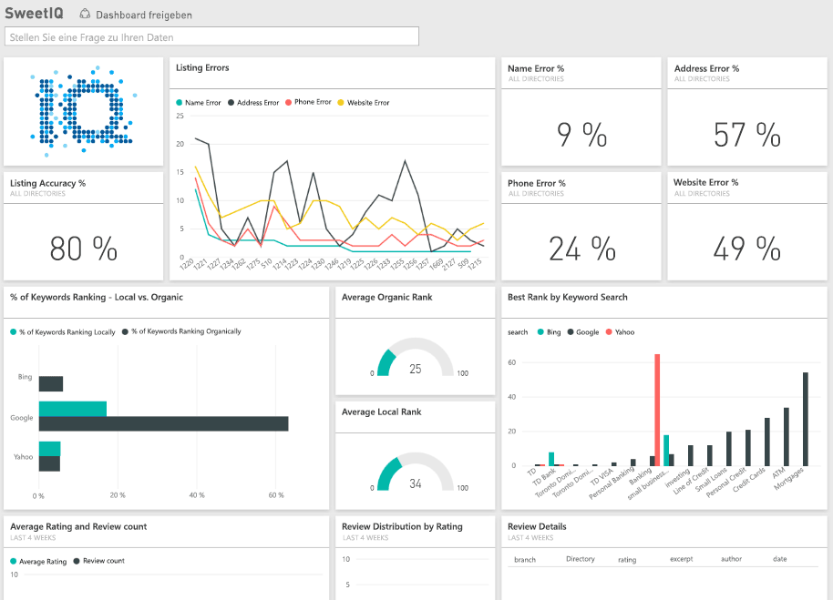

# Herstellen einer Verbindung mit SweetIQ mithilfe von Power BI
Das Power BI-Inhaltspaket ruft Daten per Pull von Ihrem SweetIQ-Konto ab und generiert ohne weitere Konfiguration Inhalte, die Ihnen das problemlose Durchsuchen Ihrer Daten ermöglichen. Verwenden Sie das SweetIQ-Inhaltspaket, um Daten zu Ihren Standorten, Auflistungen, Bewertungen und Rezensionen zu analysieren. Die Daten werden täglich aktualisiert, um sicherzustellen, dass sie auf dem neuesten Stand sind.

Stellen Sie die Verbindung zum [SweetIQ-Inhaltspaket](https://app.powerbi.com/groups/me/getdata/services/sweetiq) für Power BI her.

## Herstellen der Verbindung
1. Klicken Sie im Navigationsbereich auf der linken Seite auf **Daten abrufen**.
   
    
2. Wählen Sie **SweetIQ** aus, und klicken Sie auf **Abrufen**.
   
    
3. Geben Sie Ihre SweetIQ-Client-ID an. Dies ist normalerweise ein alphanumerischer Wert. Einzelheiten zum Ermitteln dieses Werts finden Sie unten.
   
    
4. Wählen Sie die Authentifizierungsart **Schlüssel** aus, und geben  Sie Ihren Sweet IQ-API-Schlüssel ein. Dies ist normalerweise ein alphanumerischer Wert. Einzelheiten zum Ermitteln dieses Werts finden Sie unten.
   
    
5. Power BI beginnt mit dem Laden Ihrer Daten, was je nach der Menge der Daten in Ihrem Konto einige Zeit in Anspruch nehmen kann. Sobald das Laden abgeschlossen ist, werden im linken Navigationsbereich ein neues Dashboard, ein Bericht und ein Dataset angezeigt.
   
    

**Was nun?**

* Versuchen Sie, am oberen Rand des Dashboards [im Q&A-Feld eine Frage zu stellen](consumer/end-user-q-and-a.md).
* [Ändern Sie die Kacheln](service-dashboard-edit-tile.md) im Dashboard.
* [Wählen Sie eine Kachel aus](consumer/end-user-tiles.md), um den zugrunde liegenden Bericht zu öffnen.
* Zwar ist Ihr Dataset auf tägliche Aktualisierung festgelegt, jedoch können Sie das Aktualisierungsintervall ändern oder über **Jetzt aktualisieren** nach Bedarf aktualisieren.

## Suchen von Parametern
Die Client-ID und der API-Schlüssel für dieses Inhaltspaket sind nicht mit Ihrem SweetIQ-Benutzernamen und dem zugehörigen Kennwort identisch .

Wählen Sie eine Client-ID für einen der Clients aus, auf die Ihr Konto Zugriff hat. Sie finden die Liste der Clients unter "Clientverwaltung" in Ihrem SweetIQ-Konto.

Wenden Sie sich an Ihren Administrator, um den API-Schlüssel zu erhalten, um auf die Daten für einen spezifischen Client zuzugreifen.

## Nächste Schritte
[Was ist Power BI?](power-bi-overview.md)

[Abrufen von Daten in Power BI](service-get-data.md)

