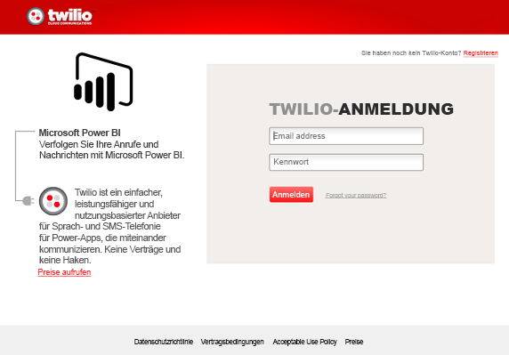
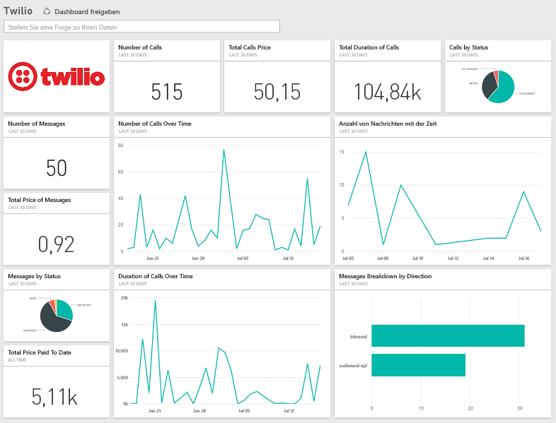

# Herstellen einer Verbindung mit Twilio mithilfe von Power BI
Mit dem Microsoft Twilio-Inhaltspaket für Power BI können Sie Ihre Daten in Power BI abrufen und ein fertig konfiguriertes [Twilio-Dashboard](https://powerbi.microsoft.com/integrations/twilio) und einen Bericht erstellen, die Erkenntnisse zu Ihren Daten bieten. Sie können Ihre benutzerdefinierten Berichte und das Dashboard auch für das von Power BI erstellte Dataset erstellen. Die Daten werden einmal täglich aktualisiert werden, damit immer die aktuellen Daten angezeigt werden.

Stellen Sie die Verbindung zum [Twilio-Inhaltspaket](https://app.powerbi.com/getdata/services/twilio) für Power BI her.

## Herstellen der Verbindung
1. Wählen Sie unten im linken Navigationsbereich **Daten abrufen** aus.
   
    
2. Wählen Sie im Feld **Dienste** die Option **Abrufen**aus.
   
    
3. Wählen Sie **Twilio** \> **Abrufen** aus.
   
   
4. Wählen Sie als **Authentifizierungsmethode** die Option **oAuth2** \> Anmelden aus. Geben Sie bei der entsprechenden Aufforderung Ihre Twilio-Anmeldeinformationen an, und autorisieren Sie die Power BI-Anwendung für den Zugriff auf Ihre Daten.
   
   
5. Dadurch wird das Importieren der Daten aus Ihrem Twilio-Konto gestartet, und Ihr Dashboard wird mit den in den letzten 30 Tagen verwendeten Anrufen und Nachrichten gefüllt. 
   
   

**Was nun?**

* Versuchen Sie, am oberen Rand des Dashboards [im Q&A-Feld eine Frage zu stellen](power-bi-q-and-a.md).
* [Ändern Sie die Kacheln](service-dashboard-edit-tile.md) im Dashboard.
* [Wählen Sie eine Kachel aus](service-dashboard-tiles.md), um den zugrunde liegenden Bericht zu öffnen.
* Ihr Dataset ist auf eine tägliche Aktualisierung festgelegt. Sie können jedoch das Aktualisierungsintervall ändern oder es über **Jetzt aktualisieren** nach Bedarf aktualisieren.

## Inhalt
Die Details für alle Anruf- und Nachrichtentransaktionen für die letzten 30 Tage. Sie können für diese Daten alle Arten von Analysen und Aggregationen durchführen.

Eine Reihe von bereits aggregierten Statistiken, die Sie möglicherweise im Auge behalten möchten. Dieser Satz umfasst Folgendes:

        All Time Calls Count  
        All Time Calls Duration  
        All Time Calls Price  
        All Time Messages Price  
        All Time Messages Count  
        All Time Count of Phone Numbers  
        All Time Price of Phone Numbers  
        All Time Twilio Client Calls Price  
        All Time Twilio Client Calls Duration  
        All Time Twilio Client Calls Count  
        All Time Total Price  
        All Time Inbound Calls Price  
        All Time Inbound Calls Duration  
        All Time Inbound Calls Count  
        All Time Outbound Calls Price  
        All Time Outbound Calls Duration  
        All Time Outbound Calls Count  
        This Month Calls Price  
        This Month Calls Duration  
        This Month Calls Count  
        This Month Messages Count  
        This Month Messages Price  
        This Month Count of Phone Numbers  
        This Month Price of Phone Numbers  
        This Month Twilio Client Calls Price  
        This Month Twilio Client Calls Duration  
        This Month Twilio Client Calls Count  
        This Month Total Price  
        This Month Inbound Calls Price  
        This Month Inbound Calls Duration  
        This Month Inbound Calls Count  
        This Month Outbound Calls Price  
        This Month Outbound Calls Duration  
        This Month Outbound Calls Count  
        This Month Inbound Messages Price  
        This Month Inbound Messages Count  
        This Month Outbound Messages Price  
        This Month Outbound Messages Count

## Problembehandlung
Wenn für die letzten 30 Tage eine große Datenmenge vorliegt (Hunderttausende Transaktionen), kann beim Datenabruf ein Fehler auftreten. Das Problem ist bekannt und wir arbeiten an der Behebung. Wenn das Problem in der Zwischenzeit auftritt, verwenden Sie den Supportlink am oberen Rand der Power BI-Seite, um uns entsprechend zu informieren. Wir werden uns dann zwecks weiterer Untersuchungen an Sie wenden.

## Nächste Schritte
[Erste Schritte mit Power BI](service-get-started.md)

[Abrufen von Daten in Power BI](service-get-data.md)

