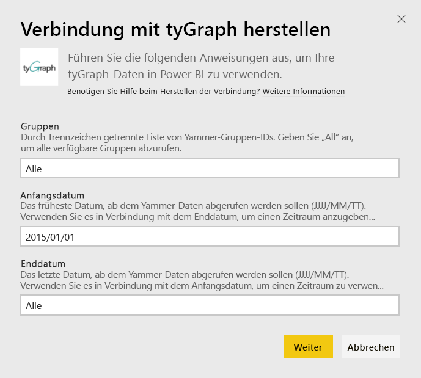
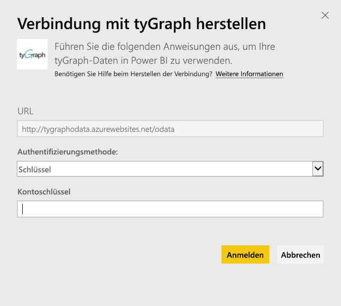
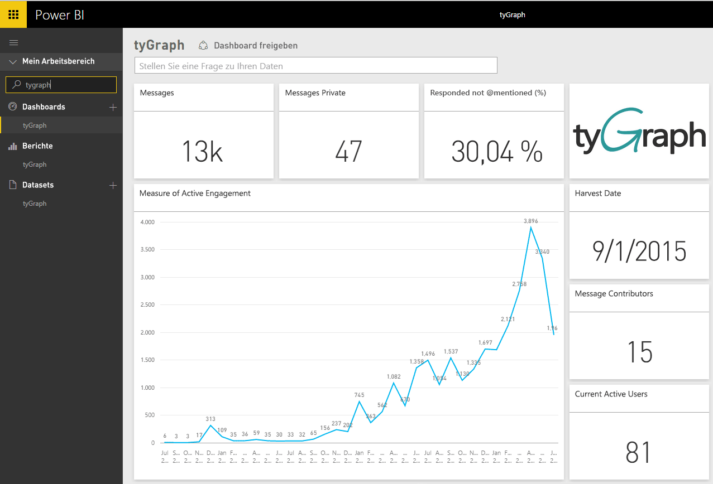
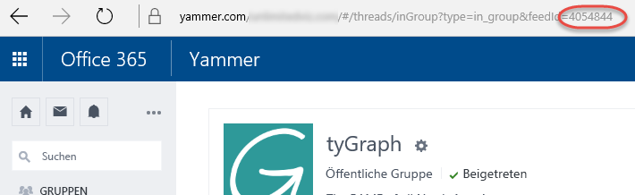

# Herstellen einer Verbindung mit tyGraph mithilfe von Power BI
Visualisieren und durchsuchen Sie Ihre tyGraph-Daten mithilfe des Power BI-Inhaltspakets in Power BI. Beginnen Sie, indem Sie eine Verbindung mit Ihrem tyGraph-Konto herstellen und das Dashboard, die Berichte und die Datasets laden. Die ohne Konfiguration verfügbaren Inhalte bieten Einsichten wie den MAE-Punktstand (Maß der aktiven Teilnahme, Measure of Active Engagement) und die aktivsten Mitwirkenden. Passen Sie das Paket weiter an, um die Informationen hervorzuheben, die Sie besonders interessieren.  Die Daten werden automatisch nach einem Zeitplan aktualisiert, den Sie festlegen.

Stellen Sie eine Verbindung mit [tyGraph für Power BI](https://app.powerbi.com/getdata/services/tygraph) her.

## Herstellen der Verbindung
1. Wählen Sie unten im linken Navigationsbereich **Daten abrufen** aus.
   
   
2. Wählen Sie im Feld **Dienste** die Option **Abrufen**aus.
   
   
3. Wählen Sie **TyGraph** \> **Abrufen** aus.
   
   
4. Geben Sie die Gruppen und den Zeitbereich ein, zu deren Daten Sie Verbindungen herstellen möchten, oder „Alles“ um alle Daten zu importieren. Beachten Sie das erwartete Datumsformat (JJJJ/MM/TT). Nachstehend finden Sie weitere Informationen zum [Suchen der Parameter](#FindingParams).
   
   
5. Geben Sie Ihren tyGraph-Schlüssel ein, um die Verbindung herzustellen. Einzelheiten zum Ermitteln dieses Werts finden Sie unten.
   
    **Wenn Sie von Yammer überprüfter Administrator sind**  
    Ihnen wird nach der erfolgreichen Erstellung Ihres tyGraph-Kontos Ihr API-Schlüssel in einer E-Mail zugesandt. Wenn Sie Ihren Schlüssel nicht mehr finden können, können Sie per E-Mail an support@unlimitedviz.com einen neuen Schlüssel anfordern. Wenn Sie noch nicht über ein tyGraph-Konto verfügen, können Sie sich unter [http://www.tygraph.com/](http://www.tygraph.com/) für eine Testversion registrieren. 
   
    **Wenn Sie kein von Yammer überprüfter Administrator sind**
   
    Für das tyGraph-Inhaltspaket ist ein tyGraph-Konto erforderlich, das von einem von Yammer überprüften Administrator erstellt wurde. Nach der Erstellung können weitere Schlüssel an Benutzer innerhalb der gleichen Organisation ausgegeben werden. Wenn Ihr überprüfter Administrator noch kein tyGraph-Konto erstellt hat, wenden Sie sich in dieser Sache an ihn. Wenn das Konto bereits erstellt wurde, können Sie mit einer E-Mail an <support@unlimitedviz.com> einen Schlüssel anfordern.
   
    
6. Nach erfolgreicher Authentifizierung wird der Importvorgang automatisch gestartet. Nach Abschluss des Vorgangs werden im Navigationsbereich ein neues Dashboard, ein Bericht und ein Modell angezeigt. Wählen Sie das Dashboard aus, um die importierten Daten anzuzeigen.
   
    

**Was nun?**

* Versuchen Sie, am oberen Rand des Dashboards [im Q&A-Feld eine Frage zu stellen](consumer/end-user-q-and-a.md).
* [Ändern Sie die Kacheln](service-dashboard-edit-tile.md) im Dashboard.
* [Wählen Sie eine Kachel aus](consumer/end-user-tiles.md), um den zugrunde liegenden Bericht zu öffnen.
* Zwar ist Ihr Dataset auf tägliche Aktualisierung festgelegt, jedoch können Sie das Aktualisierungsintervall ändern oder über **Jetzt aktualisieren** nach Bedarf aktualisieren.

## Suchen von Parametern
Sie können Daten für alle Gruppen, auf die Sie Zugriff haben, importieren oder eine Teilmenge angeben. Ferner können Sie eine datumsbasierte Teilmenge erstellen. Sie können mehrere tyGraph-Dashboards erstellen, um bestimmte Zusammenstellungen von Gruppen und/oder bestimmte Datumsbereiche zu überwachen. Details zu diesen Parametern finden Sie unten.

**Gruppen**

Die TyGraph-API kann Daten nach der Gruppen-ID filtern. Die Gruppen-IDs werden dem Inhaltspaket als Liste mit Kommatrennung übergeben. 

    Example: 2427647,946595,1154464

Sie können die Gruppen-ID für eine bestimmte Gruppe in Yammer ermitteln, indem Sie zu dem Feed für die Gruppe navigieren und die URL untersuchen.

Im Beispiel oben ist die Yammer-Gruppen-ID 4054844

**Anfangsdatum**

Mit dem Anfangsdatum können Sie den frühesten Wert für die zurückgegebenen Daten einschränken. Nur Daten, die an oder nach diesem Datum erstellt wurden, werden in das Inhaltspaket geladen. Das Anfangsdatum hat das Format JJJJ/MM/TT. 

    Example: 2013/10/29

Im Beispiel oben werden alle Daten ab dem 29. Oktober 2013 einschließlich in das Inhaltspaket geladen. 

**Enddatum** Mit dem Enddatum können Sie den spätesten Wert für die zurückgegebenen Daten einschränken. Es kann in Verbindung mit dem Anfangsdatum verwendet werden, um Daten aus einem Datumsbereich zu laden. Nur Daten, die an oder vor diesem Datum erstellt wurden, werden in das Inhaltspaket geladen. Das Enddatum hat das Format JJJJ/MM/TT. 

    Example: 2014/10/20

Im Beispiel oben werden alle Daten bis zum 20. Oktober 2014 einschließlich in das Inhaltspaket geladen. 

## Nächste Schritte
[Erste Schritte mit Power BI](service-get-started.md)

[Abrufen von Daten in Power BI](service-get-data.md)

