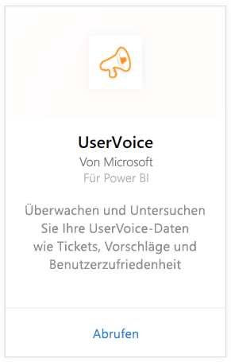
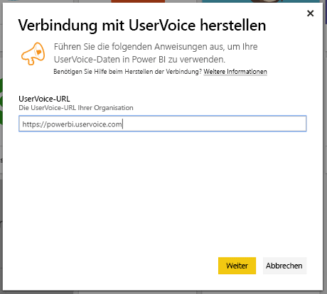
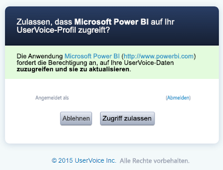
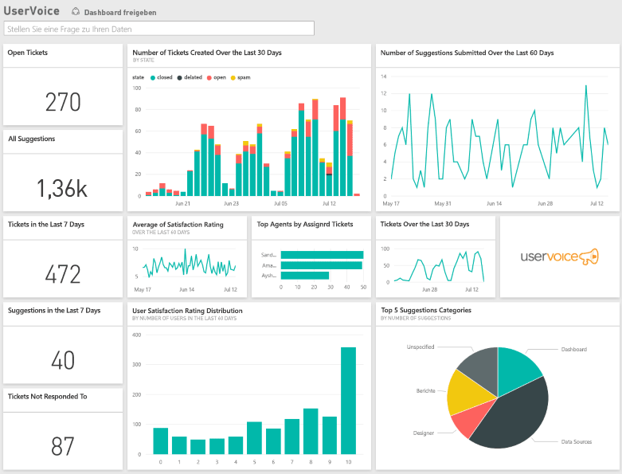

# Herstellen einer Verbindung mit UserVoice mithilfe von Power BI
Das Nachverfolgen und Durchsuchen Ihrer UserVoice-Daten ist mit Power BI und dem UserVoice-Inhaltspaket problemlos möglich. Power BI ruft Ihre Daten ab, einschließlich der Tickets, Vorschläge und Zufriedenheitsbewertungen, und erstellt dann ohne Konfiguration ein Dashboard sowie Berichte auf der Grundlage dieser Daten.

Stellen Sie die Verbindung zum [UserVoice-Inhaltspaket](https://app.powerbi.com/getdata/services/uservoice) für Power BI her.

>[!NOTE]
>Für die Verbindung mit dem Power BI-Inhaltspaket ist ein Administratorkonto erforderlich. Das Inhaltspaket nutzt auch die UserVoice-API. Diese Nutzung wird auf die UserVoice-Kontingente angerechnet. Weitere Details finden Sie unten.

## Herstellen der Verbindung
1. Wählen Sie unten im linken Navigationsbereich **Daten abrufen** aus.
   
   
2. Wählen Sie im Feld **Dienste** die Option **Abrufen**aus.
   
    
3. Wählen Sie **UserVoice** und dann **Abrufen** aus.
   
   
4. Wenn Sie dazu aufgefordert werden, geben Sie Ihre UserVoice-URL ein. Die URL muss der Syntax https://fabrikam.uservoice.com exakt entsprechen, wobei „fabrikam“ durch den Namen Ihres Produkts oder Diensts ersetzt wird.
   
   >[!NOTE]
   >Am Ende der URL darf sich kein nachgestellter Schrägstrich befinden, und die Verbindung erfolgt per http**s**.
   
   
5. Wenn Sie dazu aufgefordert werden, geben Sie Ihre UserVoice-Anmeldeinformationen ein, und schließen Sie den UserVoice Authentifizierungsprozess ab. Wenn Sie bereits im Browser bei UserVoice angemeldet sind, werden Sie möglicherweise nicht zur Eingabe der Anmeldeinformationen aufgefordert. Erteilen Sie der Power BI-Anwendung Zugriff auf Ihre Daten, indem Sie auf "Zugriff zulassen" klicken.
   
   >[!NOTE]
   >Für Ihr UserVoice-Konto benötigen Sie Administratoranmeldeinformationen.
   
   
6. Power BI ruft Ihre UserVoice-Daten ab und erstellt für Sie ein gebrauchsfertiges Dashboard und einen Bericht. Power BI ruft die folgenden Daten ab: alle Ihre Vorschläge, alle Ihre offenen Tickets, alle in den letzten 30 Tagen erstellten Tickets, einschließlich der geschlossenen, und alle Bewertungen zur Benutzerzufriedenheit.
   
   

**Was nun?**

* Versuchen Sie, am oberen Rand des Dashboards [im Q&A-Feld eine Frage zu stellen](power-bi-q-and-a.md).
* [Ändern Sie die Kacheln](service-dashboard-edit-tile.md) im Dashboard.
* [Wählen Sie eine Kachel aus](service-dashboard-tiles.md), um den zugrunde liegenden Bericht zu öffnen.
* Ihr Dataset ist auf eine tägliche Aktualisierung festgelegt. Sie können jedoch das Aktualisierungsintervall ändern oder es über **Jetzt aktualisieren** nach Bedarf aktualisieren.

## Problembehandlung
**„Fehler beim Überprüfen der Parameter – stellen Sie sicher, dass alle Parameter gültig sind“.**

Wenn dieser Fehler nach dem Eingeben der UserVoice-URL angezeigt wird, stellen Sie sicher, dass die folgenden Bedingungen erfüllt sind:

* Die URL folgt genau diesem Muster: "https://fabrikam.uservoice.com", wobei "fabrikam" durch Ihr korrektes UserVoice-URL-Präfix ersetzt wurde.
* Achten Sie darauf, nur Kleinbuchstaben zu verwenden.
* Vergewissern Sie sich, dass es sich bei der URL um „http**s**“ handelt.
* Achten Sie darauf, dass am Ende der URL kein nachgestellter Schrägstrich vorkommt.

**„Anmeldefehler“**

Wenn nach dem Eingeben Ihrer UserVoice-Anmeldeinformationen zur Anmeldung der „Anmeldefehler“ gemeldet wird, verfügt das verwendete Konto nicht über die erforderlichen Berechtigungen, um die UserVoice-Daten aus Ihrem Konto abzurufen. Überprüfen Sie, ob es sich um ein Administratorkonto handelt, und versuchen Sie es erneut.

„**Huch, etwas ist schiefgelaufen**“

Wenn während des Ladens der Daten diese Fehlermeldung angezeigt wird, stellen Sie sicher, dass Ihr UserVoice-Konto sein monatliches Kontingent für die API-Nutzung nicht überschritten hat. Wenn alles in Ordnung zu sein scheint, versuchen Sie es erneut. Wenn das Problem weiterhin besteht, wenden Sie sich unter [https://community.powerbi.com](https://community.powerbi.com/) an den Power BI-Support.

**Sonstiges**  

Das Power BI UserVoice-Inhaltspaket verwendet die UserVoice-APIs zum Abrufen Ihrer Daten. Achten Sie unbedingt darauf, Ihre API-Nutzung im Blick zu behalten, damit Sie Ihr Limit nicht überschreiten. Wenn Sie viele Daten in Ihrem UserVoice-Konto haben, besteht eine Möglichkeit, den Einfluss auf Ihre API-Nutzung zu minimieren, darin, die Aktualisierungshäufigkeit vom aktuellen Standardwert, der bei einmal täglich liegt, je nach Ihren Anforderungen auf einmal pro Arbeitstag oder jeden zweiten Tag zu ändern. Ein anderer Vorschlag besteht darin, einen Administrator das Inhaltspaket erstellen und für das restliche Team freigeben zu lassen, statt jeden Administrator in der Organisation ein eigenes Paket erstellen zu lassen, was eine unnötige Auslastung der APIs mit sich bringt.

## Nächste Schritte
[Erste Schritte mit Power BI](service-get-started.md)

[Abrufen von Daten in Power BI](service-get-data.md)

