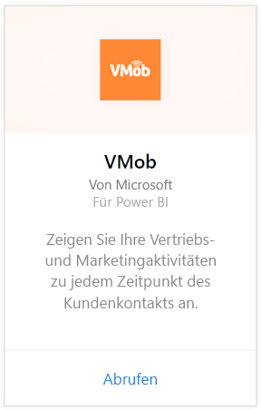
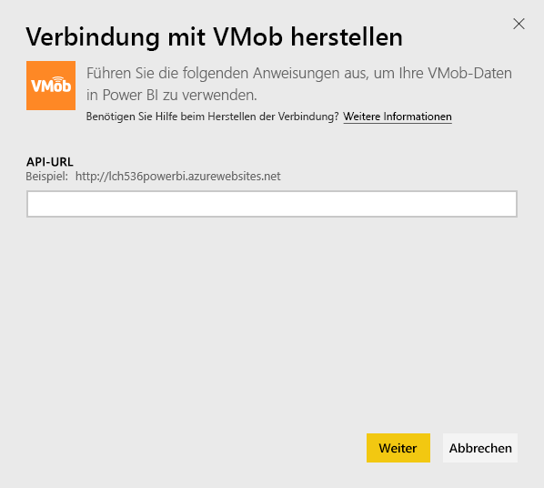
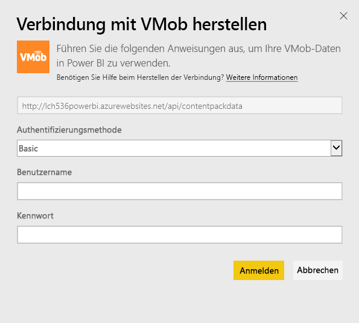
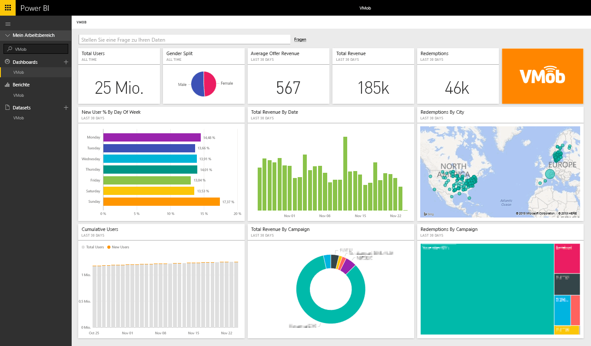

# Herstellen einer Verbindung mit VMob mithilfe von Power BI
Das Nachverfolgen und Durchsuchen Ihrer VMob-Daten ist mit Power BI und dem VMob-Inhaltspaket problemlos möglich. Power BI ruft folgende Daten ab: Benutzerstatistik des Gesamtzeitraums sowie der letzten 30 Tage, Leistungskennzahlen Einzelhandel der letzten 30 Tage und Kampagnen-Leistung der letzten 30 Tage.

Stellen Sie die Verbindung zum [VMob-Inhaltspaket](https://app.powerbi.com/getdata/services/vmob) für Power BI her.

## Herstellen der Verbindung
1. Wählen Sie unten im linken Navigationsbereich **Daten abrufen** aus.
   
    
2. Wählen Sie im Feld **Dienste** die Option **Abrufen**aus.
   
   
3. Wählen Sie **VMob** \> **Abrufen** aus.
   
   
4. Geben Sie nach Aufforderung Ihre VMob-URL ein, und klicken Sie auf die Schaltfläche „Weiter“. Diese URL wird separat von VMob bereitgestellt.
   
    
5. Wählen Sie in der Dropdownliste für die Authentifizierungsmethode **Basic** aus, geben Sie den VMob-Benutzernamen und das Kennwort ein, und klicken Sie auf die Schaltfläche **Anmelden** .
   
    
6. Der Importvorgang beginnt automatisch, und Power BI ruft die VMob-Daten ab, um ein vorgefertigtes Dashboard und einen Bericht zu erstellen.
   
   

**Was nun?**

* Versuchen Sie, am oberen Rand des Dashboards [im Q&A-Feld eine Frage zu stellen](power-bi-q-and-a.md).
* [Ändern Sie die Kacheln](service-dashboard-edit-tile.md) im Dashboard.
* [Wählen Sie eine Kachel aus](service-dashboard-tiles.md), um den zugrunde liegenden Bericht zu öffnen.
* Ihr Dataset ist auf eine tägliche Aktualisierung festgelegt. Sie können jedoch das Aktualisierungsintervall ändern oder es über **Jetzt aktualisieren** nach Bedarf aktualisieren.

## Nächste Schritte
[Erste Schritte mit Power BI](service-get-started.md)

[Abrufen von Daten in Power BI](service-get-data.md)

