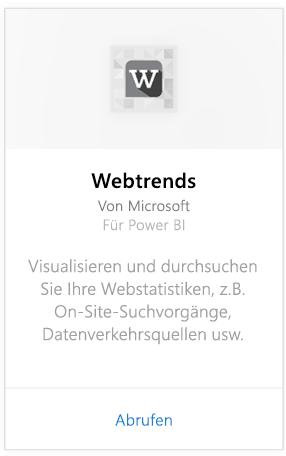
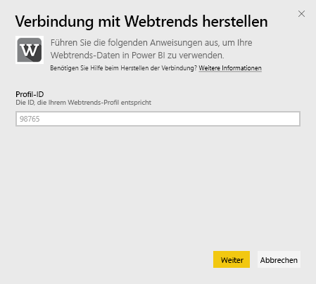
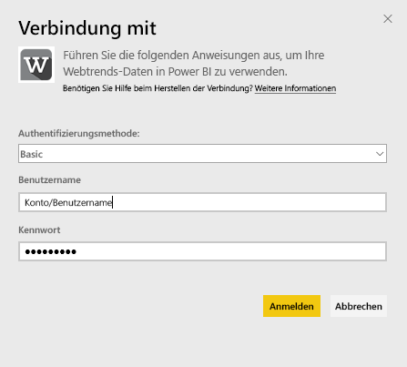
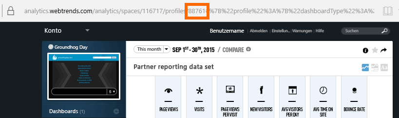
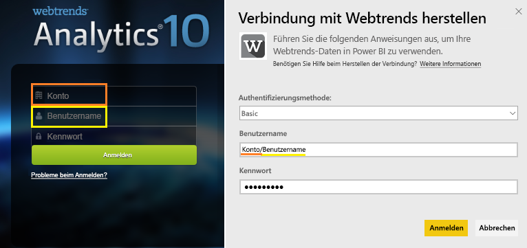

# Herstellen einer Verbindung mit Webtrends mithilfe von Power BI
Das Webtrends-Inhaltspaket für Power BI enthält eine Vielzahl von Metriken, die ohne Konfiguration verfügbar sind, wie etwa die Anzahl der Seitenaufrufe und die Besuche nach Verkehrsquelle. Das Visualisieren Ihrer Webtrends-Daten in Power BI beginnt mit dem Herstellen der Verbindung mit Ihrem Webtrends-Konto. Sie können die bereitgestellten Dashboards und Berichte verwenden oder sie anpassen, um die für Sie wichtigsten Informationen hervorzuheben.  Die Daten werden automatisch einmal täglich aktualisiert.

Stellen Sie die Verbindung mit dem [Webtrends-Inhaltspaket für Power BI](https://app.powerbi.com/getdata/services/webtrends) her.

## Herstellen der Verbindung
1. Wählen Sie unten im linken Navigationsbereich **Daten abrufen** aus.
   
   
2. Wählen Sie im Feld **Dienste** die Option **Abrufen**aus.
   
   
3. Wählen Sie **Webtrends** \> **Abrufen** aus.
   
   
4. Das Inhaltspaket stellt eine Verbindung mit einer bestimmten Webtrends-Profil-ID her. Nachstehend finden Sie weitere Informationen zum [Suchen dieses Parameters](#FindingParams).
   
   
5. Geben Sie Ihre Webtrends-Anmeldeinformationen ein, um die Verbindung herzustellen. Beachten Sie, dass im Feld „Benutzername“ die Eingabe Ihres Kontos und Ihres Benutzernamens erwartet wird. Nachstehend finden Sie [weitere Informationen](#FindingParams).
   
   
6. Nach der Genehmigung wird der Importvorgang automatisch gestartet. Nach Abschluss des Vorgangs werden im Navigationsbereich ein neues Dashboard, ein Bericht und ein Modell angezeigt. Wählen Sie das Dashboard aus, um die importierten Daten anzuzeigen.
   
   

**Was nun?**

* Versuchen Sie, am oberen Rand des Dashboards [im Q&A-Feld eine Frage zu stellen](power-bi-q-and-a.md).
* [Ändern Sie die Kacheln](service-dashboard-edit-tile.md) im Dashboard.
* [Wählen Sie eine Kachel aus](service-dashboard-tiles.md), um den zugrunde liegenden Bericht zu öffnen.
* Ihr Dataset ist auf eine tägliche Aktualisierung festgelegt. Sie können jedoch das Aktualisierungsintervall ändern oder es über **Jetzt aktualisieren** nach Bedarf aktualisieren.

## Inhalt

Das Webtrends-Inhaltspaket ruft Daten aus den folgenden Berichten ab:  

| Berichtsname | Berichts-ID |
| --- | --- |
| Key Metrics (Schlüsselmetrik) | |
| On-Site Searches (On-site-Suchvorgänge) |34awBVEP0P6 |
| Exit Pages (Ausgangsseiten) |7FshY8eP0P6 |
| Next Pages (Nächste Seiten) |CTd5rpeP0P6 |
| Previous Pages (Vorherige Seiten) |aSdOeaUgnP6 |
| Site Pages (Websiteseiten) |oOEWQj3sUo6 |
| Onsite Ads Clickthroughs (Durchklicks für On-site-Werbung) |41df19b6d9f |
| Cities (Städte) |aUuHskcP0P6 |
| Länder |JHWXJNcP0P6 |
| Visitors (Besucher) |xPcmTDDP0P6 |
| Visit Duration (Besuchsdauer) |U5KAyqdP0P6 |
| Search Phrases (Suchausdrücke) |IKYEDxIP0P6 |
| Traffic Sources (Datenverkehrsquellen) |JmttAoIP0P6 |
| Search Engines (Suchmaschinen) |yGz3gAGP0P6 |
| Entry Pages (Eingangsseiten) |i6LrkNVRUo6 |

>[!NOTE]
>Für SharePoint-Profile weichen die Metriknamen möglicherweise ein bisschen von dem ab, was in der Webtrends-Benutzeroberfläche angezeigt wird. Die folgende Zuordnung erfolgt, um die Konsistenz zwischen SharePoint- und Web-Profilen zu erhalten:   

    - Sessions (Sitzungen) = Visits (Besuche)  
    - New Users (Neue Benutzer) = New Visitors (Neue Besucher)  
    - Views per Session (Ansichten pro Sitzung) = Page Views per Visit (Seitenansichten pro Besuch)  
    - Avg Daily User Duration (Durchschnittliche tägliche Benutzerdauer) = Avg Time on Site per Visitor (Durchschnittliche Zeit auf der Website pro Besucher)  

## Systemanforderungen
Das Inhaltspaket benötigt Zugriff auf ein Webtrends-Profil, in dem der [richtige Satz an Berichten](#Included) aktiviert ist.

## Suchen von Parametern
Ihre Webtrends-Profil-ID finden Sie in der URL, nachdem Sie ein Profil ausgewählt haben:

Ihre Anmeldeinformationen sind die gleichen, die Sie für die Anmeldung bei Webtrends verwenden, allerdings wird die Eingabe von Konto und Benutzername in der gleichen Zeile, getrennt durch einen umgekehrten Schrägstrich, erwartet:

## Problembehandlung
Nachdem Sie Ihre Anmeldeinformationen angegeben haben, kann beim Laden des Inhaltspakets ein Problem auftreten. Wenn während des Ladens die Meldung „Entschuldigung“ angezeigt wird, überprüfen Sie die folgenden Vorschläge zur Problembehandlung. Wenn das Problem weiterhin besteht, erstellen Sie unter „https://support.powerbi.com“ ein Support-Ticket.

1. Die richtige Profil-ID wird verwendet (weitere Informationen finden Sie im Abschnitt [Suchen von Parametern](#FindingParams)).
2. Der Benutzer hat Zugriff auf die im Abschnitt [„Inhalt“](#Included) aufgelisteten Berichte.

## Nächste Schritte
[Erste Schritte mit Power BI](service-get-started.md)

[Power BI – Grundkonzepte](service-basic-concepts.md)

