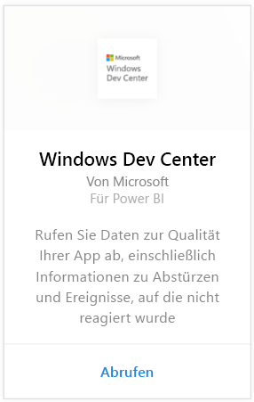
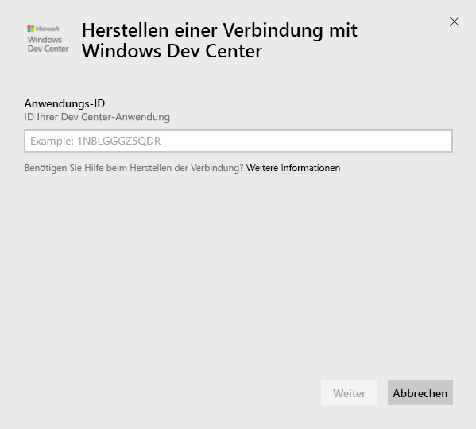
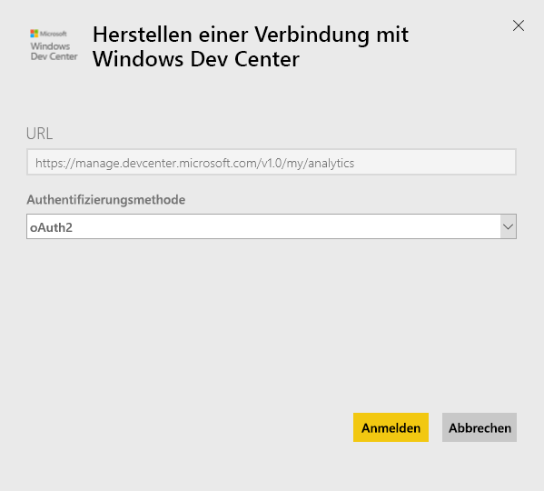
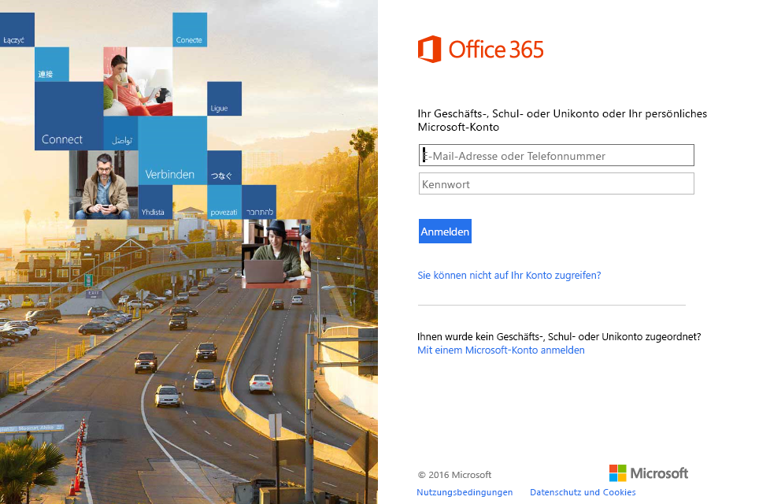
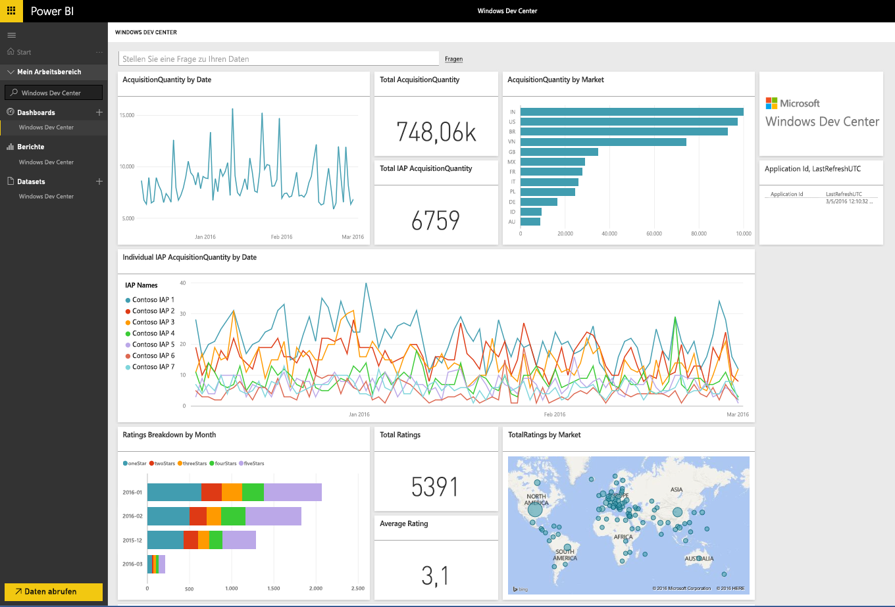
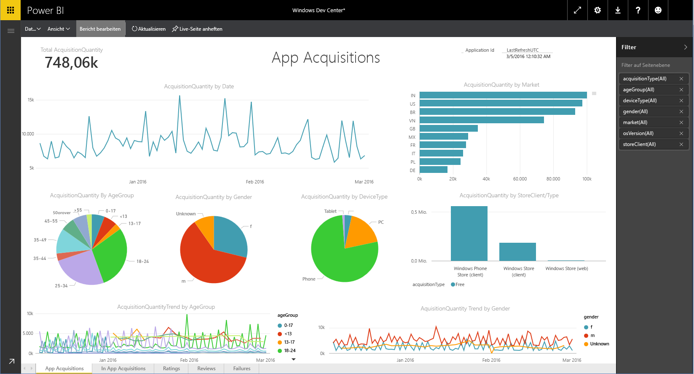

# Herstellen einer Verbindung mit Windows Dev Center mithilfe von Power BI
Mit diesem Power BI-Inhaltspaket können Sie die Analysedaten von Windows Dev Center-Apps in Power BI untersuchen und überwachen. Die Daten werden automatisch einmal täglich aktualisiert.

Stellen Sie eine Verbindung mit dem [Windows Dev Center-Inhaltspaket](https://app.powerbi.com/getdata/services/devcenter) für Power BI her.

## Herstellen der Verbindung
1. Wählen Sie unten im linken Navigationsbereich **Daten abrufen** aus.
   
   
2. Wählen Sie im Feld **Dienste** die Option **Abrufen**aus.
   
   
3. Wählen Sie **Windows Dev Center** \> **Abrufen**.
   
   
4. Geben Sie die Anwendungs-ID einer in Ihrem Besitz befindlichen App ein, und klicken Sie auf „Weiter“. Unten finden Sie Einzelheiten zum [Suchen dieser Parameter](#FindingParams).
   
   
5. Wählen Sie als **Authentifizierungsmethode** die Option **oAuth2** \> **Anmelden** aus. Wenn Sie dazu aufgefordert werden, geben Sie die Azure Active Directory-Anmeldeinformationen ein, die Ihrem Windows Dev Center-Konto zugeordnet sind (weitere Informationen finden Sie unter [Systemanforderungen](#Requirements)).
   
    
   
    
6. Nach der Genehmigung wird der Importvorgang automatisch gestartet. Nach Abschluss des Vorgangs werden im Navigationsbereich ein neues Dashboard, ein Bericht und ein Modell angezeigt. Wählen Sie das Dashboard zum Anzeigen der importierten Daten aus, und wählen Sie eine Kachel, um zu den zugrunde liegenden Berichten zu navigieren.
   
    
   
    

**Was nun?**

* Versuchen Sie, am oberen Rand des Dashboards [im Q&A-Feld eine Frage zu stellen](service-q-and-a.md).
* [Ändern Sie die Kacheln](service-dashboard-edit-tile.md) im Dashboard.
* [Wählen Sie eine Kachel aus](service-dashboard-tiles.md), um den zugrunde liegenden Bericht zu öffnen.
* Ihr Dataset ist auf eine tägliche Aktualisierung festgelegt. Sie können jedoch das Aktualisierungsintervall ändern oder es über **Jetzt aktualisieren** nach Bedarf aktualisieren.

## Inhalt
Das Developer Center-Inhaltspaket für Power BI enthält Analysedaten für Ihre App und für IAP-Käufe (In-App-Produkte) sowie Bewertungen und Kritiken und außerdem Daten zur App-Integrität. Die Daten sind auf die letzte 3 Monate begrenzt. Der Bereich ist ein bewegliches Fenster, sodass die enthaltenen Datumsangaben bei Aktualisierung des Datasets aktualisiert werden.

## Systemanforderungen
Für dieses Inhaltspaket müssen Sie mindestens eine App im Windows Store veröffentlicht haben und über ein Windows Dev Center-Konto verfügen (weitere Informationen finden Sie [hier](https://msdn.microsoft.com/windows/uwp/publish/manage-account-users)).

## Suchen von Parametern
Sie finden die Anwendungs-ID einer App, indem Sie unter „App-Verwaltung“ zur Seite „App-Identität“ wechseln.

Die Anwendungs-ID befindet sich am Ende der URL für den Windows 10 Store: https://www.microsoft.com/store/apps/ **{applicationId}**

## Nächste Schritte
[Erste Schritte mit Power BI](service-get-started.md)

[Abrufen von Daten in Power BI](service-get-data.md)

