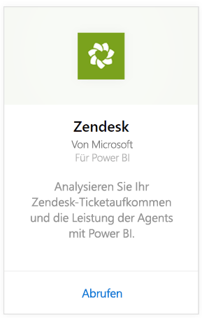
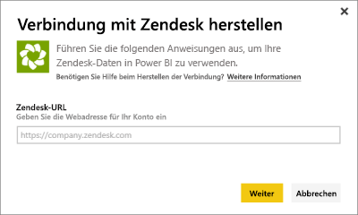
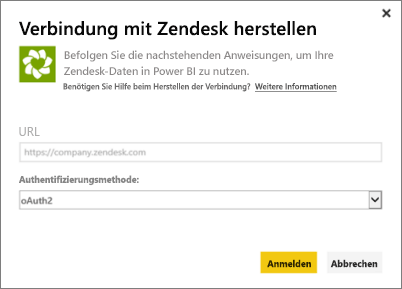
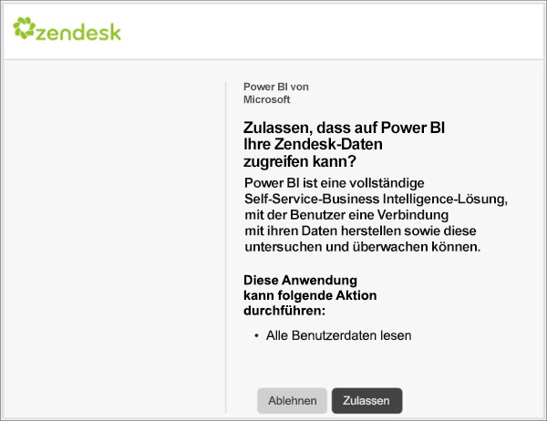
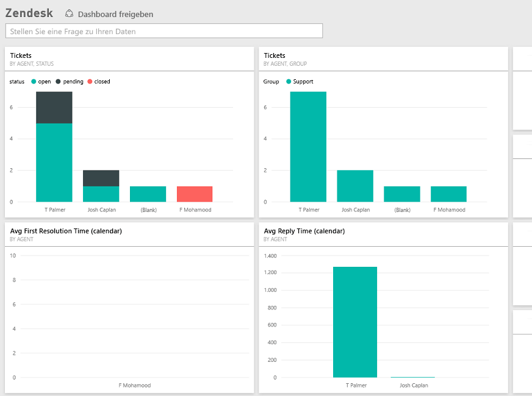

# Herstellen einer Verbindung mit Zendesk mithilfe von Power BI
Das Zendesk-Inhaltspaket bietet ein Power BI-Dashboard und eine Reihe von Power BI-Berichten, die Einblicke in Ihr Ticketaufkommen und die Leistung der Agenten bieten. Sie können die bereitgestellten Dashboards und Berichte verwenden oder sie anpassen, um die für Sie wichtigsten Informationen hervorzuheben.  Die Daten werden automatisch einmal täglich aktualisiert. 

Stellen Sie eine Verbindung mit dem [Zendesk-Inhaltspaket](https://app.powerbi.com/getdata/services/zendesk) her, oder erfahren Sie mehr über die [Zendesk-Integration](https://powerbi.microsoft.com/integrations/zendesk) in Power BI.

>[!NOTE]
>Für die Verbindung ist ein Zendesk-Administratorkonto erforderlich. Weitere Informationen zu den [Anforderungen](#Requirements) finden Sie unten.

## Herstellen der Verbindung
1. Wählen Sie unten im linken Navigationsbereich **Daten abrufen** aus.
   
   
2. Wählen Sie im Feld **Dienste** die Option **Abrufen**aus.
   
    
3. Wählen Sie **Zendesk** \> **Abrufen** aus.
   
   
4. Stellen Sie die Ihrem Konto zugeordnete URL bereit. Diese hat das Format **https://company.zendesk.com**. Nachstehend finden Sie Einzelheiten zum [Auffinden dieser Parameter](#FindingParams).
   
   
5. Wenn Sie dazu aufgefordert werden, geben Sie Ihre Zendesk-Anmeldeinformationen ein.  Wählen Sie **oAuth 2** als Authentifizierungsmechanismus aus, und klicken Sie dann auf **Anmelden**. Befolgen Sie die Anweisungen bei der Zendesk-Authentifizierung. (Wenn Sie in Ihrem Browser bereits bei Zendesk angemeldet sind, werden Sie möglicherweise nicht zur Eingabe von Anmeldeinformationen aufgefordert.)
   
   > [!NOTE]
   > Dieses Inhaltspaket erfordert, dass Sie eine Verbindung mit einem Zendesk-Administratorkonto herstellen. 
   > 
   > 
   
   
6. Klicken Sie auf **Zulassen** , um Power BI den Zugriff auf Ihre Zendesk-Daten zu gewähren.
   
   
7. Klicken Sie auf **Verbinden** , um den Importvorgang zu starten. Nachdem die Daten von Power BI importiert wurden, werden im linken Navigationsbereich ein neues Dashboard, ein Bericht und ein Dataset angezeigt. Neue Elemente werden mit einem gelben Sternchen \* markiert.
   
   

**Was nun?**

* Versuchen Sie, am oberen Rand des Dashboards [im Q&A-Feld eine Frage zu stellen](power-bi-q-and-a.md).
* [Ändern Sie die Kacheln](service-dashboard-edit-tile.md) im Dashboard.
* [Wählen Sie eine Kachel aus](service-dashboard-tiles.md), um den zugrunde liegenden Bericht zu öffnen.
* Ihr Dataset ist auf eine tägliche Aktualisierung festgelegt. Sie können jedoch das Aktualisierungsintervall ändern oder es über **Jetzt aktualisieren** nach Bedarf aktualisieren.

## Inhalt
Das Power BI-Inhaltspaket umfasst Daten zu Folgendem:  

* Benutzer (Endbenutzer und Agents)  
* Organisationen  
* Gruppen  
* Tickets  

Es gibt auch eine Reihe von Messwerten, die berechnet wurden, z. B. die durchschnittliche Wartezeit und die in den letzten 7 Tagen gelösten Tickets. Eine vollständige Liste ist im Inhaltspaket enthalten.

## Systemanforderungen
Ein Zendesk-Administratorkonto ist erforderlich, um auf das Zendesk-Inhaltspaket zuzugreifen. Wenn Sie ein Agent oder Endbenutzer sind und Ihre Zendesk-Daten anzeigen möchten, fügen Sie einen Vorschlag hinzu, und überprüfen Sie den Zendesk-Connector in [Power BI Desktop](desktop-connect-to-data.md).

## Suchen von Parametern
Ihre Zendesk-URL stimmt mit der URL überein, die Sie zum Anmelden bei Ihrem Zendesk-Konto verwenden. Wenn Sie Ihre Zendesk-URL nicht kennen, können Sie die [Hilfe bei der Anmeldung](https://www.zendesk.com/login/) von Zendesk nutzen.

## Problembehandlung
Wenn Sie beim Herstellen einer Verbindung Probleme auftreten, überprüfen Sie Ihre Zendesk-URL, und bestätigen Sie, dass Sie ein Zendesk-Administratorkonto verwenden.

## Nächste Schritte
* [Erste Schritte mit Power BI](service-get-started.md)
* [Abrufen von Daten](service-get-data.md)

