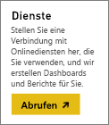
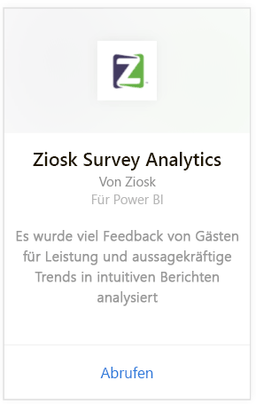
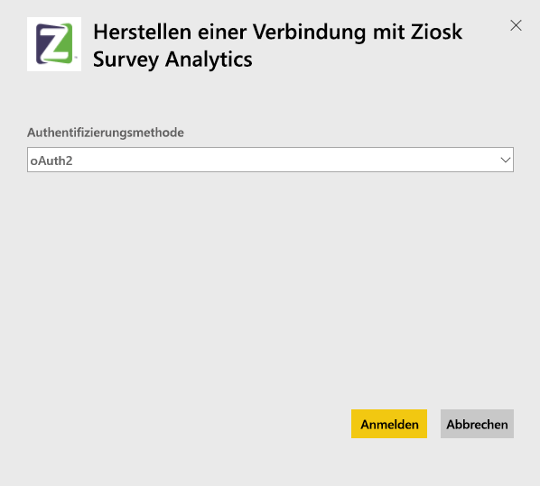
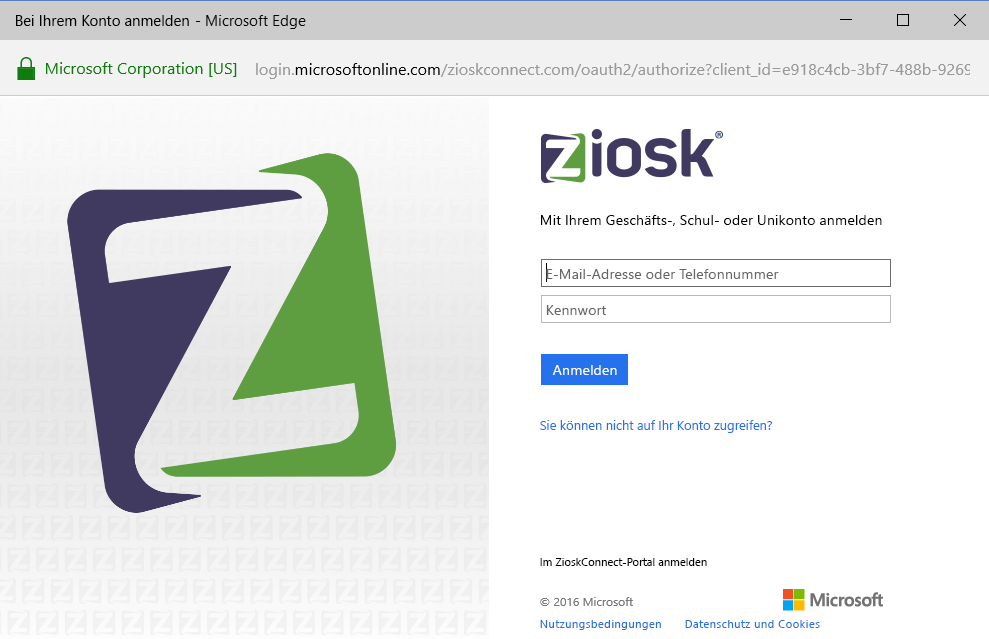
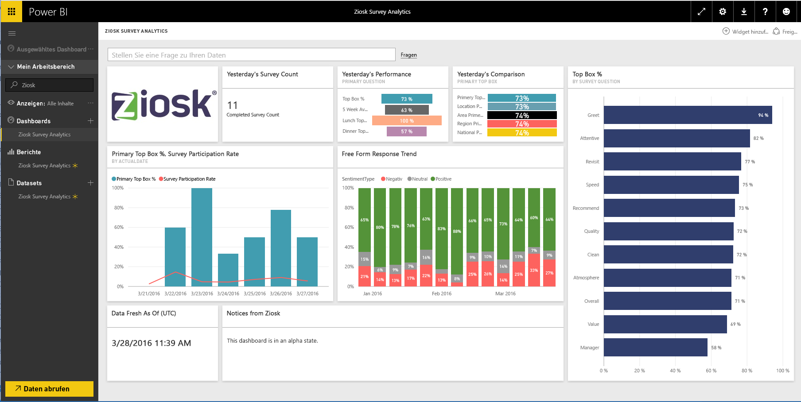

# Herstellen einer Verbindung mit Ziosk Survey Analytics mithilfe von Power BI
Das Ziosk Survey Analytics-Inhaltspaket für Power BI bietet Restaurants mit Ziosk-Tablets beispiellosen Zugriff auf durch Ziosk Survey-Daten bereitgestellte Informationen, einschließlich der Segmentierung nach Tag, Ort, Mitarbeiter etc.

Stellen Sie eine Verbindung mit dem [Ziosk Survey Analytics-Inhaltspaket](https://app.powerbi.com/getdata/services/ziosk-survey-analytics) für Power BI her.

## Herstellen der Verbindung
1. Wählen Sie unten im linken Navigationsbereich **Daten abrufen** aus.  
   
    
2. Wählen Sie im Feld **Dienste** die Option **Abrufen**aus.  
   
    
3. Wählen Sie **Ziosk Survey Analytics** und anschließend **Abrufen** aus.  
   
    
4. Wählen Sie **OAuth 2** und anschließend **Anmelden** aus. Geben Sie Ihre Ziosk-Anmeldeinformationen an, wenn Sie dazu aufgefordert werden.
   
    
   
    
5. Sobald Sie verbunden sind, werden ein Dashboard, ein Bericht und ein Dataset automatisch geladen. Anschließend werden die Kacheln mit Daten aus Ihrem Ziosk-Konto aktualisiert.
   
    

**Was nun?**

* Versuchen Sie, am oberen Rand des Dashboards [im Q&A-Feld eine Frage zu stellen](power-bi-q-and-a.md).
* [Ändern Sie die Kacheln](service-dashboard-edit-tile.md) im Dashboard.
* [Wählen Sie eine Kachel aus](service-dashboard-tiles.md), um den zugrunde liegenden Bericht zu öffnen.
* Ihr Dataset ist auf eine tägliche Aktualisierung festgelegt. Sie können jedoch das Aktualisierungsintervall ändern oder es über **Jetzt aktualisieren** nach Bedarf aktualisieren.

## Inhalt
Das Inhaltspaket umfasst Daten aus den folgenden Tabellen:  

    - Alcohol Category (Alkoholkategorie)  
    - Appetizer Category (Vorspeisenkategorie)  
    - CommentKeywords (Kommentarschlüsselwörter)  
    - Datum (Date)  
    - Daypart (Tageszeit)  
    - Dessert Category (Nachspeisenkategorie)  
    - FreeForm (Freiform)  
    - Kids Category (Kinderkategorie)  
    - Messages (Nachrichten)  
    - Premium Content Category (Premiuminhaltskategorien)  
    - Question (Frage)  
    - Store (Speicher)  
    - Surveys (Umfragen)  
    - Weekday (Wochentag)  

## Systemanforderungen
Ein Ziosk-Konto mit Berechtigungen für die obigen Tabellen wird benötigt, um dieses Inhaltspaket zu instanziieren.

## Nächste Schritte
[Erste Schritte mit Power BI](service-get-started.md)

[Power BI – Grundkonzepte](service-basic-concepts.md)

