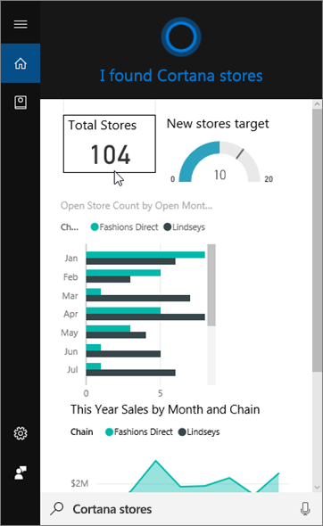
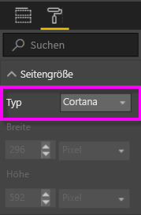
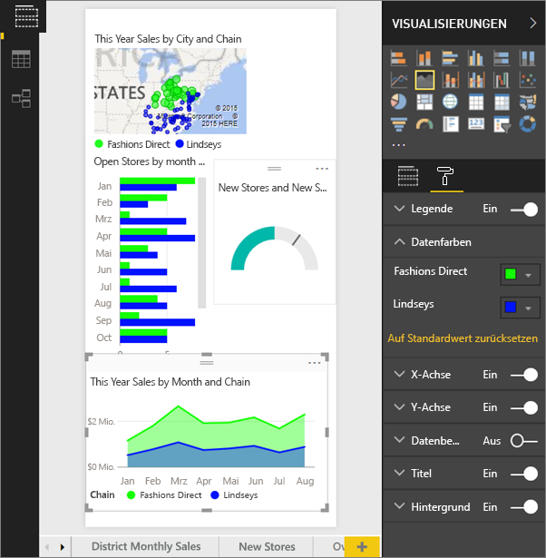
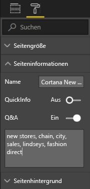
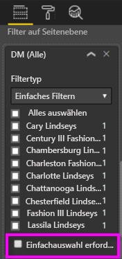

# Verwenden des Power BI-Diensts oder von Power BI Desktop zum Erstellen einer benutzerdefinierten Antwortseite für Cortana
Verwenden Sie den vollständigen Funktionsumfang von Power BI zum Erstellen von speziellen Berichtsseiten, die als *Cortana-Antwortseiten* (und gelegentlich als „Cortana-Antwortkarten“) bezeichnet werden und zur Beantwortung von Cortana-Fragen entworfen wurden.

> [!NOTE]
> Wenn Sie die Vorschauversion für Cortana und Power BI-**Dashboards** testen, müssen Sie den Rest dieses Artikels nicht lesen. Es gelten keine Setupanforderungen, damit Cortana Ihre Power BI-Dashboards durchsuchen kann.
> 
> 

## Vorbereitende Schritte
Insgesamt gibt es vier Dokumente, in denen Sie schrittweise Anweisungen zum Einrichten und Verwenden von Cortana für Power BI erhalten. Sofern nicht bereits geschehen, empfehlen wir, dass Sie zuerst Artikel 1 lesen. Artikel 2 ist besonders wichtig, denn darin werden einige Schritte beschrieben, die Sie ausführen müssen, ehe Sie Cortana-Antwortseiten verwenden können.

**Artikel 1** [Hier erfahren Sie mehr über die Zusammenarbeit von Cortana und Power BI ](service-cortana-intro.md)

**Artikel 2**: [Zum Durchsuchen von Power BI-Berichten: Aktivieren der Integration von Cortana – Power BI – Windows](service-cortana-enable.md)

**Artikel 3**: Dieser Artikel

**Artikel 4**: [Behandeln von Problemen](service-cortana-troubleshoot.md)

## Erstellen einer Cortana-Antwortseite, die speziell für Cortana entworfen wurde
Die Größe einer *Cortana-Antwortseite* in einem Bericht ist speziell für Cortana angepasst, sodass Cortana sie als Antwort auf eine Frage auf dem Bildschirm anzeigen kann.  So erstellen Sie eine Antwortseite für Cortana:

1. Es wird empfohlen, mit einer [leeren Berichtseite](power-bi-report-add-page.md) zu beginnen.
2. Wählen Sie im Bereich **Visualisierungen** das Farbrollersymbol und dann **Seitengröße > Typ > Cortana** aus.
   
    
3. Erstellen Sie eine oder mehrere Visualisierungen, die in Cortana als Antwort auf eine bestimmte Frage (oder eine Reihe von Fragen) angezeigt werden sollen.
4. Stellen Sie sicher, dass alle Visualisierungen auf die Seite passen.  Ändern Sie optional die Anzeigeoptionen, Datenbeschriftungen, Farben und Hintergründe.  
   
    
5. Benennen Sie die Seite, und fügen Sie alternative Namen hinzu.  Cortana verwendet diese Namen bei der Suche nach Ergebnissen. Wählen Sie im Bereich **Visualisierungen** das Pinselsymbol und dann **Seiteninformationen** aus. Aktivieren Sie Q&A für diese Visualisierung durch Verschieben des Schiebereglers auf **Ein**.
   
    
   
   > [!TIP]
   > Um die Ergebnisse zu verbessern, sollten Sie keine Wörter verwenden, die auch Spaltennamen sind.
   > 
   > 
6. Wenn der Bericht über Filter auf Seitenebene verfügt, legen Sie **Einfachauswahl erfordern**fest. Cortana zeigt diesen Bericht nur dann als Antwort an, wenn ein einziges der Filterelemente in der Frage angegeben ist.
   
   > [!NOTE]
   > Damit Cortana einen Bericht mit Seitenebenenfiltern anzeigen kann, muss **Einfachauswahl erforderlich** nicht festgelegt werden.  Beispiel: Die Aufforderung „Verkäufe für Charlotte Lindseys anzeigen“ erzeugt unabhängig von der Einstellung „Einfachauswahl erforderlich“ eine Antwortseite.
   > 
   > 
   
     
   
      Wenn Sie Cortana beispielsweise folgende Fragen stellen:
   
   * „Verkäufe nach Ladenname anzeigen“ – Diese Antwortseite wird nicht angezeigt, da Sie keines der Elemente zum erforderlichen Seitenebenenfilter hinzugefügt haben.
   * „Verkäufe für Cary Lindseys und Charlotte Lindseys anzeigen“ – Diese Antwortseite wird nicht angezeigt, da Sie mehr als ein Element aus dem erforderlichen Seitenebenenfilter angegeben haben.
   * „Verkäufe für Charlotte Lindseys anzeigen“ – Diese Antwortseite wird angezeigt.
     
     = „Umsätze anzeigen“ – Diese Antwortseite wird nicht angezeigt, da Sie keines der Elemente zum erforderlichen Seitenebenenfilter hinzugefügt haben.

> [!IMPORTANT]
> Bevor Cortana auf Ihre Cortana-Antwortseite zugreifen kann, müssen Sie [das Dataset für Cortana aktivieren](service-cortana-enable.md).
> 
> 

## Wie sortiert Cortana die Ergebnisse?
Ergebnisse mit hoch bewerteten Antworten (z.B. vollständige Übereinstimmung mit einem angegebenen Seitennamen) werden als erstes als *beste Übereinstimmung* in Cortana angezeigt. Mehrere beste Übereinstimmungen können angezeigt werden, wenn in Power BI mehrere Cortana-Antwortseiten vorhanden sind. Mittel oder niedrig bewertete Antworten, z.B. Antworten, die nicht auf dem Namen einer Antwortseite basieren, oder eine Frage mit Wörtern, die von Power BI nicht verstanden wurden, werden als Links unter den besten Übereinstimmungen in Cortana aufgeführt.

> [!NOTE]
> Wenn Power BI ein neues Dataset oder eine benutzerdefinierte Cortana-Antwortseite hinzugefügt und für Cortana aktiviert wird, kann es bis zu 30 Minuten dauern, bis Ergebnisse in Cortana angezeigt werden. Durch das Anmelden und Abmelden bei Windows 10 oder einen Neustart des Cortana-Prozesses in Windows 10 werden neue Inhalte sofort angezeigt.
> 
> 

## Nächste Schritte
[Verwenden von Cortana mit Power BI](service-cortana-intro.md)

Können Sie Cortana immer noch nicht mit Power BI verwenden?  Verwenden Sie die [Cortana-Problembehandlung](service-cortana-troubleshoot.md).

Weitere Fragen? [Wenden Sie sich an die Power BI-Community](http://community.powerbi.com/)

