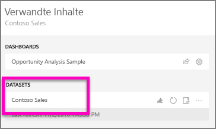
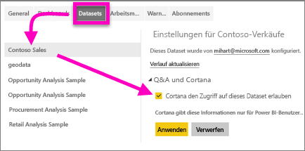
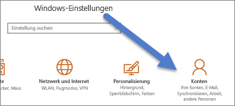
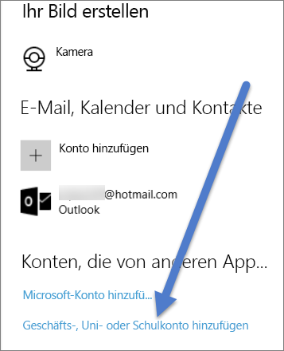

# Aktivieren von Cortana für den Zugriff auf Power BI-Berichte (und deren zugrunde liegende Datasets)
Sie haben die [Einführung in Cortana für Power BI](service-cortana-intro.md) gelesen (falls nicht, sollten Sie diese lesen und dann hierher zurückkehren). Und jetzt möchten Sie es selbst auszuprobieren.  Bevor Sie in Cortana Fragen in natürlicher Sprache stellen und Antworten anhand der in Power BI-***Berichten*** gespeicherten Daten erhalten können, müssen einige Anforderungen erfüllt sein. Insbesondere müssen Sie folgende Aktionen ausführen.

> [!NOTE]
> Wenn Sie die Vorschauversion für Cortana und Power BI-***Dashboards*** testen, müssen Sie den Rest dieses Artikels nicht lesen. Es gelten keine Setupanforderungen, damit Cortana Ihre Power BI-Dashboards durchsuchen kann.
> 
> 

Im Power BI-Dienst

* Aktivieren Sie ein oder mehrere Datasets für Cortana. (Berichte werden über Datasets erstellt, daher benötigt Cortana Zugriff auf diese Datasets.)

In Microsoft Windows

* Vergewissern Sie sich, dass Windows 10, Version 1511 oder höher, ausgeführt wird.
* Stellen Sie sicher, dass Power BI und Windows miteinander kommunizieren können. Dies bedeutet, dass Sie Ihr Konto mit Windows verbinden müssen.

## Verwenden des Power BI-Diensts, um Cortana den Zugriff auf Berichtsseiten in Power BI zu ermöglichen
Das Einrichten des Zugriffs von Cortana auf Berichte in Power BI ist ein einfacher Prozess.  Sie müssen lediglich das zugrunde liegende Dataset des Berichts aktivieren, indem Sie die Option „Cortana den Zugriff auf dieses Dataset ermöglichen“ auswählen. Danach kann jeder Benutzer, der über reguläre Freigabe-, App- und Inhaltspaketfeatures von Power BI Zugriff auf das Dataset in Power BI hat, in Cortana unter Windows 10 Antworten anhand des Berichts erhalten.

Sie müssen sich für jedes Dataset, auf das Contana Zugriff haben soll, beim Power BI-Dienst (nicht bei Power BI Desktop) anmelden und diese Schritte wiederholen.

1. Bestimmen Sie, welche Datasets zu aktivieren sind. Wählen Sie in der Liste der Berichtsinhalte den Bericht aus, auf den Cortana Zugriff erhalten soll, und klicken Sie auf das Symbol **Verwandte Inhalte anzeigen** .
   
    
2. Das diesem Bericht zugeordnete Dataset heißt **Contoso Vertrieb**.
   
    
3. Wählen Sie die **Auslassungspunkte (...) > Einstellungen** rechts neben dem Datasetnamen aus.  
   
    
4. Wählen Sie **Q&A und Cortana** > **Cortana den Zugriff auf dieses Dataset erlauben** > **Anwenden** aus.
   
   
   
   In diesem Beispiel aktivieren wir den Cortana-Zugriff auf das Dataset „Contoso Vertrieb“.
   
   > [!NOTE]
   > Wenn ein neues Dataset oder eine neue Cortana-Antwortkarte zu Power BI hinzugefügt und für Cortana aktiviert wird, kann es bis zu 30 Minuten dauern, bis Ergebnisse angezeigt werden. Durch das Anmelden und Abmelden bei Windows 10 oder einen Neustart des Cortana-Prozesses in Windows 10 werden neue Inhalte sofort angezeigt.
   > 
   > Wenn Sie ein Dataset für Cortana aktivieren und dieses Dataset zu einem Ihrer Inhaltspakete oder einer Ihrer Apps gehört, müssen Sie es erneut veröffentlichen, damit Ihre Kollegen das Dataset mit Cortana verwenden können.
   > 
   > 

## Hinzufügen Ihrer Power BI-Anmeldeinformationen zu Windows
Es muss Windows 10, Version 1511 oder höher, ausgeführt werden.

1. Bestimmen Sie, welche Windows 10-Version Sie ausführen. Öffnen Sie **Einstellungen**.
    

    Wählen Sie dann **System > Info** aus. Unten auf dem Bildschirm wird **Windows-Spezifikationen > Version** angezeigt.

   * Wenn Sie Windows 10, Version 1511 (Windows 10-Update vom November 2015), oder eine höhere Version vor Version 1607 verwenden, fügen Sie Ihr Geschäfts- oder Schulkonto und Ihr Microsoft-Konto hinzu (führen Sie Schritt 2 und 3 aus).
   * Wenn Sie Windows 10, Version 1607 (Windows 10-Update vom Juli 2016) oder eine höhere Version verwenden, fügen Sie Ihr Geschäfts- oder Schulkonto hinzu (führen Sie nur Schritt 2 aus).
1. Fügen Sie Ihr Geschäfts- oder Schulkonto für Cortana hinzu.
   
   * Öffnen Sie **Einstellungen** > **Konten**.
     
       
   * Führen Sie einen Bildlauf nach unten durch, und wählen Sie **Geschäfts- oder Schulkonto hinzufügen** aus. Sie können auch auf der Seite **Konten** die Option **Auf Arbeits- oder Schulkonto zugreifen > Verbinden** auswählen.
     
     

Cortana verwendet dieses Geschäfts- oder Schulkonto, um in Power BI nach möglichen Antworten auf Ihre Fragen in Cortana zu suchen.

## Nächste Schritte
[Erstellen von *Antwortseiten* für Cortana in Power BI](service-cortana-answer-cards.md)

[Behandeln von Problemen bei Cortana für Power BI](service-cortana-troubleshoot.md)

Weitere Fragen? [Wenden Sie sich an die Power BI-Community](http://community.powerbi.com/)

