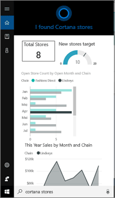
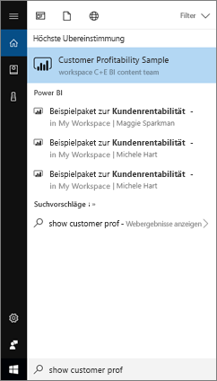
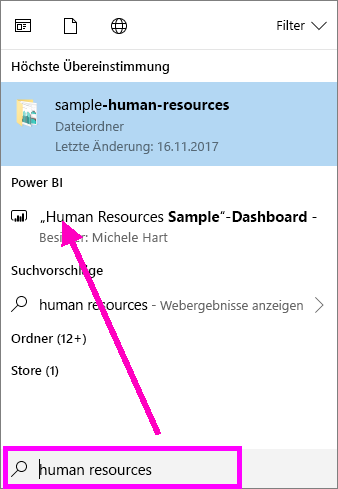
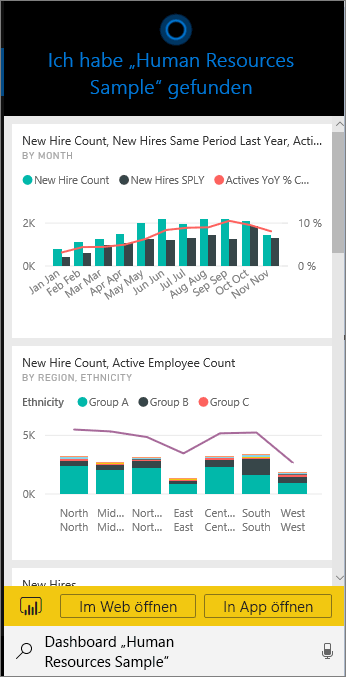
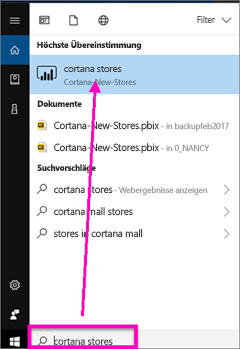
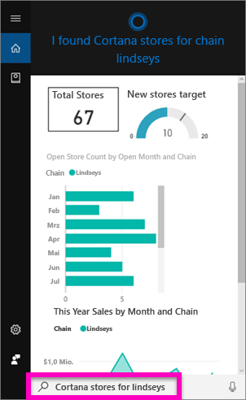
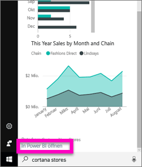
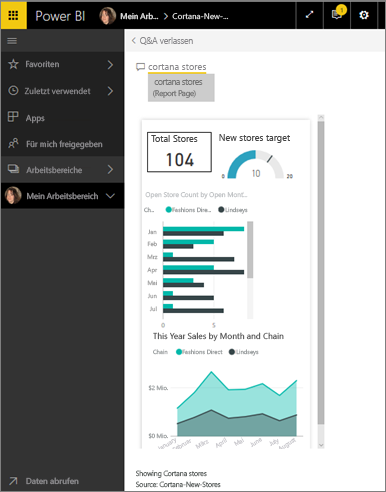

# Schnelles Auffinden und Anzeigen Ihrer Power BI-Daten mithilfe von Cortana für Power BI
Verwenden Sie Cortana auf Ihren Windows 10-Geräten, um sofort Antworten auf wichtige geschäftliche Fragen zu erhalten. Durch die Integration mit Power BI kann Cortana wichtige Informationen direkt aus Power BI-Dashboards und -Berichten abrufen. Sie benötigen lediglich die Windows 10-Version vom November 2015 oder eine höhere Version, Cortana, Power BI sowie Zugriff auf mindestens ein Dataset.

## Vorschauversion der neuen *Dashboard*-Suche von Cortana für Windows 10
Sie sind bereits eine Weile in der Lage, [mithilfe von Cortana bestimmte Typen von Berichtsseiten abzurufen](service-cortana-answer-cards.md). Nun haben wir eine **neue Benutzererfahrung** hinzugefügt: Sie können nun auch Dashboards abrufen. Probieren Sie es aus, und [senden Sie uns Feedback](mailto:pbicortanasg@microsoft.com). Schließlich wird die *neue Benutzererfahrung* erweitert, dass auch eine Cortana-Suche für Berichte verfügbar ist.  Einer der wichtigsten Vorteile der neuen Benutzererfahrung besteht darin, dass Sie keine speziellen Einrichtungsschritte ausführen müssen – Cortana muss nicht aktiviert und Windows 10 muss nicht konfiguriert – die Funktion ist sofort einsatzbereit.

> [!NOTE]
> Sollte sie nicht „sofort einsatzbereit“ sein, sehen Sie den [Artikel zur Problembehandlung](service-cortana-troubleshoot.md) ein, um Hilfe zu erhalten.
> 
> 

Die zugrunde liegende Technologie verwendet den [Azure Search-Dienst von Microsoft](). Dieser Suchdienst bietet weitere Möglichkeiten, wie intelligente Bewertung, Fehlerkorrektur und Autovervollständigung.

Beide Cortana-Funktionen können parallel verwendet werden.

## Dokumentation zu Cortana für Power BI
Insgesamt gibt es vier Dokumente, in denen Sie schrittweise Anweisungen zum Einrichten und Verwenden von Cortana für Power BI erhalten. Diese Artikelserie führt Sie durch die Schritte der folgenden Aufgaben:

**Artikel 1** (dieser Artikel): So erfolgt die Zusammenarbeit von Cortana und Power BI

**Artikel 2**: [Durchsuchen von Power BI-Berichten: Aktivieren der Integration von Cortana – Power BI – Windows](service-cortana-enable.md)

**Artikel 3**: [Durchsuchen von Power BI-Berichten: Erstellen von speziellen *Cortana-Antwortkarten*](service-cortana-answer-cards.md)

**Artikel 4**: [Behandeln von Problemen](service-cortana-troubleshoot.md)

## Wie arbeiten Cortana und Power BI zusammen?
Wenn Sie mit Cortana eine Frage stellen, kann Cortana auch in Power BI nach Antworten suchen. Cortana kann in Power BI umfassende, auf Daten in Power BI-Berichten basierende Antworten ermitteln (die einen besonderen Typ von Berichtsseiten enthalten, der als *Cortana-Antwortkarte* bezeichnet wird). Eine weitere Quelle sind Power BI-Dashboards.

Wenn Cortana eine Übereinstimmung findet, wird der Name des Dashboards oder der Berichtsseite direkt auf dem Cortana-Bildschirm angezeigt. Das Dashboard oder die Berichtsseite kann in Power BI geöffnet werden. Berichtsseiten können auch direkt in Cortana durchsucht werden, denn sie sind interaktiv.

### Cortana und Dashboards (die *neue Benutzererfahrung*)
Cortana sucht nach Antworten in Ihren eigenen Dashboards sowie in Dashboards, die für Sie freigegeben wurden. Stellen Sie Cortana Fragen anhand von Titeln, Schlüsselwörtern, Besitzernamen, Arbeitsbereichsnamen, App-Namen usw.

Ihre Frage muss mindestens zwei Wörter umfassen, damit Cortana eine Antwort finden kann. Wenn Sie also in einem Dashboard suchen, dessen Name aus einem Wort besteht („Marketing“), fügen Sie den Begriff „anzeigen“ oder „Power BI“ oder „<owner name>“ Ihrer Frage hinzu, z.B. „Marketing anzeigen“ und „Michele Hart-Beispiel“. 

Weist Ihr Dashboard einen Titel auf, der aus mehreren Wörtern besteht, gibt Cortana dieses Dashboard nur zurück, wenn die Suche eine Übereinstimmung mit mindestens zwei der Wörter ergibt, oder wenn der Titel des Dashboards mindestens einen der Begriffe und den Besitzernamen enthält. Für ein Dashboard mit dem Namen „Beispiel zur Kundenrentabilität“: 

* „Kunden anzeigen“ gibt *kein* Power BI-Dashboard als Ergebnis zurück.   
* Formulierungen wie „Kundenrentabilität anzeigen“, „Kundenr“, „Kunde B“, „Rentabilitätsbeispiel“, „Michele Hart Beispiel“, „Beispiel zur Kundenrentabilität anzeigen“ und „Kundenr anzeigen“ *liefern* hingegen ein Power BI-Ergebnis.
* Wird das Wort „powerbi“ hinzugefügt, zählt es als eines der zwei erforderlichen Wörter, daher *wird* bei „powerbi Beispiel“ ein Power BI-Ergebnis zurückgegeben. 
  
    

### Cortana und Berichte
 Cortana findet Antworten in Berichten, die [Seiten enthalten, welche speziell für die Anzeige in Cortana entwickelt wurden](service-cortana-answer-cards.md). Stellen Sie einfach Fragen anhand des Titels oder von Schlüsselwörtern aus einer dieser speziellen Berichtsseiten.  

Als zugrunde liegende Technologie für Berichte wird [Power BI Q&A von Microsoft](power-bi-q-and-a.md) verwendet.

Wenn Sie in Cortana eine Frage stellen, gibt Power BI Antworten mit Berichtsseiten aus, die speziell für Cortana entwickelt wurden. Mögliche Antworten werden von Cortana direkt anhand der Cortana-*Antwortkarten* bestimmt, die bereits in Power BI erstellt sind.  Öffnen Sie einfach ein Ergebnis in Power BI, um eine Antwort weiter zu erkunden.

> [!NOTE]
> Bevor Cortana in den Power BI-Berichten nach Antworten suchen kann, müssen Sie [dieses Feature mithilfe des Power BI-Diensts aktivieren und Windows für die Kommunikation mit Power BI](service-cortana-enable.md) einrichten.  
> 
> 

## Verwenden von Cortana, um Antworten aus Power BI abzurufen
1. Beginnen Sie in Cortana. Es gibt viele verschiedene Möglichkeiten, Cortana zu *öffnen*: Wählen Sie das Cortana-Symbol auf der Taskleiste (unten abgebildet) aus, verwenden Sie Sprachbefehle, oder tippen Sie auf das Suchsymbol auf Ihrem Windows-Mobilgerät.
   
     
2. Sobald Cortana bereit ist, können Sie Ihre Frage in der Suchleiste von Cortana eingeben oder sprechen. Cortana zeigt die verfügbaren Ergebnisse an. Wenn ein Power BI-Dashboard vorhanden ist, das Ihrer Frage entspricht, wird sie unter **Höchste Übereinstimmung** oder **Power BI** angezeigt.
   
     
   
   > [!NOTE]
   > Derzeit wird nur die englische Sprache unterstützt.
   > 
   > 
3. Wählen Sie das Dashboard aus, um es in Cortana zu öffnen.

    

    Sie können das Layout ändern, indem Sie die [*Telefonansicht* des Dashboards bearbeiten](service-create-dashboard-mobile-phone-view.md). 

1. Sie können das Dashboard auch aus Cortana heraus im Power BI-Dienst und in Power BI Mobile öffnen. Öffnen Sie das Dashboard im Power BI-Dienst, indem Sie **Im Web öffnen** auswählen. 
   
      
4. Suchen Sie nun mithilfe von Cortana nach einem Bericht. Es muss sichergestellt sein, dass es einen [Bericht gibt, der eine Seite mit einer Cortana-Antwortkarte enthält](service-cortana-answer-cards.md). In diesem Beispiel enthält ein Bericht mit dem Namen „Cortana-New-Stores“ eine Cortana-Antwortkarte mit dem Namen „cortana stores“.  
   
     Sprechen oder geben Sie in der Cortana-Suchleiste Ihre Frage ein. Cortana zeigt die verfügbaren Ergebnisse an. Wenn eine Power BI-Berichtsseite vorhanden ist, die Ihrer Frage entspricht, wird sie unter **Höchste Übereinstimmung** oder **Power BI** angezeigt. Und in diesem Beispiel wird zudem die PBIX-Datei (und die Sicherung) angezeigt, die ich zum Erstellen der Antwortkarten verwendet habe (unter **Dokumente**).
   
      
5. Wählen Sie die Berichtsseite **Cortana stores** aus, um sie im Cortana-Fenster anzuzeigen.
   
       
   
    Beachten Sie, dass eine *Antwortkarte* ein besonderer Typ von Power BI-Berichtsseite ist, die vom Besitzer eines Datasets erstellt wurde.  Weitere Informationen finden Sie unter [Erstellen einer Cortana-Antwortkarte](service-cortana-answer-cards.md).
6. Aber das ist noch nicht alles. Sie können wie in Power BI mit den Visualisierungen auf der Antwortkarte interagieren.
   
   * Wählen Sie z.B. ein Element in einer Visualisierung aus, um die anderen Visualisierungen auf der Antwortkarte kreuzzufiltern und hervorzuheben.
     
     
   * Oder verwenden Sie stattdessen natürliche Sprache, um die Ergebnisse zu filtern.  Wenn Sie z.B. die Frage „Cortana stores for Lindseys“ stellen, wird die Karte gefiltert, sodass nur Daten für die Handelskette Lindseys angezeigt werden.
     
     
7. Setzen Sie Ihre Erkundung fort. Scrollen Sie zum unteren Rand des Cortana-Fensters, und wählen Sie **In Power BI öffnen** aus.
   
     
8. Die Berichtsseite wird in Power BI geöffnet.    
     

## Zu beachtende Aspekte und Problembehandlung
* Cortana hat keinen Zugriff auf Cortana-Karten, die nicht [für Power BI aktiviert](service-cortana-enable.md) wurden.
* Können Sie Cortana immer noch nicht mit Power BI verwenden?  Verwenden Sie die [Cortana-Problembehandlung](service-cortana-troubleshoot.md).
* Cortana ist für Power BI derzeit nur in englischer Sprache verfügbar.
* Cortana für Power BI ist nur auf Windows-Mobilgeräten verfügbar.

Weitere Fragen? [Wenden Sie sich an die Power BI-Community](http://community.powerbi.com/)

## Nächste Schritte
[Aktivieren der Integration von Cortana – Power BI – Windows für Berichte](service-cortana-enable.md)

