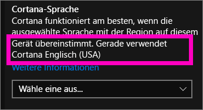
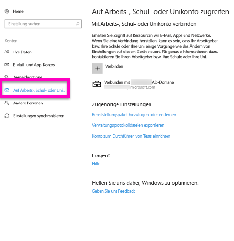
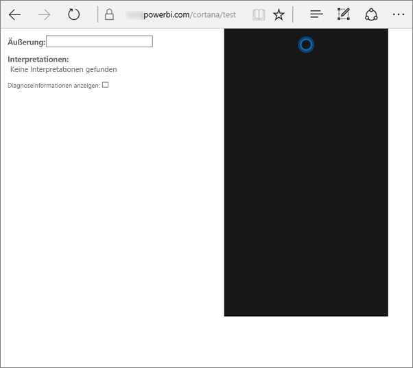
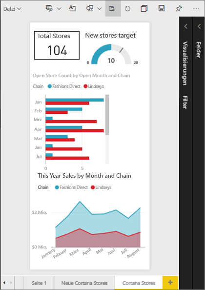
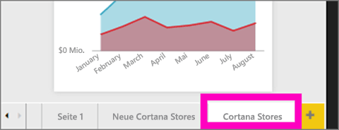
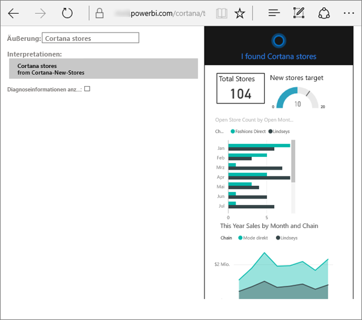
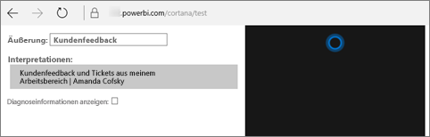

# Behandeln von Problemen bei Cortana für Power BI
Dieser Artikel ist Teil einer Serie. 

> [!IMPORTANT]
> Cortana-Integration ist in Power BI veraltet. Gestartet am 11. Juni, funktioniert Cortana nicht mehr für alle Dashboards und Berichte.

Wenn Sie beim Abrufen von Cortana in Power BI integrieren Probleme auftreten, sind Sie an die richtige Stelle gekommen. Führen Sie die folgenden Schritte zum Diagnostizieren und Beheben des Problems aus.

## Warum findet Cortana keine Antworten in meinen Power BI-Berichten oder -Dashboards?
1. Haben Sie ein Power BI-Konto?  Wenn nicht, [Registrieren Sie sich für eine kostenlose Testversion](https://powerbi.microsoft.com/get-started/).
2. Ist Cortana funktionsfähig?  Wird auf der Taskleiste das Cortana-Symbol angezeigt?

    

    Wenn Sie es auswählen, wird Cortana mit einem Eingabefeld geöffnet?
3. Haben Sie für die Suche mindestens zwei Wörter eingegeben? Cortana benötigt Ausdrücke aus mindestens zwei Wörtern, um Antworten in Power BI finden zu können. Versuchen Sie, am Anfang Ihrer Frage das Wort „show“ hinzuzufügen.
4. Weist Ihr Dashboard einen Titel auf, der aus mehreren Wörtern besteht, gibt Cortana dieses Dashboard nur zurück, wenn die Suche eine Übereinstimmung mit mindestens zwei der Wörter ergibt. Für ein Dashboard mit dem Namen „Sales FY16“:

   * gibt „show sales“ *kein* Power BI-Ergebnis zurück.   
   * „show me sales fy16“, „sales fy16“, „show sales fy16“ und „show me sales f“ hingegen *liefern* ein Power BI-Ergebnis.    
   * Wird das Wort „powerbi“ hinzugefügt, zählt es als eines der zwei erforderlichen Wörter, daher *wird* bei „powerbi sales“ ein Power BI-Ergebnis zurückgegeben.
5. Verfügen Sie über Berechtigungen zum Aufrufen oder Bearbeiten von Berichten oder Dashboards? Vergewissern Sie sich bei Berichten, dass für die zu durchsuchenden Inhalte eine [Antwortkarte](service-cortana-answer-cards.md) vorhanden ist.  Vergewissern Sie sich bei Dashboards, dass sich die zu durchsuchenden Inhalte in **Für mich freigegeben**, in einem App-Arbeitsbereich oder in **Mein Arbeitsbereich** befinden. [Verwenden Sie das Problembehandlungstool](#try-the-cortana-troubleshooting-tool), um Hilfe bei der Identifizierung des Problems zu erhalten.
6. Verwenden Sie ein mobiles Gerät?  Derzeit wird die Integration von Power BI und Cortana ausschließlich auf Windows-Mobilgeräten unterstützt.
7. Ist Cortana für Englisch konfiguriert?  Die aktuelle Integration von Cortana in Power BI unterstützt nur Englisch. Öffnen Sie Cortana, und wählen Sie das Zahnradsymbol aus, um „Einstellungen“ anzuzeigen. Scrollen Sie nach unten zu **Cortana-Sprache**, und stellen Sie sicher, dass die Einstellung auf eine der Optionen für Englisch festgelegt ist.

   
8. Verfügen Sie über mehr als 100 Berichte, die für Cortana aktiviert sind?  Cortana durchsucht nur bis zu insgesamt 100 Datasets und Berichte.  Um sicherzustellen, dass der Bericht in die Suche eingeschlossen wird, verschieben oder kopieren Sie den Bericht in **Mein Arbeitsbereich**, da Cortana dort zuerst sucht.
9. Sie müssen eventuell etwas warten. Wenn Sie zum ersten Mal eine Abfrage eingeben, ist das Modell möglicherweise *noch nicht betriebsbereit*. Warten Sie einige Sekunden, damit die Daten in den Arbeitsspeicher geladen werden können, und versuchen Sie es dann erneut.
10. Bei Dashboards kann es bis zu 24 Stunden dauern, bis sie in Cortana zugänglich sind.    
11. Wenn für Berichte Power BI ein neues Dataset oder eine benutzerdefinierte Cortana-Antwortkarte hinzugefügt und für Cortana aktiviert wird, kann es zudem bis zu 30 Minuten dauern, bis Ergebnisse in Cortana angezeigt werden. Durch das Anmelden und Abmelden bei Windows 10 oder einen Neustart des Cortana-Prozesses in Windows 10 werden neue Berichtsinhalte sofort angezeigt.  
12. Ihr Power BI-Administrator kann eine Abmeldung vornehmen. Wenden Sie sich an Ihren Administrator, um festzustellen, ob dies der Fall ist.

## Nur für Berichte: Warum findet Cortana in meinen Power BI-Berichten keine Antworten?
1. Wenn Sie nach Antworten in Berichten suchen, verfügen Sie über Berichte mit Cortana-**Antwortkarten**? Antwortkarten sind die einzige Möglichkeit, mit der Cortana Antworten in den Power BI-Berichten finden kann.  Lesen Sie [Erstellen von Cortana-Antwortkarten im Power BI-Dienst und in Power BI Desktop](service-cortana-answer-cards.md), um zu erfahren, wie Sie eine Antwortkarte erstellen.
2. Führen Sie Windows, Version 1511, oder höher aus?  Um dies zu ermitteln, öffnen Sie in Windows „Einstellungen“ und wählen Sie **System > Info** aus. Wenn dies nicht der Fall ist, aktualisieren Sie Ihre Version von Windows.
3. Sind Ihr Windows-Konto und Power BI-Konto verbunden? Dies kann verwirrend sein. Befolgen Sie die Anweisungen in [Aktivieren von Cortana für Power BI](service-cortana-enable.md#add-your-power-bi-credentials-to-windows).
4. Wurden die zugrunde liegenden Datasets für Cortana aktiviert? Möglicherweise hat ein Mitarbeiter ein Dataset freigegeben, das bereits für Cortana aktiviert wurde. Wenn dies jedoch nicht der Fall ist, [informieren Sie sich, wie Sie selbst Datasets für Cortana aktivieren](service-cortana-enable.md). Das Verfahren ist schnell und einfach.

## Nur für Dashboards: Warum findet Cortana in meinen Power BI-Dashboards keine Antworten?
1. Stellen Sie sicher, dass Sie mit Ihrem Geschäftskonto verbunden sind. Power BI benötigt diese Verbindung, um Ihre Zugriffsberechtigungen für Daten authentifizieren zu können. Um zu überprüfen, ob eine Verbindung besteht und ggf. eine Verbindung mit Ihrem Geschäftskonto herzustellen, navigieren Sie mithilfe des Windows-Suchfelds zu „Mit Arbeit oder Schule verbinden“.  

    
2. Verfügen Sie über Zugriff auf Cortana? Wählen Sie das Windows-Suchfeld aus, und geben Sie Cortana-Zugriffsberechtigungen für Ihre Informationen an.

## Verwenden des Cortana-Problembehandlungstools
Immer noch Probleme?  Jetzt empfiehlt es sich, das Cortana-Problembehandlungstool auszuführen und die möglichen Probleme einzugrenzen.

### Sie haben Probleme, Antworten aus einem Bericht abzurufen?
1. Bei Berichten müssen Sie vor dem Ausführen des Problembehandlungstools die **Filter auf Seitenebene** der Cortana-Antwortkarten auf **Einfachauswahl erforderlich** festlegen. Hilfe hierzu finden Sie unter [Erstellen von Cortana-Antwortkarten](service-cortana-answer-cards.md).
2. Öffnen Sie das Problembehandlungstool, indem Sie am Ende der URL des Power BI-Diensts „/cortana/test“ hinzufügen. Die URL sollte ungefähr wie folgt aussehen:

   app.powerbi.com/cortana/test

   
3. Geben Sie für eine Problembehandlung bei Berichten im Feld **Utterance** (Äußerung) den Namen einer Cortana-Antwortkarte ***genau so ein, wie er auf der Power BI-Registerkarte angezeigt wird***.

   

    

   
4. Manchmal führt die erste Eingabe im Feld **Utterance** (Äußerung) zu keiner Reaktion. Durch diese erste Eingabe wird das Problembehandlungstool lediglich aktiviert. Geben Sie den Namen manuell oder durch Ausschneiden und Kopieren erneut im Feld **Utterance** (Äußerung) ein. In diesem Beispiel lautet der Name der Antwortkarte **Cortana stores**. Das Einfügen oder Eingeben von **Cortana stores** im Tool liefert ein einzelnes Ergebnis, das im Feld **Interpretations** (Interpretationen) angezeigt wird. Klicken Sie, um die im Cortana-Fenster dargestellte Antwortkarte anzuzeigen. In diesem Fall handelt es sich um **Cortana stores**.

   

   Da wir ein Ergebnis erhalten haben, wissen wir jetzt, dass Cortana in Power BI **aktiviert ist**. Dadurch wird das Problem eingegrenzt: Es kann sich um eine Einstellung von Windows, um die Spracheinstellung von Cortana oder darum handeln, dass mehr als 100 Datasets für Cortana aktiviert sind.

### Sie haben Probleme, Antworten aus einem Dashboard abzurufen?
Sie suchen ein Dashboard, das für Sie freigegeben wurde?  Öffnen Sie Power BI > **Für mich freigegeben**, und suchen Sie nach dem Namen des Dashboards.  Geben Sie diesen Namen anschließend im Feld **Utterances** (Äußerungen) ein.

#### Bekannte Probleme beim Problembehandlungstool
* Wenn das Tool die Ergebnisse nicht beim ersten Mal abruft, fügen Sie die Abfrage stattdessen im Textfeld „Utterance“ (Äußerung) ein.
* Die Abfrage muss mindestens 2 Wörter enthalten.  Wenn die Abfrage zu kurz ist, fügen Sie das Wort „show“ hinzu.
* Einige Abfragezeichenfolgen mit Präpositionen sind möglicherweise nicht zulässig (z.B. „sales by item“). Verwenden Sie andere Abfrageausdrücke, die keine Präpositionen enthalten und aussagekräftig/eindeutig sind.

Weitere Fragen? [Wenden Sie sich an die Power BI-Community](http://community.powerbi.com/)
