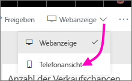
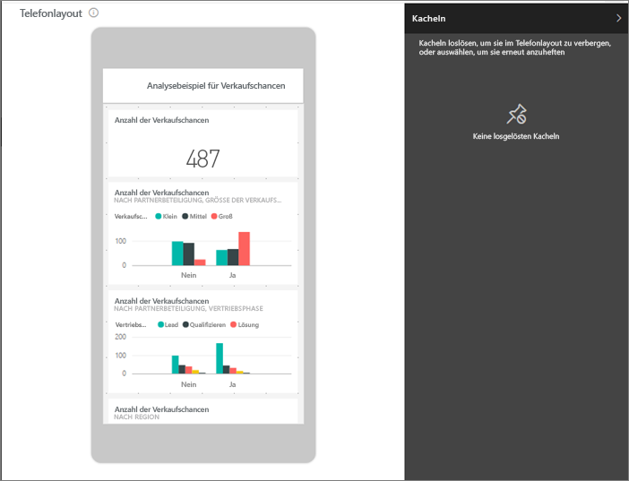
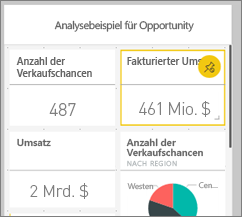
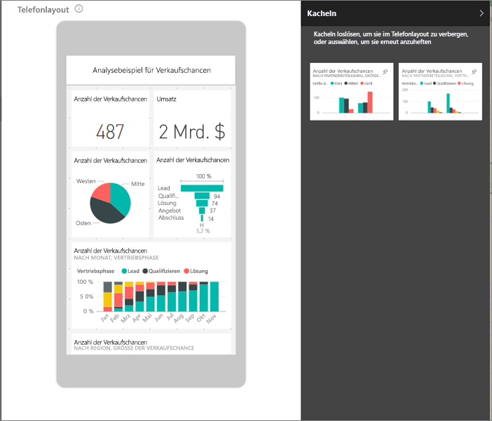
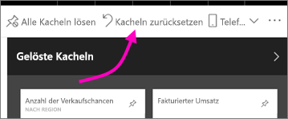

# Erstellen eines für Mobiltelefone optimierten Power BI-Dashboards
Wenn Sie Dashboards in der mobilen Power BI-App auf einem Telefon anzeigen, werden Sie bemerken, dass die Dashboardkacheln nacheinander angeordnet sind und die gleiche Größe aufweisen. Sie können im Power BI-Dienst eine benutzerdefinierte Ansicht eines jeden Dashboards erstellen, das Sie besitzen – speziell für Telefone.

Wenn Sie den Bildschirm um 90° drehen, wird das Dashboard wie im Dienst angezeigt, nicht so, wie Sie es für das Telefon entworfen hatten.

> [!NOTE]
> Während Sie die Telefonansicht bearbeiten, kann jeder, der das Dashboard auf einem Telefon anzeigt, Ihre Änderungen in Echtzeit verfolgen. Wenn Sie beispielsweise alle Kacheln in Ihrer Telefonansicht des Dashboards lösen, verfügt das Dashboard auf anderen Telefonen plötzlich über keine Kacheln mehr. 
> 
> 

## Erstellen einer Telefonansicht eines Dashboards
1. Öffnen Sie ein Dashboard im Power BI-Dienst.
2. Wählen Sie in der rechten oberen Ecke den Pfeil neben **Webansicht**, und wählen Sie dann **Telefonansicht** aus.

    

    Wenn Sie nicht der Besitzer des Dashboards sind, wird Ihnen diese Option nicht angezeigt.

    

    Die Bearbeitungsansicht für das Telefondashboard wird geöffnet. Hier können Sie Kacheln lösen, ihre Größe ändern und sie neu anordnen, um die Telefonansicht anzupassen. Die Webversion des Dashboards ändert sich dabei nicht.

1. Wählen Sie eine Kachel aus, um sie zu ziehen, ihre Größe zu ändern oder sie zu lösen. Sie werden feststellen, dass die anderen Kacheln sich zur Seite bewegen, während Sie eine Kachel über den Bildschirm ziehen.
   
    
   
    Sie können die gelösten Kacheln im Bereich „Gelöste Kacheln“ ablegen, wo Sie angezeigt werden, bis Sie sie wieder hinzufügen.
   
    
2. Wenn Sie es sich anders überlegen, wählen Sie **Kacheln zurücksetzen** aus, um die ursprüngliche Größe und Reihenfolge der Kacheln wiederherzustellen.
   
    
   
    Durch Öffnen der Telefonbearbeitungsansicht im Power BI-Dienst ändern sich die Größe und die Form der Kacheln auf einem Telefon nur minimal. Wählen Sie also **Kacheln zurücksetzen** aus, um das Dashboard auf genau den Zustand vor der Öffnung der Telefonbearbeitungsansicht zurückzusetzen.
3. Wenn Sie mit dem Layout des Telefondashboards zufrieden sind, wählen Sie in der rechten oberen Ecke den Pfeil neben **Telefonansicht** und dann die Option **Webansicht** aus.
   
    Das Telefonlayout wird in Power BI automatisch gespeichert.

## Nächste Schritte
* [Erstellen von Berichten, die für die Power BI-Smartphone-Apps optimiert sind](desktop-create-phone-report.md)
* [Erstellen von dynamischen Visuals, die für eine beliebige Größe optimiert sind](desktop-create-responsive-visuals.md)
* Weitere Fragen? [Stellen Sie Ihre Frage in der Power BI-Community.](http://community.powerbi.com/)

