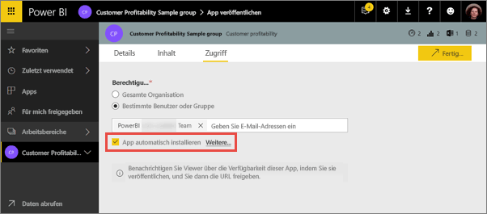

# Veröffentlichen von Apps mit Dashboards und Berichten in Power BI

In Power BI können Sie *Apps* mit Sammlungen zugehöriger Dashboards und Berichten veröffentlichen. Sie können Apps in *App-Arbeitsbereichen* erstellen, in denen Sie mit Ihren Kollegen zusammen an Power BI-Inhalten arbeiten können. Anschließend können Sie die fertigen Apps für große Personengruppen in Ihrer Organisation veröffentlichen. Weitere Informationen zum [Erstellen von App-Arbeitsbereichen](service-create-workspaces.md).

Ihre Geschäftskunden benötigen für den Betrieb ihres Unternehmens häufig mehrere Power BI-Dashboards und -Berichte. Mit Power BI-Apps können Sie Sammlungen von Dashboards und Berichten erstellen und diese Apps in Ihrer gesamten Organisation oder für bestimmte Personen oder Gruppen veröffentlichen. Apps vereinfachen das Verwalten von Berechtigungen für derartige Sammlungen für Berichtersteller und Administratoren.

Geschäftskunden erhalten Ihre Apps mit unterschiedlichen Methoden. Wenn der Power BI-Administrator Ihnen die entsprechende Berechtigung gewährt, können Sie Apps automatisch in den Power BI-Konten Ihrer Kollegen installieren. Andernfalls können diese Ihre Apps über Microsoft AppSource installieren, oder Sie können ihnen einen direkten Link senden. Sie können die Inhalte problemlos finden und zu ihnen zurückkehren, da sich alles an zentraler Stelle befindet. Sie können die Inhalte der App nicht ändern, aber sie können mit ihr im Power BI-Dienst oder in einer der mobilen Apps interagieren, indem sie die Daten selbst filtern, hervorheben und sortieren. Sie erhalten Updates automatisch, und Sie können steuern, wie oft die Daten aktualisiert werden. Erfahren Sie mehr über die [Nutzung von Apps durch Geschäftskunden](service-install-use-apps.md).

**Wussten Sie schon?** Power BI enthält nun neue Vorschaufeatures für Arbeitsbereiche. Unter [Erstellen der neuen Arbeitsbereiche (Vorschau)](service-create-the-new-workspaces.md) erfahren Sie, wie sich Arbeitsbereiche in der Zukunft entwickeln. 

## Apps und organisationsbezogene Inhaltspakete
Apps sind die Weiterentwicklung von organisationsbezogenen Inhaltspaketen. Inhaltspakete sind in der Vorschauversion der neuen Arbeitsbereiche nicht verfügbar. Wenn die neuen Arbeitsbereiche in die allgemeine Verfügbarkeit übergehen, werden Sie in neu erstellten Arbeitsbereichen keine Inhaltspakete mehr verwenden können. Wenn Sie es noch nicht getan haben, sollten Sie Ihre Inhaltspakete zu Apps migrieren.

## Video: Apps und App-Arbeitsbereiche
<iframe width="640" height="360" src="https://www.youtube.com/embed/Ey5pyrr7Lk8?showinfo=0" frameborder="0" allowfullscreen></iframe>

## Lizenzen für Apps
Alle Mitglieder eines App-Arbeitsbereichs benötigen eine Power BI Pro-Lizenz. App-Benutzern stehen zwei Optionen zur Verfügung.

* Option 1: Alle Geschäftsbenutzer benötigen **Power BI Pro**-Lizenzen, um Ihre App anzeigen zu können. 
* Option 2: Benutzer von Power BI Free in Ihrer Organisation können App-Inhalte anzeigen, wenn sich Ihre App in einer Power BI Premium-Kapazität befindet. Details finden Sie unter [Was ist Power BI Premium?](service-premium.md).

## Veröffentlichen der App
Wenn die Dashboards und Berichte in Ihrem Arbeitsbereich bereit sind, wählen Sie aus, welche Dashboards und Berichte Sie veröffentlichen möchten. Anschließend veröffentlichen Sie diese als App. Sie können einen direkten Link an die größere Zielgruppe senden. Alternativ können deren Mitglieder zu **Klicken Sie, um die App aus dem Store abzurufen** navigieren, um Ihre App auf der Registerkarte „Apps“ zu finden. 

1. Entscheiden Sie in der Listenansicht des Arbeitsbereichs, welche Dashboards und Berichte Sie in die App einschließen möchten.

     

     Wenn Sie einen Bericht nicht für die Veröffentlichung auswählen, wird neben dem Bericht und dem zugehörigen Dashboard eine Warnung angezeigt. Sie können die App veröffentlichen, jedoch fehlen im entsprechenden Dashboard die Kacheln aus diesem Bericht.

     

2. Wählen Sie rechts oben die Schaltfläche **App veröffentlichen** aus, um mit dem Freigeben aller Inhalte in diesem Arbeitsbereich zu beginnen.
   
     

3. Geben Sie in **Details** die Beschreibung ein, damit andere Personen die App leichter finden. Sie können eine Hintergrundfarbe festlegen, um die App zu personalisieren.
   
     

4. Unter **Inhalt** wird der Inhalt angezeigt, der als Teil der App veröffentlicht wird. Dies ist der gesamte Inhalt, den Sie in diesem Arbeitsbereich ausgewählt haben. Sie können auch die Landing Page der App festlegen – dies ist das Dashboard oder der Bericht, der für Benutzer als Erstes angezeigt wird, wenn sie Ihre App öffnen. Sie können **Keine** auswählen. Dann wird als Erstes eine Liste des gesamten Inhalts der App angezeigt. 
   
     

5. Legen Sie unter **Zugriff** fest, wer Zugriff auf die App hat: jeder Benutzer in der Organisation, nur bestimmte Personen oder Active Directory-Sicherheitsgruppen. Wenn Sie über entsprechende Berechtigungen verfügen, können Sie die App automatisch für die Empfänger installieren lassen. Sie können diese Einstellung im [Power BI-Verwaltungsportal](#how-to-enable-pushing-apps) aktivieren. Hier finden Sie weitere Aspekte: [Übertragung einer App mithilfe von Push](#how-to-enable-pushing-apps).

    

6. Wenn Sie **Fertig stellen** auswählen, wird eine Meldung mit der Bestätigung angezeigt, dass die App jetzt veröffentlicht werden kann. Sie können im Dialogfeld mit der Erfolgsmeldung die URL, die ein direkter Link zu dieser App ist, kopieren und an die Personen senden, für die Sie die App freigegeben haben.
   
     

Erfahren Sie mehr über die [Nutzung von Apps durch Geschäftskunden](service-install-use-apps.md).

## Ändern der veröffentlichten App
Nachdem Sie Ihre App veröffentlicht haben, möchten Sie sie eventuell ändern oder aktualisieren. Es ist einfach, diese zu aktualisieren, wenn Sie über Administratorrechte verfügen, Mitglied des App-Arbeitsbereichs oder Mitwirkender in einem neuen App-Arbeitsbereich sind. 

1. Öffnen Sie den App-Arbeitsbereich, der der App entspricht. 
   
     
2. Öffnen Sie das Dashboard oder den Bericht. Sie werden feststellen, dass Sie jede gewünschte Änderung vornehmen können.
   
     Der App-Arbeitsbereich ist der Stagingbereich. Deshalb werden Ihre Änderungen nicht in Echtzeit in der App angezeigt, bis Sie die App erneut veröffentlichen. So können Sie Änderungen vornehmen, ohne dass sich diese auf die veröffentlichten Apps auswirken.  
 
3. Kehren Sie zur Liste der Inhalte im App-Arbeitsbereich zurück, und wählen Sie **App aktualisieren** aus.
   
     

4. Aktualisieren Sie ggf. **Details**, **Inhalt** und **Zugriff**, und wählen Sie dann **App aktualisieren** aus.
   
     

Den Personen, für die Sie die App veröffentlicht haben, wird automatisch die aktualisierte Version der App angezeigt. 

## Automatisches Installieren von Apps für Endbenutzer
Apps liefern Daten, die Ihre Endbenutzer benötigen, um ihre Aufträge erledigen zu können. Wenn ein Administrator Ihnen die Berechtigungen erteilt, können Sie Apps für Endbenutzer automatisch installieren, um so die Verteilung der richtigen Apps an die richtigen Leute oder Gruppen zu vereinfachen. Ihre App wird automatisch in der Apps-Inhaltsliste der Endbenutzer angezeigt, sodass diese sie nicht in Microsoft AppSource suchen oder auf einen Installationslink klicken müssen. Dies erleichtert es Ihnen, Ihre Benutzer mit dem Standardinhalt von Power BI vertraut zu machen.

### So führen Sie die automatische Installation einer App für Endbenutzer durch
Sobald der Administrator Ihnen die Berechtigungen zugewiesen hat, verfügen Sie über die neue Option **install the app automatically** (App automatisch installieren). Wenn Sie das Kontrollkästchen aktivieren und auf **Fertig stellen** (oder **App aktualisieren** bei vorhandenen Apps) klicken, wird die App mithilfe von Push an alle Benutzer oder Gruppen übertragen, die im Abschnitt **Berechtigungen** der App auf der Registerkarte **Zugriff** definiert sind.

### So erhalten Benutzer die Apps, die mithilfe von Push an sie übertragen wurden
Nachdem Sie eine App mithilfe von Push übertragen haben, wird sie automatisch in der Liste der Apps angezeigt. Sie können die Apps zusammenstellen, die bestimmte Benutzer oder Aufgabengebiete in Ihrer Organisation benötigen.

### Überlegungen zum automatischen Installieren von Apps
Beachten Sie bei der Übertragung von Apps mithilfe von Push an Benutzer folgende Punkte:

* Die automatische Installation für Benutzer einer App kann zeitaufwendig sein. Die meisten Apps werden für Benutzer sofort installiert, die Übertragung von Apps mithilfe von Push kann allerdings einige Zeit in Anspruch nehmen.  Dies ist von der Anzahl der Elemente in der App und der Anzahl der Personen abhängig, denen der Zugriff gewährt wird. Es wird empfohlen, die Übertragung von Apps mithilfe von Push außerhalb der Stoßzeiten und mit ausreichend Vorlaufzeit durchzuführen, bevor die Benutzer diese benötigen. Überprüfen Sie die Funktionsfähigkeit des Vorgangs mit einigen wenigen Benutzern, bevor Sie die Verfügbarkeit der App im großen Rahmen ankündigen.

* Aktualisieren Sie Ihren Browser. Bevor die mithilfe von Push übertragene App in der Liste der Apps angezeigt wird, muss der Benutzer seinen Browser gegebenenfalls aktualisieren, schließen und neu öffnen.

* Wenn der Benutzer die App nicht sofort in der Liste der Apps sieht, sollte der Browser aktualisiert, geschlossen und neu geöffnet werden.

* Versuchen Sie die Benutzer nicht zu überfordern. Achten Sie darauf, dass nicht zu viele Apps mithilfe von Push übertragen werden, damit die Benutzer die vorinstallierten Apps als nützlich wahrnehmen. Um ein sinnvolles Timing zu gewährleisten, sollten Sie steuern können, wer Apps mithilfe von Push an Endbenutzer übertragen kann. Sie können eine Kontaktperson auswählen, die für das Übertragen von Apps in Ihrer Organisation mithilfe von Push an Endbenutzer verantwortlich ist.

* Für Gastbenutzer, die keine Einladung angenommen haben, werden keine Apps automatisch installiert.  

## Aufheben der Veröffentlichung einer App
Jedes Mitglied eines App-Arbeitsbereichs kann die Veröffentlichung der App aufheben.

* Klicken Sie im App-Arbeitsbereich rechts oben auf die Auslassungspunkte (**...**), und wählen Sie **Veröffentlichung der App aufheben** aus.
  
     

Dadurch wird die App für alle Benutzer, für die sie veröffentlicht wurde, deinstalliert, sodass diese keinen Zugriff mehr darauf haben. Der App-Arbeitsbereich oder sein Inhalt wird dadurch nicht gelöscht.

## Nächste Schritte
* [Erstellen eines App-Arbeitsbereichs](service-create-workspaces.md)
* [Installieren und Verwenden von Apps in Power BI](service-install-use-apps.md)
* [Power BI-Apps für externe Dienste](service-connect-to-services.md)
* [Power BI-Verwaltungsportal](https://docs.microsoft.com/power-bi/service-admin-portal)
* Haben Sie Fragen? [Stellen Sie Ihre Frage in der Power BI-Community.](http://community.powerbi.com/)
