# Erstellen und Veröffentlichen von Apps mit Dashboards und Berichten in Power BI

In Power BI können Sie *Apps* erstellen, um zusammengehörige Dashboards und Berichte an einer Stelle zusammenzuführen und anschließend für große Personengruppen in Ihrer Organisation zu veröffentlichen. Sie können auch eine Verbindung mit [Power BI-Apps für externe Dienste](service-connect-to-services.md) wie Google Analytics und Microsoft Dynamics CRM herstellen.

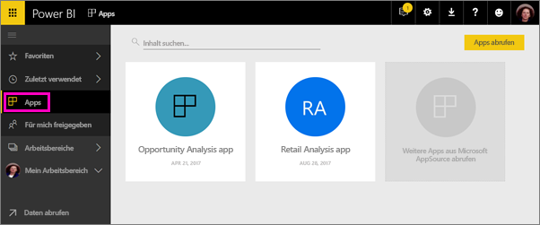

Ihre Geschäftskunden benötigen für den Betrieb ihres Unternehmens häufig mehrere Power BI-Dashboards und -Berichte. Da die Apps diese Bestandteile zusammenbringen, müssen sie sich nicht die Namen und Positionen aller dieser Dashboards merken.  

Mit Power BI-Apps, die derzeit in der Vorschauphase sind, können Sie Sammlungen von Dashboards und Berichten erstellen und diese Apps in Ihrer gesamten Organisation oder für bestimmte Personen oder Gruppen veröffentlichen. Für Sie als Berichtersteller oder Administrator vereinfachen Apps das Verwalten von Berechtigungen für Sammlungen von Dashboards.

Geschäftskunden installieren diese Apps über Microsoft AppSource, oder Sie können ihnen einen direkten Link senden. Sie können die Inhalte problemlos finden und zu ihnen zurückkehren, da sich alles an zentraler Stelle befindet. Sie erhalten Updates automatisch, und Sie können steuern, wie oft die Daten aktualisiert werden. Erfahren Sie mehr über die [Nutzung von Apps durch Geschäftskunden](service-install-use-apps.md).

### Apps und organisationsbezogene Inhaltspakete
Apps sind die Weiterentwicklung von organisationsbezogenen Inhaltspaketen. Wenn Sie bereits über organisationsbezogene Inhaltspakete verfügen, können sie weiterhin neben Apps verwendet werden.

Da Sie jetzt einen Überblick über Apps erlangt haben, wollen wir *App-Arbeitsbereiche* erläutern, in denen Sie Apps erstellen. 

## Video: Apps und App-Arbeitsbereiche
<iframe width="640" height="360" src="https://www.youtube.com/embed/Ey5pyrr7Lk8?showinfo=0" frameborder="0" allowfullscreen></iframe>

## Lizenzen für Apps
Als App-Ersteller benötigen Sie eine Power BI Pro-Lizenz. Die Benutzer Ihrer App haben zwei Optionen.

* Option 1: Alle Geschäftsbenutzer benötigen **Power BI Pro**-Lizenzen, um Ihre App anzeigen zu können. 
* Option 2: Benutzer von Power BI Free in Ihrer Organisation können App-Inhalte anzeigen, wenn sich Ihre App in einer Power BI Premium-Kapazität befindet. Details finden Sie unter [Was ist Power BI Premium?](service-premium.md).

## App-Arbeitsbereiche
Apps werden in *App-Arbeitsbereichen* erstellt. Deshalb müssen Sie zum Erstellen einer App zunächst einen App-Arbeitsbereich erstellen. Wenn Sie in Power BI bereits in einem Gruppenarbeitsbereich gearbeitet haben, werden Ihnen App-Arbeitsbereiche vertraut vorkommen. Sie sind die Weiterentwicklung von Gruppenarbeitsbereichen – Stagingbereiche und Container für die Inhalte der App. 

Sie können diesen Arbeitsbereichen Kollegen als Mitglieder oder Administratoren hinzufügen. Jedes Mitglied und jeder Administrator des App-Arbeitsbereichs benötigt eine Power BI Pro-Lizenz. In dem Arbeitsbereich können alle beim Erstellen von Dashboards, Berichten und anderen Artikeln, die Sie für eine größere Zielgruppe oder sogar die gesamte Organisation veröffentlichen möchten, zusammenarbeiten. 

Wenn der Inhalt fertig ist, veröffentlichen Sie die App. Sie können einen direkten Link an die größere Zielgruppe senden. Alternativ können deren Mitglieder zu **Klicken Sie, um die App aus dem Store abzurufen** navigieren, um Ihre App auf der Registerkarte „Apps“ zu finden. Diese Personen können die Inhalte der App nicht ändern, aber sie können mit ihnen im Power BI-Dienst oder in einer der mobilen Apps interagieren – indem sie die Daten selbst filtern, hervorheben und sortieren. 

### Wie unterscheiden sich App-Arbeitsbereiche von Gruppenarbeitsbereichen?
Alle vorhandenen Gruppenarbeitsbereiche können als App-Arbeitsbereiche fungieren, und Sie können Apps aus jedem dieser Arbeitsbereiche veröffentlichen. App-Arbeitsbereiche und Gruppenarbeitsbereiche unterscheiden sich in der folgenden Hinsicht: Sie erstellen einen App-Arbeitsbereich, um eine bestimmte App zu erstellen und dort unterzubringen. Zwischen der App und den Inhalten des App-Arbeitsbereichs besteht eine 1:1-Beziehung. Alle Elemente im App-Arbeitsbereich sind in der App enthalten, wenn Sie sie veröffentlichen. 

Da Sie jetzt über Apps und App-Arbeitsbereiche Bescheid wissen, lassen Sie uns eine App erstellen und veröffentlichen. 

## Erstellen eines App-Arbeitsbereichs
[!INCLUDE [powerbi-service-create-app-workspace](./includes/powerbi-service-create-app-workspace.md)]

Er ist leer, deshalb können Sie ihm jetzt Inhalt hinzufügen. Beachten Sie, dass Sie nach dem Erstellen möglicherweise etwa eine Stunde warten müssen, bis der Arbeitsbereich an Office 365 weitergeleitet wurde. 

Sie fügen Inhalte auf die gleiche Weise hinzu, wie Sie in „Mein Arbeitsbereich“ Inhalt hinzufügen, mit dem Unterschied, dass andere Personen im Arbeitsbereich ebenfalls den Inhalt anzeigen und bearbeiten können. Ein großer Unterschied ist, dass Sie nach Abschluss der Bearbeitung den Inhalt als App veröffentlichen können. Sie können im App-Arbeitsbereich auf die gleiche Weise wie in „Mein Arbeitsbereich“ Dateien hochladen, Verbindungen mit ihnen herstellen oder eine Verbindung mit Drittanbieterdiensten herstellen. Beispiel:

* [Stellen Sie eine Verbindung mit Diensten her](service-connect-to-services.md), z.B. Microsoft Dynamics CRM, Salesforce oder Google Analytics.
* [Rufen Sie Daten aus Dateien ab](service-get-data-from-files.md), z.B. aus Excel-, CSV- oder PBIX-Dateien (Power BI Desktop).

## Hinzufügen eines Bilds zu Ihrer App (optional)
Standardmäßig wird für die App in Power BI ein kleiner farbiger Kreis mit den Initialen der App erstellt. Sie können dies jedoch mit einem Bild anpassen. Sie benötigen eine Exchange Online-Lizenz, um ein Bild hinzuzufügen.

1. Wählen Sie **Arbeitsbereiche**, wählen Sie die Auslassungspunkte (...) neben dem Namen des Arbeitsbereichs, und wählen Sie dann **Mitglieder** aus. 
   
     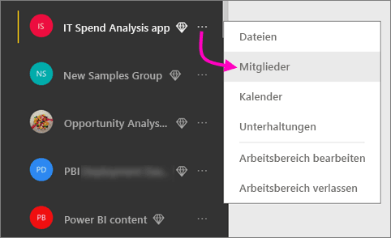
   
    Das Office 365 Outlook-Konto für den Arbeitsbereich wird in einem neuen Browserfenster geöffnet.
2. Wenn Sie auf den farbigen Kreis in der oberen linken Ecke zeigen, ändert er sich in ein Stiftsymbol. Wählen Sie sie aus.
   
     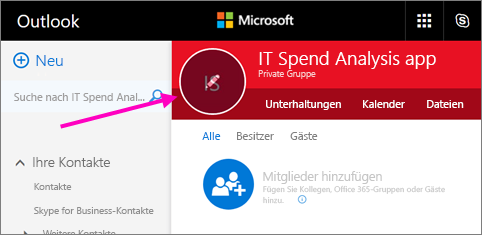
3. Wählen Sie das Stiftsymbol erneut aus, und suchen Sie das Bild, das Sie verwenden möchten.
   
     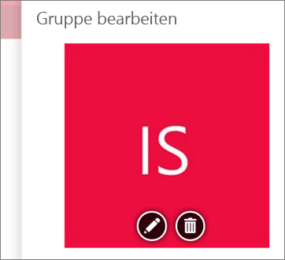
4. Wählen Sie **Speichern**.
   
     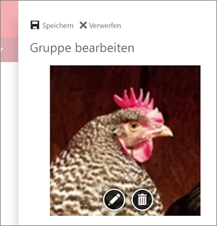
   
    Das Bild ersetzt den farbigen Kreis im Office 365 Outlook-Fenster. 
   
     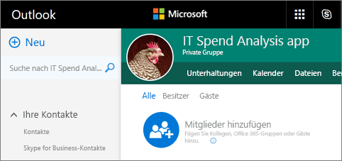
   
    In einigen Minuten wird es auch in der App in Power BI angezeigt.
   
     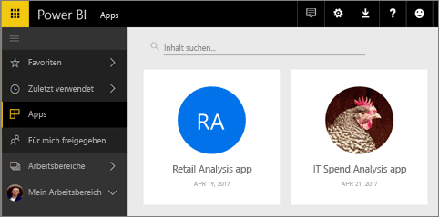

## Veröffentlichen der App
Wenn die Dashboards und Berichte in Ihrem App-Arbeitsbereich fertig sind, veröffentlichen Sie sie als eine App. Beachten Sie, dass Sie nicht alle Berichte und Dashboards im Arbeitsbereich veröffentlichen müssen. Sie brauchen nur diejenigen zu veröffentlichen, die fertig sind. 

1. Entscheiden Sie in der Listenansicht des Arbeitsbereichs, welche Dashboards und Berichte Sie in die App einschließen möchten.

     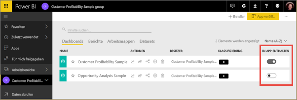

     Wenn Sie einen Bericht nicht für die Veröffentlichung auswählen, wird neben dem Bericht und dem zugehörigen Dashboard eine Warnung angezeigt. Sie können die App veröffentlichen, jedoch fehlen im entsprechenden Dashboard die Kacheln aus diesem Bericht.

     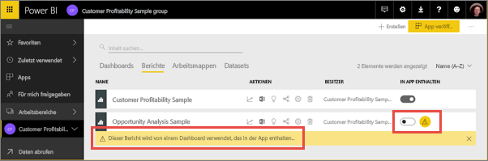

1. Wählen Sie rechts oben die Schaltfläche **App veröffentlichen** aus, um mit dem Freigeben aller Inhalte in diesem Arbeitsbereich zu beginnen.
   
     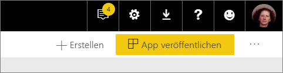

2. Geben Sie zunächst in **Details** die Beschreibung ein, damit andere Personen die App leichter finden. Sie können eine Hintergrundfarbe festlegen, um die App zu personalisieren.
   
     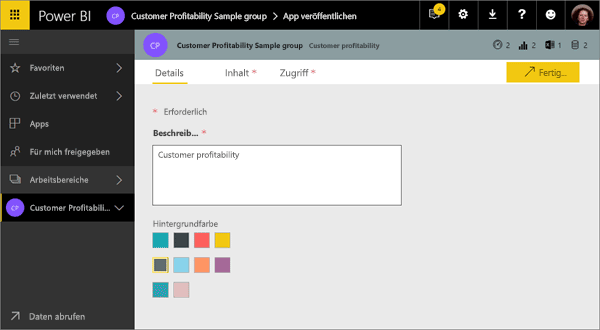

3. Öffnen Sie anschließend **Inhalt**. Dort wird der Inhalt angezeigt, der als Teil der App veröffentlicht wird. Dies ist der gesamte Inhalt, den Sie in diesem Arbeitsbereich ausgewählt haben. Sie können auch die Landing Page der App festlegen – dies ist das Dashboard oder der Bericht, der für Benutzer als Erstes angezeigt wird, wenn sie Ihre App öffnen. Sie können **Keine** auswählen. Dann wird als Erstes eine Liste des gesamten Inhalts der App angezeigt. 
   
     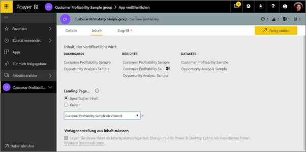

4. Legen Sie schließlich unter **Zugriff** fest, wer Zugriff auf die App hat: jeder Benutzer in der Organisation oder nur bestimmte Personen oder Active Directory-Sicherheitsgruppen. 

5. Wenn Sie **Fertig stellen** auswählen, wird eine Meldung mit der Bestätigung angezeigt, dass die App jetzt veröffentlicht werden kann. Sie können im Dialogfeld mit der Erfolgsmeldung die URL, die ein direkter Link zu dieser App ist, kopieren und an die Personen senden, für die Sie die App freigegeben haben.
   
     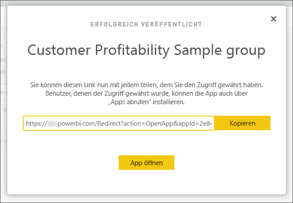

Die Geschäftskunden, für die Sie die App veröffentlicht haben, können diese auf zwei unterschiedliche Arten finden. Sie können ihnen einen direkten Link zur App senden, oder sie können in Microsoft AppSource, wo alle Apps angezeigt werden, auf die sie Zugriff haben, nach ihr suchen. Die App wird in der Liste angezeigt, wenn sie anschließend „Apps“ aufrufen.

Erfahren Sie mehr über die [Nutzung von Apps durch Geschäftskunden](service-install-use-apps.md).

## Ändern der veröffentlichten App
Nachdem Sie Ihre App veröffentlicht haben, möchten Sie sie eventuell ändern oder aktualisieren. Sie lässt sich einfach aktualisieren, wenn Sie Administrator oder Mitglied des App-Arbeitsbereichs sind. 

1. Öffnen Sie den App-Arbeitsbereich, der der App entspricht. 
   
     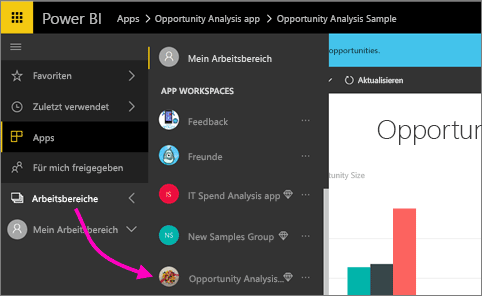
2. Öffnen Sie das Dashboard oder den Bericht. Sie werden feststellen, dass Sie jede gewünschte Änderung vornehmen können.
   
     Der App-Arbeitsbereich ist der Stagingbereich. Deshalb werden Ihre Änderungen erst dann mithilfe von Push in die App übertragen, wenn Sie die App erneut veröffentlichen. So können Sie Änderungen vornehmen, ohne dass sich diese auf die veröffentlichten Apps auswirken.  
 
1. Kehren Sie zur Liste der Inhalte im App-Arbeitsbereich zurück, und wählen Sie **App aktualisieren** aus.
   
     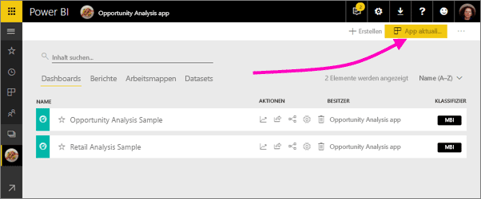
4. Aktualisieren Sie ggf. **Details**, **Inhalt** und **Zugriff**, und wählen Sie dann **App aktualisieren** aus.
   
     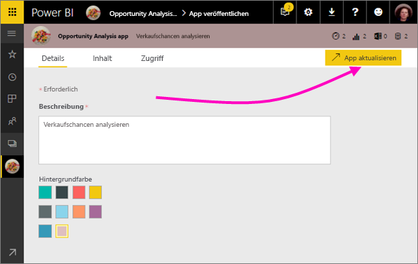

Den Personen, für die Sie die App veröffentlicht haben, wird automatisch die aktualisierte Version der App angezeigt. 

## Aufheben der Veröffentlichung einer App
Jedes Mitglied eines App-Arbeitsbereichs kann die Veröffentlichung der App aufheben.

* Klicken Sie im App-Arbeitsbereich rechts oben auf die Auslassungspunkte (**...**), und wählen Sie **Veröffentlichung der App aufheben** aus.
  
     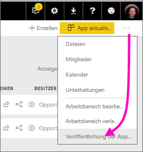

Dadurch wird die App für alle Benutzer, für die sie veröffentlicht wurde, deinstalliert, sodass diese keinen Zugriff mehr darauf haben. Der App-Arbeitsbereich oder sein Inhalt wird dadurch nicht gelöscht.

## Power BI-Apps – Häufig gestellte Fragen
### Wie unterscheiden sich App-Arbeitsbereiche von Gruppenarbeitsbereichen?
In dieser Version wurden alle Gruppenarbeitsbereiche in App-Arbeitsbereiche umbenannt. Sie können eine App aus jedem dieser Arbeitsbereiche veröffentlichen. Die meisten Funktionen bleiben die gleichen wie in Gruppenarbeitsbereichen. Wir planen für die nächsten Monate die folgenden Erweiterungen von App-Arbeitsbereichen: 

* Durch das Erstellen von App-Arbeitsbereichen werden nicht wie bei Gruppenarbeitsbereichen entsprechende Entitäten in Office 365 erstellt. Sie können also eine beliebige Anzahl von App-Arbeitsbereichen erstellen können, ohne fürchten zu müssen, dass im Hintergrund verschiedene Office 365-Gruppen erstellt werden (Sie können auch in Zukunft zum Speichern der Dateien OneDrive for Business einer Office 365-Gruppe verwenden). 
* Derzeit können Sie den Listen der Mitglieder und Administratoren nur Einzelpersonen hinzufügen. Bald können Sie diesen Listen AD-Sicherheitsgruppen oder moderne Gruppen hinzufügen, um die Verwaltung zu vereinfachen.  

### Wie unterscheiden sich Apps von organisationsbezogenen Inhaltspaketen?
Apps sind eine Weiterentwicklung und Vereinfachung von Inhaltspaketen, mit einigen wichtigen Unterschieden. 

* Nachdem Geschäftskunden ein Inhaltspaket installiert haben, verliert es seine Gruppenidentität. Es ist dann lediglich eine Liste von Dashboards und Berichten zwischen anderen Dashboards und Berichten. Hingegen bleibt die Gruppierung und Identität von Apps auch nach der Installation erhalten. Dies erleichtert Geschäftskunden die Navigation zu ihnen im zeitlichen Verlauf.  
* Sie können in jedem Arbeitsbereich mehrere Inhaltspakete erstellen, eine App weist jedoch eine 1:1-Beziehung zu ihrem Arbeitsbereich auf. Wir glauben, dass dies langfristig das Verständnis und die Verwaltung der Apps erleichtert. Im Power BI-Blog finden Sie im Abschnitt zur Planung weitere Informationen zu unseren geplanten Verbesserungen in diesem Bereich. 
* Wir planen, im Verlauf der Zeit die Unterstützung organisationsbezogener Inhaltspakete einzustellen, daher wird empfohlen, von nun an Apps zu erstellen.  

### Können Gruppen Mitglieder mit schreibgeschütztem Zugriff enthalten?
Sie können Gruppen Mitglieder mit schreibgeschütztem Zugriff hinzufügen, die den Inhalt nur anzeigen können. Das Hauptproblem bei diesem Ansatz war, dass Sicherheitsgruppen nicht als Mitglieder hinzugefügt werden konnten. Mit Apps können Sie eine schreibgeschützte Version des App-Arbeitsbereichs für große Zielgruppen, einschließlich Sicherheitsgruppen, veröffentlichen. Sie können Ihre Änderungen an den Dashboards und Berichten in der App bereitstellen, ohne Endbenutzer zu beeinträchtigen. Es wird empfohlen, Apps zukünftig auf diese Weise zu verwenden. Langfristig planen wir, die Unterstützung von Mitgliedern von Arbeitsbereichen, die schreibgeschützten Zugriff haben, ebenfalls einzustellen.  

## Nächste Schritte
* [Installieren und Verwenden von Apps in Power BI](service-install-use-apps.md)
* [Power BI-Apps für externe Dienste](service-connect-to-services.md)
* Haben Sie Fragen? [Stellen Sie Ihre Frage in der Power BI-Community.](http://community.powerbi.com/)

