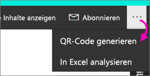
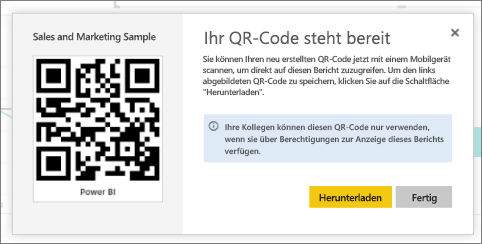

# Erstellen eines QR-Codes für einen Bericht in Power BI für die Verwendung in mobilen Apps
QR-Codes in Power BI können alle Elemente in der realen Welt direkt mit verwandten BI-Informationen verbinden – es ist keine Navigation oder Suche erforderlich.

Sie können einen QR-Code im Power BI-Dienst für beliebige Berichte erstellen, selbst für Berichte, die Sie nicht bearbeiten können. Platzieren Sie den QR-Code dann an einer geeigneten Stelle. Fügen Sie ihn beispielsweise in eine E-Mail ein, oder drucken Sie ihn aus, und stellen Sie ihn an einem bestimmten Ort bereit. 

Kollegen, mit denen Sie den Bericht gemeinsam verwenden, können den QR-Code für den Zugriff auf den Bericht direkt mit ihrem [mobilen Gerät](consumer/mobile/mobile-apps-qr-code.md) scannen. Sie können entweder den QR-Code-Scanner in der Power BI-App oder jeden anderen auf dem Gerät installierten QR-Scanner verwenden. Sie können auch [einen QR-Code mit der Power BI für Mixed Reality-App scannen](consumer/mobile/mobile-mixed-reality-app.md#scan-a-report-qr-code-in-holographic-view).

## Erstellen eines QR-Codes für einen Bericht
1. Öffnen Sie einen Bericht im Power BI-Dienst.
2. Wählen Sie die Auslassungspunkte (...) in der oberen rechten Ecke und dann **QR-Code generieren**aus. 
   
    
3. Es wird ein Dialogfeld mit dem QR-Code angezeigt. 
   
    
4. Von hier aus können Sie den QR-Code scannen oder herunterladen und speichern, um folgende Aktionen durchzuführen: 
   
   * Hinzufügen zu einer E-Mail oder einem anderen Dokument 
   * Ausdrucken und Platzieren an einem bestimmten Speicherort 

## Drucken des QR-Codes
Power BI generiert den QR-Code für den Druck als JPG-Datei. 

1. Wählen Sie **Herunterladen** aus, und öffnen Sie dann die JPG-Datei auf einem Computer, der mit einem Drucker verbunden ist.  
   
   Die JPG-Datei hat denselben Namen wie die Kachel. Beispielsweise „Beispiel für Vertrieb und Marketing.jpg“.
   
1. Drucken Sie die Datei mit einer Größe von 100 % oder in „Originalgröße“.  
2. Schneiden Sie den QR-Code entlang des Rands aus, und kleben Sie ihn an einem für den Bericht relevanten Ort auf. 

## Nächste Schritte
* [Connect to Power BI data from the real world](consumer/mobile/mobile-apps-data-in-real-world-context.md) (Verbinden mit realen Power BI-Daten mit den Apps für mobile Geräte)
* [Scannen eines Power BI-QR-Codes mit einem mobilen Gerät](consumer/mobile/mobile-apps-qr-code.md)
* [Erstellen eines QR-Codes für eine Kachel](service-create-qr-code-for-tile.md)
* Haben Sie Fragen? [Stellen Sie Ihre Frage in der Power BI-Community.](http://community.powerbi.com/)

