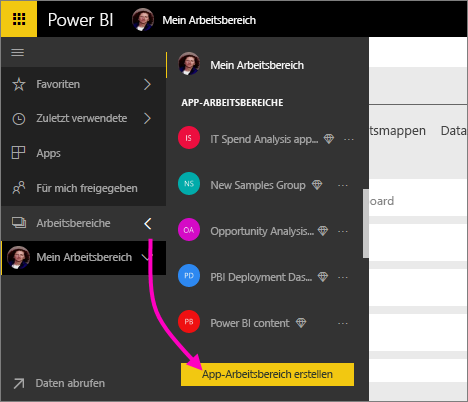
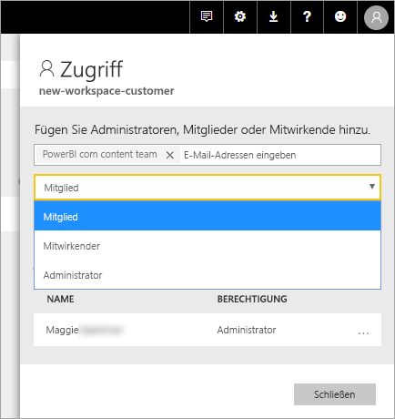

# Erstellen Sie die neue Arbeitsbereiche in Power BI

Powerbi ist eine neue Benutzeroberfläche für den Arbeitsbereich eingeführt. Arbeitsbereiche können Sie weiterhin für die Zusammenarbeit mit Kollegen zum Erstellen von Sammlungen von Dashboards, Berichten und paginierten Berichten. Anschließend können Sie diese Sammlung in bündeln ein *app* und für die gesamte Organisation oder an bestimmte Personen oder Gruppen verteilen. 

Hier ist unterschiedlich ist. In der neue Arbeitsbereiche können Sie folgende Aktionen ausführen:

- Arbeitsbereichsrollen Benutzergruppen zuweisen: Sicherheitsgruppen, Verteilerlisten, Office 365-Gruppen und Einzelpersonen.
- Einen Arbeitsbereich in Power BI erstellen, ohne eine Office 365-Gruppe zu erstellen.
- Genauere Arbeitsbereichsrollen für flexiblere Verwaltung von Berechtigungen in einem Arbeitsbereich verwenden.

> [!NOTE]
> Um die Sicherheit auf Zeilenebene (RLS) für Power BI Pro-Benutzer Durchsuchen des Inhalts in einem Arbeitsbereich zu erzwingen, verwenden Sie weiterhin [klassischen Arbeitsbereiche](service-create-workspaces.md). Wählen Sie die **Mitglieder können Power BI-Inhalte nur anzeigen** Option. Sie können auch Veröffentlichen einer Power BI-app für diese Benutzer, oder verwenden freigeben, um Inhalt zu verteilen. Die bevorstehende-Viewer-Rolle ermöglicht dieses Szenario in Zukunft neue Arbeitsbereich Erfahrung Arbeitsbereiche.

Weitere Informationen finden Sie unter den [neue Arbeitsbereiche](service-new-workspaces.md) Artikel.

## Erstellen eines neuen App-Arbeitsbereichs

1. Erstellen Sie zunächst den App-Arbeitsbereich. Wählen Sie **Arbeitsbereiche** > **App-Arbeitsbereich erstellen** aus.
   
     

2. Sie können einen aktualisierten Arbeitsbereich automatisch erstellen, es sei denn, Sie zu entscheiden **Klassisch wiederherstellen**.
   
     
     
     Bei Auswahl von **Klassisch wiederherstellen**, Sie einen Arbeitsbereich basierend auf einer Office 365-Gruppe erstellen. Verwenden Sie diese Option aus, wenn Sie müssen die **Mitglieder können Power BI-Inhalte nur anzeigen** Option zum Erzwingen von Sicherheit auf Zeilenebene (RLS) für die Mitglieder des Arbeitsbereichs.

2. Benennen Sie den Arbeitsbereich. Wenn der Name nicht verfügbar ist, bearbeiten Sie, um einen eindeutigen Namen ausdenken.
   
     Die app für den Arbeitsbereich müssen den gleichen Namen und Symbol wie der Arbeitsbereich.
   
1. Hier sind einige optionale Elemente, die Sie für Ihren Arbeitsbereich festlegen können:

    Hochladen einer **Bild**. Dateien können PNG oder JPG-Format sein. Dateigröße muss weniger als 45 KB sein.
    
    [Hinzufügen einer **Kontaktliste**](#workspace-contact-list). Standardmäßig sind die arbeitsbereichsadministratoren Kontakte. 
    
    [Geben Sie einen **Arbeitsbereich OneDrive** ](#workspace-onedrive) nur der Name einer vorhandenen Office 365-Gruppe nicht in der URL eingeben. Dieses Arbeitsbereichs kann nun den Speicherort der Protokolldatei, Office 365-Gruppe verwenden. 

    

    Um den Arbeitsbereich Zuweisen einer **dedizierte Kapazität**auf die **Premium** wählen Sie Registerkarte **dedizierte Kapazität**.
     
    

1. Wählen Sie **Speichern**.

    Der Arbeitsbereich wird in Power BI erstellt und geöffnet. Er wird Ihnen in der Liste der Arbeitsbereiche angezeigt, deren Mitglied Sie sind. 

## Arbeitsbereich-Kontaktliste

Die neue Arbeitsbereich-Kontaktliste können Sie angeben, welche Benutzer eine Benachrichtigung zu Problemen, die im Arbeitsbereich erhalten. Angegeben wird standardmäßig alle Benutzer oder Gruppen als Arbeitsbereich Administrator benachrichtigt wird, aber Sie können die Liste anpassen. Benutzer oder Gruppen in der Kontaktliste werden in der Benutzeroberfläche (UI) können angezeigt, dass Benutzer die Hilfe im Zusammenhang mit dem Arbeitsbereich abrufen.

1. Zugriff auf die neue **Kontaktliste** auf zwei Arten festlegen:

    In der **erstellen Sie einen Arbeitsbereich** Bereich beim ersten erstellen.

    Wählen Sie im linken Navigationsbereich den Pfeil neben **Arbeitsbereiche**, wählen Sie die Auslassungspunkte (...) neben dem Namen des Arbeitsbereichs > **arbeitsbereichseinstellungen**. Die **Einstellungen** Bereich wird geöffnet.

    

2. Unter **erweitert** > **Kontaktliste**, übernehmen Sie den Standardnamen **arbeitsbereichsadministratoren**, oder fügen Sie eine eigene Liste **bestimmte Benutzer oder Gruppen**. 
3. Wählen Sie **Speichern**.

## Arbeitsbereich OneDrive

Die Arbeitsbereich OneDrive-Funktion können Sie eine Office 365-Gruppe konfigurieren, dessen SharePoint-Dokumentbibliothek Dateispeicher Workspace-Benutzern zur Verfügung steht. Zuerst erstellen Sie die Gruppe außerhalb von Power BI. 

Nicht synchronisiert Powerbi Berechtigungen von Benutzern oder Gruppen, die konfiguriert sind, mit der Office 365-Gruppe Mitgliedschaft Arbeitsbereich zugreifen. Die bewährte Methode ist der gleiche Office 365-Gruppe, deren Dateispeicher, die Sie in dieser Office 365-Einstellungsgruppe konfigurieren, geben Sie [Zugriff auf den Arbeitsbereich](#give-access-to-your-workspace). Klicken Sie dann verwalten Sie arbeitsbereichszugriff, indem Sie die Verwaltung der Mitgliedschaft bei der Office 365-Gruppe. 

1. Zugriff auf die neue **Arbeitsbereich OneDrive** auf zwei Arten festlegen:

    In der **erstellen Sie einen Arbeitsbereich** Bereich beim ersten erstellen.

    Wählen Sie im linken Navigationsbereich den Pfeil neben **Arbeitsbereiche**, wählen Sie die Auslassungspunkte (...) neben dem Namen des Arbeitsbereichs > **arbeitsbereichseinstellungen**. Die **Einstellungen** Bereich wird geöffnet.

    

2. Klicken Sie unter **erweitert** > **Arbeitsbereich OneDrive**, geben Sie den Namen des Office 365-Gruppe, die Sie zuvor erstellt haben. Powerbi übernimmt automatisch die OneDrive für die Gruppe ab.

    

3. Wählen Sie **Speichern**.

### Zugriff auf den Arbeitsbereich OneDrive-Speicherort

Nachdem Sie den OneDrive-Speicherort konfiguriert haben, können Sie es aus einigen verschiedenen Stellen im Arbeitsbereich abrufen:

- Wählen Sie **Arbeitsbereiche** > *Arbeitsbereichsname* > mit den Auslassungspunkten ( **...** ) im Menü > **Dateien**. 

    

- Wählen Sie die Auslassungspunkte ( **...** ) im Menü in der oberen rechten Ecke des Arbeitsbereichs > **Dateien**.

    
    
- In der **Datenabruf** > **Dateien** auftreten. Die **OneDrive – geschäftlich** Eintrag ist Ihre eigene OneDrive for Business. Die zweite OneDrive ist diejenige aus, die Sie hinzugefügt haben.

    

## Hinzufügen von Inhalt zum App-Arbeitsbereich

Nachdem Sie einen neuen Arbeitsbereich Erfahrung Arbeitsbereich erstellt haben, ist es Zeit, die Inhalte hinzufügen. Hinzufügen von Inhalten ist in den Arbeitsbereichen der neuen und klassischen ähnlich. Verwenden Sie die Schaltfläche "erstellen" aus, oder verwenden Sie Daten abrufen, um Inhalte zu Ihrem Arbeitsbereich hinzuzufügen.

1. In der **Willkommen** Bildschirm für Ihren neuen Arbeitsbereich können Sie Inhalte hinzufügen. 

    

1. Klicken Sie beispielsweise auf **Beispiele** > **Customer Profitability Sample**.

> [!NOTE]
> In den neuen Arbeitsbereichen können nicht Sie organisationsbezogene Inhaltspakete und Inhaltspakete von Drittanbietern nutzen. Apps sind verfügbar, für alle Inhalte von Drittanbietern packs bereits verwendet. Klassischen Arbeitsbereiche verwenden, wenn Sie weiterhin den Inhaltspaketen verwenden möchten. Inhaltspakete sind veraltet, daher wird empfohlen, apps zu verwenden.

Wenn Sie Inhalte in der Inhaltsliste eines App-Arbeitsbereichs anzeigen, wird der Name des Arbeitsbereichs als Besitzer aufgeführt.

### Herstellen einer Verbindung mit Diensten von Drittanbietern in neuen Arbeitsbereichen

In den neuen Arbeitsbereichen rücken *Apps* in den Vordergrund. Apps für Drittanbieterdienste erleichtern es Benutzern, Daten von den Diensten abzurufen, die sie verwenden, z. B. Microsoft Dynamics CRM, Salesforce oder Google Analytics.

In der neuen Oberfläche Arbeitsbereich kann nicht erstellen oder nutzen von organisationsbezogenen Inhaltspaketen. Stattdessen können Sie die Apps verwenden, die zum Herstellen einer Verbindung mit Drittanbieterdiensten bereitgestellt werden, oder fordern Sie Ihre internen Teams dazu auf, Apps für Inhaltspakete bereitzustellen, die Sie derzeit verwenden. 

## Geben Sie den Zugriff zu Ihrem Arbeitsbereich

1. In der Inhaltsliste im Arbeitsbereich, da Sie Administrator sind Sie sehen neue Aktion **Zugriff**.

    

1. Klicken Sie auf **Zugriff**.

1. Fügen Sie diesen Arbeitsbereichen Sicherheitsgruppen, Verteilerlisten, Office 365-Gruppen oder Einzelpersonen als Mitglieder, Mitwirkende oder Administratoren hinzu. Eine Erläuterung der verschiedenen Rollen finden Sie unter [Rollen in den neuen Arbeitsbereichen](service-new-workspaces.md#roles-in-the-new-workspaces).

    

9. Klicken Sie auf **Hinzufügen** > **Schließen**.

## Verteilen einer App

Wenn Sie die offizielle Inhalte für eine große Zielgruppe in Ihrer Organisation verteilen möchten, können Sie eine app aus dem Arbeitsbereich veröffentlichen.  Wenn der Inhalt fertig ist, Sie wählen, welche Dashboards und Berichte, die Sie veröffentlichen möchten, und veröffentlichen Sie sie als ein *app*. Sie können über jeden Arbeitsbereich eine App erstellen.

Erfahren Sie mehr über [Veröffentlichen einer app in der neuen Arbeitsbereichen](service-create-distribute-apps.md)

## Nächste Schritte
* Erfahren Sie mehr über [Organisation bei der Arbeit auf der neuen Oberfläche von Arbeitsbereichen in Power BI](service-new-workspaces.md)
* [Klassische Arbeitsbereiche erstellen](service-create-workspaces.md)
* [Veröffentlichen einer app über die neue Arbeitsbereiche in Power BI](service-create-distribute-apps.md)
* Haben Sie Fragen? [Stellen Sie Ihre Frage in der Power BI-Community.](http://community.powerbi.com/)
