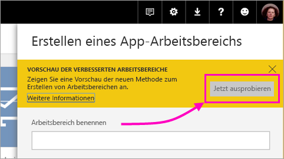
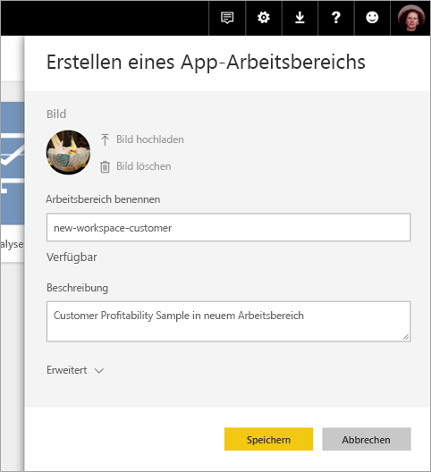
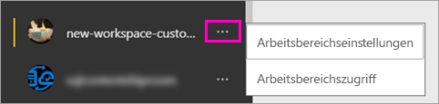

# Erstellen der neuen Arbeitsbereiche (Vorschau) in Power BI

In Power BI wird eine Vorschauversion für die neuen Arbeitsbereiche eingeführt. Arbeitsbereiche sind auch weiterhin ein Ort für die Zusammenarbeit mit Kollegen, um Sammlungen von Dashboards und Berichten zu erstellen, die Sie in *Apps* bündeln und an Ihre gesamte Organisation oder bestimmte Personen oder Gruppen verteilen können. 

Mit den neuen Arbeitsbereichen (Vorschauversion) können Sie nun Folgendes durchführen:

- Arbeitsbereichsrollen Benutzergruppen zuweisen: Sicherheitsgruppen, Verteilerlisten, Office 365-Gruppen und Einzelpersonen.
- Einen Arbeitsbereich in Power BI erstellen, ohne eine Office 365-Gruppe zu erstellen.
- Genauere Arbeitsbereichsrollen für flexiblere Verwaltung von Berechtigungen in einem Arbeitsbereich verwenden.

Weitere Informationen finden Sie im Artikel [Neue Arbeitsbereiche (Vorschauversion)](service-new-workspaces.md).

## Erstellen eines neuen App-Arbeitsbereichs

1. Erstellen Sie zunächst den App-Arbeitsbereich. Wählen Sie **Arbeitsbereiche** > **App-Arbeitsbereich erstellen** aus.
   
     

2. Klicken Sie unter **Vorschau der verbesserten Arbeitsbereiche** auf **Jetzt testen**.
   
     

2. Benennen Sie den Arbeitsbereich. Wenn der Name nicht verfügbar ist, geben Sie eine eindeutige ID ein.
   
     Die App wird den gleichen Namen wie der Arbeitsbereich haben.
   
1. Fügen Sie optional ein Bild hinzu. Die Dateigröße darf 45 KB nicht überschreiten.
 
    

1. Wählen Sie **Speichern**.

    Auf der **Willkommensseite** Ihres neuen Arbeitsbereichs können Sie Daten hinzufügen. 

    

1. Klicken Sie beispielsweise auf **Beispiele** > **Customer Profitability Sample**.

    In der Inhaltsliste im Arbeitsbereich wird nun **Neue Arbeitsbereiche (Vorschau)** angezeigt. Da Sie über Administratorrechte verfügen, wird Ihnen auch die neue Aktion **Zugriff** angezeigt.

    

1. Klicken Sie auf **Zugriff**.

1. Fügen Sie diesen Arbeitsbereichen Sicherheitsgruppen, Verteilerlisten, Office 365-Gruppen oder Einzelpersonen als Mitglieder, Mitwirkende oder Administratoren hinzu. Eine Erläuterung der verschiedenen Rollen finden Sie unter [Rollen in den neuen Arbeitsbereichen](service-new-workspaces.md#roles-in-the-new-workspaces).

    

9. Klicken Sie auf **Hinzufügen** > **Schließen**.

1. Der Arbeitsbereich wird in Power BI erstellt und geöffnet. Er wird Ihnen in der Liste der Arbeitsbereiche angezeigt, deren Mitglied Sie sind. Da Sie Administrator sind, können Sie auf die Auslassungspunkte (...) klicken, um zurückzukehren, und Änderungen an Arbeitsbereichseinstellungen vornehmen, neue Mitglieder hinzufügen oder deren Berechtigungen ändern.

     

## Hinzufügen von Inhalt zum App-Arbeitsbereich

Nachdem Sie einen neuen App-Arbeitsbereich erstellt haben, ist es Zeit, diesem Inhalte hinzuzufügen. Das Hinzufügen von Inhalt ist in den alten und neuen Arbeitsbereichen ähnlich, mit einer Ausnahme. Sie können in beiden Versionen von App-Arbeitsbereichen Dateien hochladen oder Verbindungen mit ihnen herstellen, wie Sie es in „Mein Arbeitsbereich“ tun würden. In den neuen Arbeitsbereichen können Sie keine Verbindung mit organisationsbezogenen Inhaltspaketen oder Inhaltspaketen von Drittanbietern herstellen, z.B. Microsoft Dynamics CRM, Salesforce oder Google Analytics. In den aktuellen Arbeitsbereichen können Sie eine Verbindung mit Inhaltspaketen herstellen.

Wenn Sie Inhalte in der Inhaltsliste eines App-Arbeitsbereichs anzeigen, wird der Name des Arbeitsbereichs als Besitzer aufgeführt.

### Herstellen einer Verbindung mit Drittanbieterdiensten in neuen Arbeitsbereichen (Vorschau)

In den neuen Arbeitsbereichen rücken *Apps* in den Vordergrund. Apps für Drittanbieterdienste erleichtern es Benutzern, Daten von den Diensten abzurufen, die sie verwenden, z. B. Microsoft Dynamics CRM, Salesforce oder Google Analytics.
Organisationsbezogene Apps stellen Ihren Benutzern die internen Daten zur Verfügung, die sie benötigen. Es sind weitere Funktionen für organisationsbezogene Apps geplant, damit Benutzer den Inhalt anpassen können, den sie in den Apps finden. Mit dieser Funktion entfällt die Notwendigkeit von Inhaltspaketen. 

Mit der Vorschauversion der neuen Arbeitsbereiche können Sie keine organisationsbezogenen Inhaltspakete erstellen oder nutzen. Stattdessen können Sie die Apps verwenden, die zum Herstellen einer Verbindung mit Drittanbieterdiensten bereitgestellt werden, oder fordern Sie Ihre internen Teams dazu auf, Apps für Inhaltspakete bereitzustellen, die Sie derzeit verwenden. 

## Verteilen einer App

Wenn der Inhalt bereit ist, können Sie auswählen, welche Dashboards und Berichte Sie veröffentlichen möchten. Anschließend veröffentlichen Sie diese als *App*. Sie können über jeden Arbeitsbereich eine App erstellen. Ihre Kollegen können Ihre App auf verschiedene Weise abrufen. Sie können sie automatisch in den Power BI-Konten Ihrer Kollegen installieren, wenn Ihr Power BI-Administrator Ihnen die Berechtigung dazu erteilt. Andernfalls können diese Ihre App über Microsoft AppSource finden und installieren, oder Sie können Ihren Kollegen einen direkten Link senden. Sie erhalten Updates automatisch, und Sie können steuern, wie oft die Daten aktualisiert werden. Ausführliche Informationen finden Sie unter [Veröffentlichen von Apps mit Dashboards und Berichten in Power BI](service-create-distribute-apps.md).

## Konvertieren alter App-Arbeitsbereiche in neue App-Arbeitsbereiche

Während der Vorschauphase können Sie ihre alten App-Arbeitsbereiche nicht automatisch in neue konvertieren. Sie können jedoch einen neuen App-Arbeitsbereich erstellen und Ihren Inhalt dort veröffentlichen. 

Wenn die neuen Arbeitsbereiche in die allgemeine Verfügbarkeit übergehen, können Sie die alten Arbeitsbereiche automatisch migrieren. Nach Eintritt der allgemeinen Verfügbarkeit müssen Sie sie migrieren.

## Nächste Schritte
* Weitere Informationen zum [Organisieren von Arbeit in den neuen Arbeitsbereichen (Vorschauversion) in Power BI](service-new-workspaces.md)
* [Create the current workspaces (Erstellen der aktuellen Arbeitsbereiche)](service-create-workspaces.md)
* [Installieren und Verwenden von Apps in Power BI](service-create-distribute-apps.md)
* Haben Sie Fragen? [Stellen Sie Ihre Frage in der Power BI-Community.](http://community.powerbi.com/)
