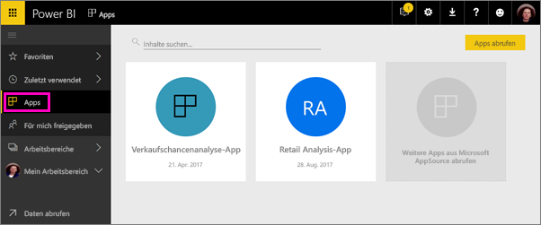

# Gemeinsames Erstellen von Arbeitsbereichen mit Ihren Kollegen in Power BI

Sie können in Power BI *Arbeitsbereiche* erstellen. Diese stellen einen hervorragenden Ort für die Zusammenarbeit mit Kollegen dar, um Sammlungen von Dashboards und Berichten zu erstellen und zu verbessern. Anschließend bündeln Sie diese in *Apps*, die Sie an die gesamte Organisation oder an bestimmte Personen oder Gruppen verteilen können. 

Wenn Sie einen Arbeitsbereich erstellen, erstellen Sie eine zugrunde liegende, zugehörige Office 365-Gruppe. Die gesamte Arbeitsbereichsverwaltung findet in Office 365 statt. Sie können diesen Arbeitsbereichen Kollegen als Mitglieder oder Administratoren hinzufügen. In dem Arbeitsbereich können Sie alle beim Erstellen von Dashboards, Berichten und anderen Artikeln zusammenarbeiten, die Sie für eine größere Zielgruppe veröffentlichen möchten. Alle Benutzer, die Sie einem App-Arbeitsbereich hinzufügen, benötigen eine Power BI Pro-Lizenz. 

**Wussten Sie schon?** Power BI enthält nun neue Vorschaufeatures für Arbeitsbereiche. Unter [Erstellen der neuen Arbeitsbereiche (Vorschau)](service-create-the-new-workspaces.md) erfahren Sie, wie sich Arbeitsbereiche in der Zukunft entwickeln. 

## Video: Apps und App-Arbeitsbereiche
<iframe width="640" height="360" src="https://www.youtube.com/embed/Ey5pyrr7Lk8?showinfo=0" frameborder="0" allowfullscreen></iframe>

## Erstellen eines App-Arbeitsbereichs basierend auf einer Office 365-Gruppe

Wenn Sie einen App-Arbeitsbereich erstellen, basiert dieser auf einer Office 365-Gruppe.

[!INCLUDE [powerbi-service-create-app-workspace](./includes/powerbi-service-create-app-workspace.md)]

Wenn Sie diesen erstellen, müssen Sie möglicherweise etwa eine Stunde warten, bis der Arbeitsbereich an Office 365 weitergeleitet wurde. 

### Hinzufügen eines Bilds im Office 365-App-Arbeitsbereich (optional)
Standardmäßig wird für die App in Power BI ein kleiner farbiger Kreis mit den Initialen der App erstellt. Sie können dies jedoch mit einem Bild anpassen. Sie benötigen eine Exchange Online-Lizenz, um ein Bild hinzuzufügen.

1. Wählen Sie **Arbeitsbereiche**, wählen Sie die Auslassungspunkte (...) neben dem Namen des Arbeitsbereichs, und wählen Sie dann **Mitglieder** aus. 
   
     
   
    Das Office 365 Outlook-Konto für den Arbeitsbereich wird in einem neuen Browserfenster geöffnet.
2. Wenn Sie auf den farbigen Kreis in der oberen linken Ecke zeigen, ändert er sich in ein Stiftsymbol. Wählen Sie sie aus.
   
     
3. Wählen Sie das Stiftsymbol erneut aus, und suchen Sie das Bild, das Sie verwenden möchten.
   
     

4. Wählen Sie **Speichern**.
   
     
   
    Das Bild ersetzt den farbigen Kreis im Office 365 Outlook-Fenster. 
   
     
   
    In einigen Minuten wird es auch in der App in Power BI angezeigt.
   
     

## Hinzufügen von Inhalt zum App-Arbeitsbereich

Nachdem Sie einen App-Arbeitsbereich erstellt haben, ist es Zeit, diesem Inhalte hinzuzufügen. Sie fügen Inhalte auf die gleiche Weise hinzu, wie Sie in „Mein Arbeitsbereich“ Inhalt hinzufügen, mit dem Unterschied, dass andere Personen im Arbeitsbereich ebenfalls den Inhalt anzeigen und bearbeiten können. Ein großer Unterschied ist, dass Sie nach Abschluss der Bearbeitung den Inhalt als App veröffentlichen können. Wenn Sie Inhalte in der Inhaltsliste eines App-Arbeitsbereichs anzeigen, wird der Name des Arbeitsbereichs als Besitzer aufgeführt.

### Herstellen einer Verbindung mit Drittanbieterdiensten in App-Arbeitsbereichen

Apps werden für alle Drittanbieterdienste bereitgestellt, die Power BI unterstützt, was Ihnen erleichtert, Daten von den Diensten abzurufen, die Sie verwenden, z.B. Microsoft Dynamics CRM, Salesforce oder Google Analytics. Sie können organisationsbezogene Apps veröffentlichen, um Ihren Benutzern die Daten bereitzustellen, die sie benötigen.

In den aktuellen Arbeitsbereichen können Sie auch mithilfe organisationsbezogener Inhaltspakete und mithilfe von Inhaltspaketen von Drittanbietern Verbindungen herstellen, z.B. Microsoft Dynamics CRM, Salesforce oder Google Analytics. Erwägen Sie, Ihre organisationsbezogenen Inhaltspakete in Apps zu migrieren.

## Verteilen einer App

Wenn der Inhalt bereit ist, können Sie auswählen, welche Dashboards und Berichte Sie veröffentlichen möchten. Anschließend veröffentlichen Sie diese als *App*. Ihre Kollegen können Ihre Apps auf verschiedene Weise abrufen. Sie können sie automatisch in den Power BI-Konten Ihrer Kollegen installieren, wenn Ihr Power BI-Administrator Ihnen die Berechtigung dazu erteilt. Andernfalls können diese Ihre Apps über Microsoft AppSource finden und installieren, oder Sie können ihnen einen direkten Link senden. Sie erhalten Updates automatisch, und Sie können steuern, wie oft die Daten aktualisiert werden. Ausführliche Informationen finden Sie unter [Veröffentlichen von Apps mit Dashboards und Berichten in Power BI](service-create-distribute-apps.md).

## Power BI-Apps – Häufig gestellte Fragen

### Wie unterscheiden sich Apps von organisationsbezogenen Inhaltspaketen?
Apps sind die Weiterentwicklung von organisationsbezogenen Inhaltspaketen. Wenn Sie bereits über organisationsbezogene Inhaltspakete verfügen, können sie weiterhin neben Apps verwendet werden. Apps und Inhaltspakete unterscheiden sich deutlich. 

* Nachdem Geschäftskunden ein Inhaltspaket installiert haben, verliert es seine Gruppenidentität. Es ist dann lediglich eine Liste von Dashboards und Berichten zwischen anderen Dashboards und Berichten. Hingegen bleibt die Gruppierung und Identität von Apps auch nach der Installation erhalten. Dies erleichtert Geschäftskunden die Navigation zu ihnen im zeitlichen Verlauf.
* Sie können in jedem Arbeitsbereich mehrere Inhaltspakete erstellen, eine App weist jedoch eine 1:1-Beziehung zu ihrem Arbeitsbereich auf. 
* Wir planen, im Verlauf der Zeit die Unterstützung organisationsbezogener Inhaltspakete einzustellen, daher wird empfohlen, von nun an Apps zu erstellen.  
* Die Veröffentlichung der Vorschauversion stellt den Beginn des Wegs zum Ende der Unterstützung organisationsbezogener Inhaltspakete dar. Sie können diese nicht in der Vorschauversion für Arbeitsbereiche nutzen oder erstellen.

Einen Vergleich der aktuellen und neuen App-Arbeitsbereiche finden Sie unter [How are the new app workspaces different from existing app workspaces? (Unterschiede zwischen den neuen und den alten App-Arbeitsbereichen)](service-create-the-new-workspaces.md#how-are-the-new-app-workspaces-different-from-current-app-workspaces). 

## Nächste Schritte
* [Installieren und Verwenden von Apps in Power BI](service-create-distribute-apps.md)
- [Erstellen der neuen Arbeitsbereiche (Vorschau)](service-create-the-new-workspaces.md)
* Haben Sie Fragen? [Stellen Sie Ihre Frage in der Power BI-Community.](http://community.powerbi.com/)
