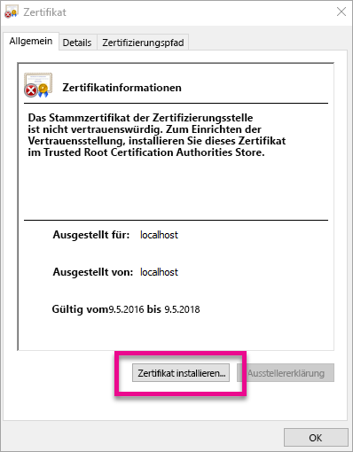
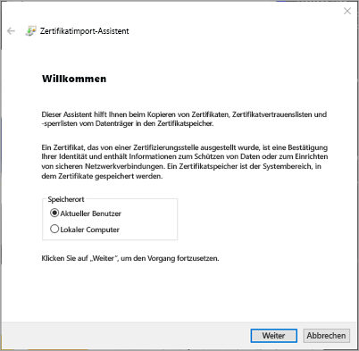
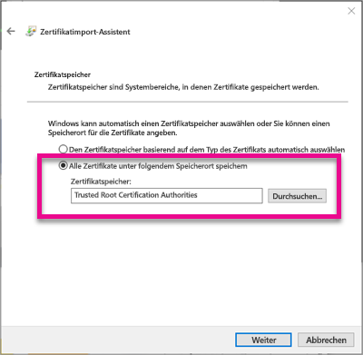
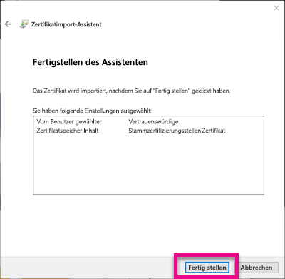
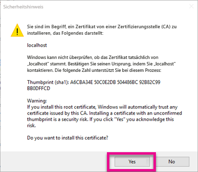
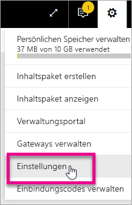
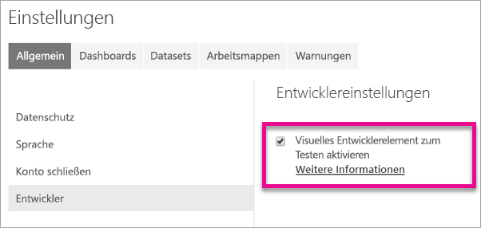
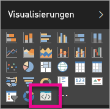

# <a name="use-developer-tools-to-create-custom-visuals"></a>Erstellen benutzerdefinierter Visualisierungen mithilfe von Entwicklertools
Mit benutzerdefinierten Visualisierungen können Sie den Bedürfnissen der Benutzer entsprechen, und sie passen zum Design Ihrer App. Erfahren Sie, wie Sie mit den Entwicklertools eine benutzerdefinierte Visualisierung für Power BI erstellen.

> [!NOTE]
> In diesem Dokument finden Sie alle Informationen, die Sie für die ersten Schritte benötigen. Ausführlichere Informationen finden Sie im [Git-Repository zu visuellen Elementen in Power BI](https://github.com/Microsoft/PowerBI-visuals).
> 
> 

## <a name="requirements"></a>Anforderungen
* NodeJS 4.0+ erforderlich (5.0 oder höher empfohlen) [NodeJS herunterladen](https://nodejs.org)

## <a name="install-nodejs-and-the-power-bi-tools"></a>Installieren von NodeJS und den Power BI-Tools
Um ein benutzerdefiniertes visuelles Element zu erstellen, müssen Sie NodeJS installieren. NodeJS ist erforderlich, um die Befehlszeilentools auszuführen.

1. Laden Sie [NodeJS](https://nodejs.org) herunter, und installieren Sie es. Version 4.0 oder höher ist mindestens erforderlich, es wird aber 5.0 oder höher empfohlen.
2. Installieren Sie die Befehlszeilentools. Führen Sie den folgenden Befehl an einer Eingabeaufforderung aus.
   
        npm install -g powerbi-visuals-tools
3. Sie können bestätigen, dass die Tools installiert sind, indem Sie den folgenden Befehl ohne Parameter ausführen.
   
        pbiviz
   
    Die Hilfeausgabe sollte angezeigt werden.
   
    <pre><code>
         +syyso+/
    oms/+osyhdhyso/
    ym/       /+oshddhys+/
    ym/              /+oyhddhyo+/
    ym/                     /osyhdho
    ym/                           sm+
    ym/               yddy        om+
    ym/         shho /mmmm/       om+
     /    oys/ +mmmm /mmmm/       om+
    oso  ommmh +mmmm /mmmm/       om+
   ymmmy smmmh +mmmm /mmmm/       om+
   ymmmy smmmh +mmmm /mmmm/       om+
   ymmmy smmmh +mmmm /mmmm/       om+
   +dmd+ smmmh +mmmm /mmmm/       om+
         /hmdo +mmmm /mmmm/ /so+//ym/
               /dmmh /mmmm/ /osyhhy/
                 //   dmmd
                       ++
   
       PowerBI Custom Visual Tool
   
    Usage: pbiviz [options] [command]
   
    Commands:
   
    new [name]        Create a new visual
    info              Display info about the current visual
    start             Start the current visual
    package           Package the current visual into a pbiviz file
    update [version]  Updates the api definitions and schemas in the current visual. Changes the version if specified
    help [cmd]        display help for [cmd]
   
    Options:
   
    -h, --help      output usage information
    -V, --version   output the version number
    --install-cert  Install localhost certificate
    </code></pre>

<a name="ssl-setup"></a>

### <a name="server-certificate-setup"></a>Einrichten des Serverzertifikats
Für eine Livevorschau eines visuellen Elements benötigen Sie einen vertrauenswürdigen HTTSP-Server. Damit Sie beginnen können, müssen Sie ein SSL-Zertifikat installieren, durch das visuelle Objekte in Ihrem Webbrowser geladen werden können. 

> [!NOTE]
> Dies ist ein einmaliges Setup für die Entwicklerarbeitsstation.
> 
> 

Führen Sie zum *Erstellen* eines Zertifikats den folgenden Befehl aus.

    pbiviz --create-cert

> [!NOTE]
> Es sollte eine Meldung angezeigt werden, die Sie über den Speicherortpfad zum Zertifikat sowie über eine neu generierte Passphrase informiert.
> 
> 


Führen Sie zum *Installieren* des Zertifikats den folgenden Befehl aus.

    pbiviz --install-cert
    
> [!NOTE]
> Es sollte eine Meldung angezeigt werden, die Ihnen Ihre neu generierte Passphrase zur Installation eines PFX-Zertifikats mitteilt.
> 
> 

**Windows**

1. Wählen Sie **Zertifikat installieren...** aus.
   
    
2. Wählen Sie dann **Aktueller Benutzer** und anschließend **Weiter** aus.
   
    
3. Wählen Sie **Alle Zertifikate an folgendem Speicherort speichern** und dann **Durchsuchen...** aus.
4. Wählen Sie **Vertrauenswürdige Stammzertifizierungsstellen** und dann **OK** aus. Wählen Sie **Weiter**aus.
   
    
5. Wählen Sie **Fertig stellen**aus.
   
    
6. Wählen Sie im Dialogfeld mit dem Sicherheitshinweis **Ja** aus.
   
    
7. Schließen Sie alle geöffneten Browser.

> [!NOTE]
> Wenn das Zertifikat nicht erkannt wird, müssen Sie möglicherweise den Computer neu starten.
> 
> 

**OS X**

1. Wenn das Schloss in der oberen linken Ecke verriegelt angezeigt wird, wählen sie es zum Entsperren aus. Suchen Sie nach *localhost*, und doppelklicken Sie auf das Zertifikat.
   
    
2. Wählen Sie **Immer vertrauen** aus, und schließen Sie das Fenster.
   
    
3. Geben Sie Ihren Benutzernamen und das Kennwort ein. Wählen Sie **Einstellungen aktualisieren** aus.
   
    
4. Schließen Sie alle geöffneten Browser.

> [!NOTE]
> Wenn das Zertifikat nicht erkannt wird, müssen Sie möglicherweise den Computer neu starten.
> 
> 

## <a name="enable-live-preview-of-developer-visual"></a>Aktivieren der Livevorschau von visuellen Entwicklerelementen
Gehen Sie folgendermaßen vor, um eine Livevorschau Ihrer benutzerdefinierten Visualisierung zu aktivieren. Hiermit kann die Visualisierung beim Bearbeiten von Berichten im Power BI-Dienst verwendet werden.

1. Navigieren Sie zu [app.powerbi.com](https://app.powerbi.com), und melden Sie sich an.
2. Wählen Sie das **Zahnradsymbol** und anschließend **Einstellungen** aus.
   
    
3. Wählen Sie **Entwickler** und dann **Visuelles Entwicklerelement zum Testen aktivieren** aus.
   
    
4. Wählen Sie **Visuelles Entwicklerelement** im Bereich **Visualisierung** aus.
   
    
   
   > [!NOTE]
   > Hierfür müssen Sie `pbiviz start` im Visualisierungsordner auf dem Entwicklungscomputer ausgeführt haben. Weitere Informationen zum Erstellen Ihrer Visualisierung finden Sie unter [Erstellen einer neuen Visualisierung](#create-a-new-visual) in diesem Artikel.
   > 
   > 
5. Wählen Sie die Visualisierung im Berichtszeichenbereich aus. Sie können Daten wie bei anderen visuellen Elementen binden.

Jetzt können Sie mit der Entwicklung Ihrer Visualisierung beginnen.

## <a name="create-a-new-visual"></a>Erstellen einer neuen Visualisierung
Sie können ein neues Visualisierungsprojekt erstellen, indem Sie den folgenden Befehl ausführen.

```
pbiviz new My Visual name
```

Sie können *Name des visuellen Elements* durch einen eigenen Namen ersetzen. Dies kann später durch Bearbeiten der Felder `name` und `displayName` in der generierten `pbiviz.json`-Datei geändert werden.

Mit diesem Befehl wird ein neuer Ordner in dem Verzeichnis erstellt, in dem der Befehl ausgeführt wurde. Dabei wird eine einfache Startvorlage für Ihre Visualisierung generiert. Nach Abschluss des Befehls können Sie das Verzeichnis öffnen und die neue Visualisierung in einem beliebigen Editor bearbeiten.

## <a name="testing-your-visual-in-power-bi"></a>Testen der Visualisierung in Power BI
Sie können Ihre Visualisierung im Power BI-Dienst in Berichten und Dashboards testen.

<a name="running-your-visual"></a>

### <a name="running-your-visual"></a>Ausführen der Visualisierung
Sie können Ihre Visualisierung wie folgt ausführen.

1. Öffnen Sie eine Eingabeaufforderung.
2. Ändern Sie das Verzeichnis in den Visualisierungsordner. Dies ist der Ordner mit der `pbiviz.json`-Datei.
3. Führen Sie den folgenden Befehl aus.
   
    ```
    pbiviz start
    ```
   
    

Wenn Sie einen falschen Speicherort verwenden, wird ein ähnlicher Fehler wie in der folgenden Abbildung angezeigt.

```
    error  LOAD ERROR Error: pbiviz.json not found. You must be in the root of a visual project to run this command.
        at e (C:\Users\[user]\AppData\Roaming\npm\node_modules\powerbi-visuals-tools\lib\VisualPackage.js:67:35)
        at Function.loadVisualPackage (C:\Users\[user]\AppData\Roaming\npm\node_modules\powerbi-visuals-tools\lib\VisualPackage.js:62:16)
        at Object.<anonymous> (C:\Users\[user]\AppData\Roaming\npm\node_modules\powerbi-visuals-tools\bin\pbiviz-start.js:43:15)
        at Module._compile (module.js:556:32)
        at Object.Module._extensions..js (module.js:565:10)
        at Module.load (module.js:473:32)
        at tryModuleLoad (module.js:432:12)
        at Function.Module._load (module.js:424:3)
        at Module.runMain (module.js:590:10)
        at run (bootstrap_node.js:394:7)
```

### <a name="viewing-your-visual-in-power-bi"></a>Anzeigen der Visualisierung in Power BI
Wenn Sie Ihre Visualisierung in einem Bericht anzeigen möchten, wechseln Sie zu diesem Bericht, und wählen Sie die Visualisierung im Bereich **Visualisierungen** aus.

> [!NOTE]
> Vorher müssen Sie den Befehl `pbiviz start` ausführen, wie im Abschnitt [Ausführen der Visualisierung](#running-your-visual) beschrieben.
> 
> 


Die Startvorlage für das visuelle Element wird angezeigt.


| Symbolleistenelement | Beschreibung |
| --- | --- |
| Visualisierung aktualisieren |Sie können die Visualisierung manuell aktualisieren, wenn das automatische erneute Laden deaktiviert ist. |
| Automatisches erneutes Laden aktivieren/deaktivieren |Wenn diese Option aktiviert ist, wird das visuelle Element bei jedem Speichern der Visualisierungsdatei automatisch aktualisiert. |
| Datenansicht anzeigen |Zeigt die der Visualisierung zugrunde liegende Datenansicht für das Debuggen an. |
| Hilfe |Dokumentation in GitHub |
| Feedback senden |Teilen Sie uns mit, wie wir das Produkt noch weiter verbessern können. (GitHub-Konto erforderlich) |

## <a name="package-your-visual-for-use-in-power-bi-desktop-and-distribution"></a>Packen einer Visualisierung für die Verwendung in Power BI Desktop und die Verteilung
Damit Sie Ihre Visualisierung in [Power BI Desktop](https://powerbi.microsoft.com/desktop/) laden oder über den [Power BI-Katalog für Visualisierungen](https://visuals.powerbi.com) mit anderen teilen können, müssen Sie eine `pbiviz`-Datei generieren.

Sie können Ihre Visualisierung wie folgt packen.

1. Öffnen Sie eine Eingabeaufforderung.
2. Ändern Sie das Verzeichnis in den Visualisierungsordner. Dies ist der Ordner mit der `pbiviz.json`-Datei.
3. Führen Sie den folgenden Befehl aus.
   
    ```
    pbiviz package
    ```

Mit diesem Befehl wird eine `pbiviz`-Datei im Verzeichnis `dist/` Ihres Visualisierungsprojekts erstellt. Wenn bereits eine `pbiviz`-Datei vorhanden ist, wird diese überschrieben.

## <a name="updating-the-visuals-api-version"></a>Aktualisieren der API-Version für Visualisierungen
Beim Erstellen einer Visualisierung mit `pbiviz new` wird eine Kopie der entsprechenden API-Typdefinitionen und des JSON-Schemas in das Verzeichnis der Visualisierung kopiert. Diese Dateien können Sie bei Bedarf mit dem Befehl `pbiviz update` aktualisieren. Dies kann hilfreich sein, wenn eine Fehlerbehebung für eine frühere API-Version veröffentlicht wird oder Sie die aktuelle API-Version aktualisieren möchten.

### <a name="updating-your-existing-api-version"></a>Aktualisieren der vorhandenen API-Version
Wenn ein Update für eine vorhandene API veröffentlicht wird, können Sie die neueste Version wie folgt abrufen.

```
#Update your version of pbiviz
npm install -g powerbi-visuals-tools

#Run update from the root of your visual project, where pbiviz.json is located
pbiviz update
```

Hiermit werden die neuesten Tools von npm heruntergeladen. u. a. auch die aktualisierten Typdefinitionen und Schemas. Mithilfe von `pbiviz update` wird die `apiVersion`-Eigenschaft in der *pbiviz.json*-Datei mit der neuesten Version überschrieben.

### <a name="upgrading-to-a-different-api-version"></a>Aktualisieren auf eine andere API-Version
Mit den oben beschriebenen Schritten können Sie auch ein Update auf eine andere API-Version ausführen. Sie können die API-Version, die Sie verwenden möchten, explizit angeben.

```
#Update your version of pbiviz
npm install -g powerbi-visuals-tools

#Run update from the root of your visual project, where pbiviz.json is located
pbiviz update 1.2.0
```

Hiermit wird Ihre Visualisierung auf die API-Version 1.2.0 aktualisiert. Ersetzen Sie `1.2.0` ggf. durch die gewünschte Version.

> [!WARNING]
> Die von den Tools verwendete API-Standardversion ist immer die stabile Version der API. Alle Versionen nach der API-Standardversion sind instabil und unterliegen Änderungen. Sie können unerwartete Verhaltensweisen aufweisen und sich mit dem Power BI-Dienst anders als mit Power BI Desktop verhalten. Die aktuelle stabile API-Version finden Sie im [Änderungsprotokoll](https://github.com/Microsoft/PowerBI-visuals/blob/master/ChangeLog.md). Weitere Informationen zu Vorabversionen finden Sie in der [Roadmap](https://github.com/Microsoft/PowerBI-visuals/blob/master/Roadmap/README.md).
> 
> 

## <a name="inside-the-visual-project"></a>Inhalt des Visualisierungsprojekts
Bei dem Visualisierungsprojekt handelt es sich um den Ordner, der beim Ausführen des `pbiviz new`-Befehls erstellt wird. 

### <a name="file-structure"></a>Dateistruktur
| Item | Beschreibung |
| --- | --- |
| assets/ |Hiermit werden Elemente für die Visualisierung gespeichert (Symbol, Screenshots usw.). |
| dist/ |Beim Ausführen von `pbiviz package` wird hier die PBIVIZ-Datei generiert. |
| src/ |Typescript-Code für die Visualisierung. |
| style/ |Less-Stile für die Visualisierung. |
| .gitignore |Teilt Git mit, dass Dateien, die im Repository nicht nachverfolgt werden sollen, ignoriert werden. |
| capabilities.json |Hiermit werden die [Funktionen](https://github.com/Microsoft/PowerBI-visuals/blob/master/Capabilities/Capabilities.md) der Visualisierung definiert. |
| package.json |Von [npm](https://www.npmjs.com/) für die Verwaltung von Modulen verwendet. |
| pbiviz.json |Hauptkonfigurationsdatei. |
| tsconfig.json |Typescript-Compilereinstellungen. Weitere Informationen zu [tsconfig.json](https://www.typescriptlang.org/docs/handbook/tsconfig-json.html). |

### <a name="pbivizjson"></a>pbiviz.json
Diese Datei ist die Hauptkonfigurationsdatei für die Visualisierung. Sie enthält Metadaten sowie Informationen zu den Dateien, die zum Erstellen der Visualisierung benötigt werden.

```
{
    "visual": {
        "name": "myVisual", // internal visual name (should not contain spaces)
        "displayName": "My Visual!", // visual name displayed to user (used in gallery)
        "guid": "PBI_CV_xxxxxxx", // a unique id for this visual MUST BE UNIQUE
        "visualClassName": "Visual" // the entry class for your visual
        "version": "1.0.0", // visual version. Should be semantic version (increment if you update the visual)
        "description": "", // description used in gallery
        "supportUrl": "", // url to where users can get support for this visual
        "gitHubUrl": "" // url to the source in github (if applicable)
    },
    "apiVersion": "1.0.0", //API version this visual was created with
    "author": {
        "name": "", // your name
        "email": "" // your e-mail
    },
    "assets": {
        "icon": "assets/icon.png" // relative path to your icon file (20x20 png)
    },
    "style": "style/visual.less", // relative path to your less file
    "capabilities": "capabilities.json" // relative path to your capabilities definition 
}
```

### <a name="visual-source-typescript"></a>Quellcode für Visualisierung (TypeScript)
Code für Visualisierungen sollte in TypeScript geschrieben werden. Dies ist ein Superset von JavaScript, das erweiterte Funktionen und Vorabzugriff auf ES6/ES7-Funktionen unterstützt.

Alle TypeScript-Dateien sollten im Verzeichnis `src/` gespeichert und zum `files`-Array in `tsconfig.json` hinzugefügt werden. So kann der TypeScript-Compiler sie in der entsprechenden Reihenfolge laden.

Beim Erstellen der Visualisierung wird der TypeScript-Code in einer JavaScript-Datei kompiliert. So können Sie auf exportierte Elemente aus anderen Dateien verweisen, ohne `require` manuell auszuführen, sofern beide Dateien in „tsconfig“ aufgeführt werden.

Sie können beliebig viele Dateien und Klassen erstellen, die Sie für Ihre Visualisierung benötigen.

Weitere Informationen zu [TypeScript](http://www.typescriptlang.org/).

### <a name="visual-style-less"></a>Stile für Visualisierungen (Less)
Stile für Visualisierungen werden mit Cascading Stylesheets (CSS) angewendet. Zur Vereinfachung wird der Less-Vorcompiler verwendet, der einige erweiterte Funktionen unterstützt, u. a. Schachtelung, Variablen, Mixins, Bedingungen und Schleifen. Wenn Sie diese Funktionen nicht verwenden möchten, können Sie einfachen CSS-Code in der Less-Datei schreiben.

Alle Less-Dateien sollten im Verzeichnis `style/` gespeichert werden. Die im Feld `style` in der `pbiviz.json`-Datei angegebene Datei wird geladen. Alle weiteren Dateien müssen mit `@import` geladen werden.

Weitere Informationen zu [Less](http://lesscss.org/).

## <a name="debugging"></a>Debuggen
Tipps zum Debuggen von benutzerdefinierten Visualisierungen finden Sie im [Debug-Handbuch](https://github.com/Microsoft/PowerBI-visuals/blob/master/tools/debugging.md).

## <a name="submit-your-visual-to-appsource"></a>Senden von Visuals an AppSource
Indem Sie Ihr Visual an AppSource senden, können Sie es für andere veröffentlichen. Weitere Informationen zu diesem Vorgang finden Sie im Artikel zum [Veröffentlichen benutzerdefinierter Visuals in AppSource](developer/office-store.md).

## <a name="troubleshooting"></a>Problembehandlung
**Pbiviz-Befehl wurde nicht gefunden (oder ähnliche Fehler)**

Wenn Sie `pbiviz` im Terminal/in der Befehlszeile ausführen, sollte das Hilfefenster angezeigt werden. Wenn dies nicht der Fall ist, war die Installation fehlerhaft. Stellen Sie sicher, dass Sie mindestens Version 4.0 von NodeJS installiert haben.

Weitere Informationen finden Sie unter [Installieren von NodeJS und den Power BI-Tools](#install-nodejs-and-the-power-bi-tools).

**Die Debug-Visualisierung wird nicht auf der Registerkarte „Visualisierungen“ angezeigt**

Die Debug-Visualisierung sieht wie ein Eingabeaufforderungssymbol auf der Registerkarte **Visualisierungen** aus.


Wenn sie nicht angezeigt wird, vergewissern Sie sich, dass Sie sie in den Power BI-Einstellungen aktiviert haben. 

> [!NOTE]
> Die Debug-Visualisierung ist derzeit nur im Power BI-Dienst und nicht in Power BI Desktop oder in der mobilen App verfügbar. Die gepackte Visualisierung kann aber überall ausgeführt werden.
> 
> 

Weitere Informationen finden Sie unter [Aktivieren der Livevorschau von visuellen Entwicklerelementen](#enable-live-preview-of-developer-visual).

**Server für visuelle Elemente kann nicht erreicht werden**

Führen Sie die Visualisierung mit dem Befehl `pbiviz start` im Terminal/in der Befehlszeile im Stammverzeichnis des Visualisierungsprojekts aus. Wenn der Server ausgeführt wird, wurden vermutlich die SSL-Zertifikate nicht ordnungsgemäß installiert.

Weitere Informationen finden Sie unter [Ausführen der Visualisierung](#running-your-visual) und [Einrichten des Serverzertifikats](#ssl-setup).

## <a name="next-steps"></a>Nächste Schritte
[Visualisierungen in Power BI](power-bi-report-visualizations.md)  
[Benutzerdefinierte Visualisierungen in Power BI](power-bi-custom-visuals.md)  
[Veröffentlichen benutzerdefinierter Visualisierungen im Office Store](developer/office-store.md)  
[TypeScript](http://www.typescriptlang.org/)  
[Less-CSS](http://lesscss.org/)  

Weitere Fragen? [Stellen Sie Ihre Frage in der Power BI-Community.](http://community.powerbi.com/)

