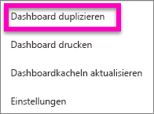
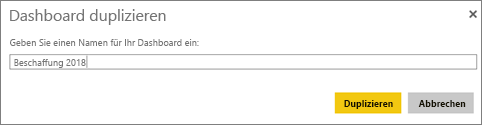
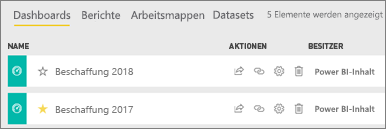

# Erstellen einer Kopie eines Dashboards im Power BI-Dienst

 Es gibt viele verschiedene Gründe, um eine Kopie eines Dashboards zu erstellen. Vielleicht möchten Sie Änderungen vornehmen und die Leistung gegenüber dem Original testen oder leicht unterschiedliche Versionen für verschiedene Kollegen, Regionen oder Teams verteilen. Möglicherweise gefällt einem Kollegen die Gestaltung Ihres Dashboards, und er möchte sie in eigenen Berichten für seine Vorgesetzten verwenden. Ein weiterer Grund könnte eine neue Datenbank mit der gleichen Datenstruktur und den gleichen Datentypen sein, bei der Sie ein erstelltes Dashboard wiederverwenden möchten – dies ist ebenfalls möglich, erforderlich aber etwas Arbeit in Power BI Desktop. 

Dashboards werden mit dem Power BI-Dienst erstellt (und kopiert), und sie können in Power BI Mobile und Power BI Embedded angezeigt werden.  Dashboards sind in Power BI Desktop nicht verfügbar. 

Um eine Kopie eines Dashboards zu erstellen, müssen Sie der *Ersteller* des Dashboards sein. Dashboards, die als App für Sie freigegeben wurden, können nicht dupliziert werden.

1. Öffnen Sie das Dashboard.
2. Wählen Sie in der rechten oberen Ecke die Auslassungspunkte (...) und dann **Dashboard duplizieren** aus.
   
   
3. Weisen Sie dem Dashboard einen Namen zu, und wählen Sie **Duplizieren** aus. 
   
   
4. Das neue Dashboard wird im gleichen Arbeitsbereich wie das Original gespeichert. 
   
   

5.    Öffnen Sie das neue Dashboard, und bearbeiten Sie es nach Bedarf. Sie können als Nächstes z.B. die folgenden Schritte ausführen:    
    a. [Verschieben, Umbenennen, Ändern der Größe oder Löschen von Kacheln](service-dashboard-edit-tile.md).  
    b. Bearbeiten von Kacheldetails und Links, indem Sie die Auslassungspunkte (...) der Kachel auswählen und **Details bearbeiten** wählen.  
    c. [Hinzufügen neuer Kacheln aus der Dashboardmenüleiste](service-dashboard-add-widget.md) (**Kachel hinzufügen**).  
    d. Anheften neuer Kacheln [aus Q&A](service-dashboard-pin-tile-from-q-and-a.md) oder [aus Berichten](service-dashboard-pin-tile-from-report.md).  
    e. Umbenennen des Dashboards, Aktivieren oder Deaktivieren von Q&A und Festlegen des Kachelflusses über den Dashboardbereich „Einstellungen“.  (Wählen Sie das Dashboard-Dropdownmenü mit den Auslassungspunkten (...) aus, und wählen Sie **Einstellungen**.)  
    f. Freigeben des Dashboards für Kollegen, direkt oder als Teil einer Power BI-App. 

## Nächste Schritte
* [Tipps zum Gestalten überzeugender Power BI-Dashboards](service-dashboards-design-tips.md) 

Weitere Fragen? [Wenden Sie sich an die Power BI-Community](http://community.powerbi.com/)

