# Erstellen eines Power BI-Dashboards im Power BI-Dienst
Sie haben [Dashboards in Power BI](service-dashboards.md) gelesen, und jetzt möchten Sie Ihr eigenes erstellen. Ein Dashboard kann auf verschiedene Arten erstellt werden, beispielsweise aus einem Bericht, von Grund auf neu, aus einem Dataset oder durch Duplizieren eines vorhandenen Dashboards.  

Anfangs kann diese Aufgabe überwältigend erscheinen. Daher erstellen wir zunächst ein schnelles und einfaches Dashboard, indem wir Visualisierungen aus einem Bericht anheften, der bereits erstellt wurde. Wenn Sie diese Schnellstartanleitung abgeschlossen haben, werden Sie mit folgenden Themen vertraut sein: die Beziehung zwischen Dashboard und Berichten, das Öffnen der Bearbeitungsansicht im Berichts-Editor und das Navigieren zwischen einem Dashboard und einem Bericht. Verwenden Sie dann die Links im Inhaltsverzeichnis auf der linken Seite oder die **nächsten Schritte** am Ende dieses Artikels, um mit komplexeren Themen fortzufahren.

## Wer kann ein Dashboard erstellen?
Das Erstellen eines Dashboards ist eine Funktion für **Ersteller** und erfordert Berechtigungen für die Bearbeitung des Berichts. Bearbeitungsberechtigungen sind für Berichtsersteller verfügbar sowie für diejenigen Kollegen, denen der Ersteller Zugriff gewährt. Ein Beispiel: David erstellt einen Bericht im Arbeitsbereich „ABC“ und fügt Sie als Mitglied zu diesem Arbeitsbereich hinzu. Dann verfügen sowohl Sie als auch David über Bearbeitungsberechtigungen. Wenn andererseits ein Bericht direkt für Sie oder im Rahmen einer [Power BI-App](service-install-use-apps.md) freigegeben wurde, Sie den Bericht also nur **nutzen**, können Sie keine Kacheln an ein Dashboard anheften.

> **HINWEIS**: Dashboards sind ein Feature des Power BI-Diensts und nicht von Power BI Desktop. Obwohl Dashboards nicht mit Power BI Mobile erstellt werden können, lassen sie sich dort [anzeigen und freigeben](mobile-apps-view-dashboard.md).
>
> 

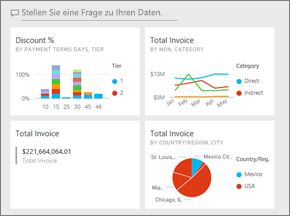

## Video: Erstellen eines Dashboards durch Anheften von Visuals und Bildern aus einem Bericht
Amanda zeigt Ihnen, wie Sie ein neues Dashboard erstellen, indem Sie Visualisierungen aus einem Bericht anheften. Befolgen Sie dann die Schritte unterhalb des Videos, um das Procedere anhand des Beispiels für die Beschaffungsanalyse selbst auszuprobieren.

<iframe width="560" height="315" src="https://www.youtube.com/embed/lJKgWnvl6bQ" frameborder="0" allowfullscreen></iframe>

### Voraussetzungen
Zum Nachvollziehen dieses Schnellstarts müssen Sie die Excel-Beispielarbeitsmappe „Beschaffungsanalyse“ herunterladen und im Power BI-Dienst (app.powerbi.com) öffnen.

## Importieren eines Datasets mit einem Bericht
Wir werden eines der Beispiel-Power BI-Datasets importieren, um damit unser neues Dashboard zu erstellen. Das Beispiel ist eine Excel-Arbeitsmappe mit zwei PowerView-Tabellen. Wenn Sie die Arbeitsmappe in Power BI importieren, werden ein Dataset und ein Bericht Ihrem Arbeitsbereich hinzugefügt.  Der Bericht wird automatisch aus den PowerView-Tabellen erstellt.

1. [Folgen Sie diesem Link](http://go.microsoft.com/fwlink/?LinkId=529784), um die Excel-Datei des Beispiels für die Beschaffungsanalyse herunterzuladen und zu speichern. Wir empfehlen, die Datei in OneDrive for Business zu speichern.
2. Öffnen Sie den Power BI-Dienst in einem Browser (app.powerbi.com).
3. Wählen Sie **Mein Arbeitsbereich** aus.
4. Wählen Sie im linken Navigationsbereich **Daten abrufen** aus.

    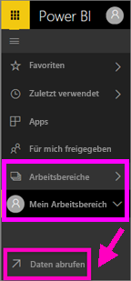
5. Wählen Sie **Dateien**aus.

   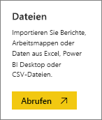
6. Navigieren Sie zum Speicherort der Excel-Datei des Beispiels für die Beschaffungsanalyse. Wählen Sie die Datei und dann **Verbinden** aus.

   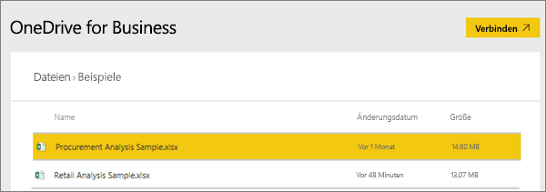
7. Wählen Sie für diese Übung **Importieren** aus.

    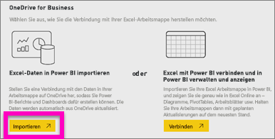
8. Wenn die Erfolgsmeldung angezeigt wird, schließen Sie sie mit **x**.

   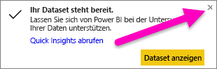

### Öffnen des Berichts und Anheften von Kacheln an ein Dashboard
1. Wählen Sie in diesem Arbeitsbereich die Registerkarte **Berichte** aus. Der neu importierte Bericht wird mit einem gelben Sternchen gekennzeichnet. Wählen Sie den Namen des Berichts aus, um ihn zu öffnen.

    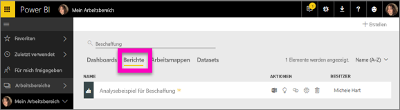
2. Der Bericht wird in der [Leseansicht](service-reading-view-and-editing-view.md) geöffnet. Beachten Sie die zwei Registerkarten am unteren Rand: „Discount Analysis“ und „Spend Overview“. Jede Registerkarte stellt eine Seite des Berichts dar.
    Wählen Sie **Bericht bearbeiten** aus, um den Bericht in der Bearbeitungsansicht zu öffnen.

    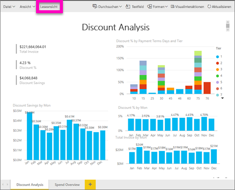
3. Zeigen Sie auf eine Visualisierung, um die verfügbaren Optionen anzuzeigen. Um eine Visualisierung einem Dashboard hinzuzufügen, wählen Sie das Stecknadelsymbol  aus.

    
4. Da wir ein neues Dashboard erstellen, wählen Sie die Option **Neues Dashboard** aus, und geben Sie einen Namen ein.

   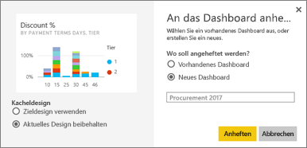
5. Wenn Sie **Anheften** auswählen, erstellt Power BI das neue Dashboard im aktuellen Arbeitsbereich. Wenn die Meldung **An das Dashboard angeheftet** angezeigt wird, wählen Sie **Zum Dashboard wechseln** aus. Wenn Sie aufgefordert werden, den Bericht zu speichern, wählen Sie **Speichern** aus.

     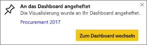
6. Power BI öffnet das neue Dashboard. Es enthält eine Kachel: die eben von Ihnen angeheftete Visualisierung.

   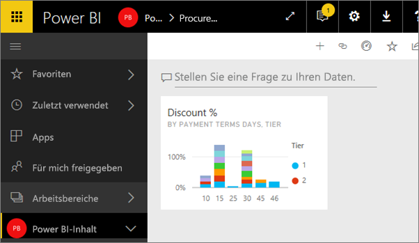
7. Um zum Bericht zurückzukehren, wählen Sie die Kachel aus. Heften Sie einige weitere Kacheln an das neue Dashboard an. Wenn das Fenster **An das Dashboard anheften** angezeigt wird, wählen Sie dieses Mal **Vorhandenes Dashboard** aus.  

   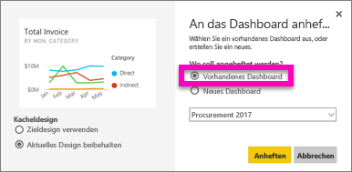

## Anheften einer vollständigen Berichtsseite an das Dashboard
Anstatt einzelne Visuals anzuheften, können Sie [eine vollständige Berichtsseite als *Live-Kachel* anheften](service-dashboard-pin-live-tile-from-report.md). Los geht‘s.

1. Wählen Sie im Berichts-Editor die Registerkarte **Ausgabenübersicht**, um die zweite Seite des Berichts zu öffnen.

   

2. Sie möchten all diese Visuals auf Ihrem Dashboard anzeigen.  Wählen Sie in der oberen rechten Ecke der Menüleiste die Option **Live-Seite anheften**. Kacheln für Live-Seiten werden auf einem Dashboard jedes Mal aktualisiert, wenn die Seite aktualisiert wird.

   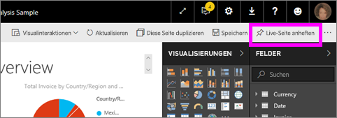

3. Wenn das Fenster **An das Dashboard anheften** angezeigt wird, wählen Sie **Vorhandenes Dashboard** aus.

   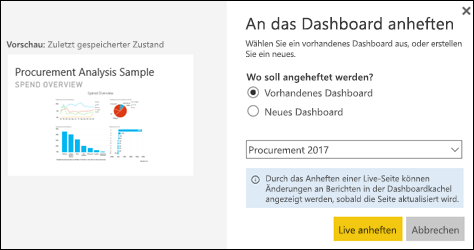

4. Wenn die Erfolgsmeldung angezeigt wird, wählen Sie **Zum Dashboard wechseln** aus. Dort sehen Sie die Kacheln, die Sie aus dem Bericht angeheftet haben. Im unten gezeigten Beispiel haben wir zwei Kacheln von Seite 1 des Berichts sowie eine Live-Kachel angeheftet, die Seite 2 des Berichts darstellt.

   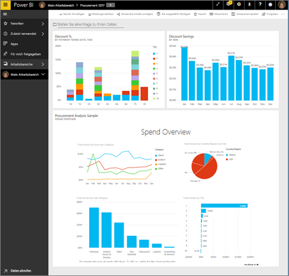

Glückwunsch, Sie haben Ihr erstes Dashboard erstellt! Da Sie jetzt über ein Dashboard verfügen, stehen Ihnen alle Möglichkeiten offen, die ein Dashboard bietet.  Wenn Sie unseren Empfehlungen folgen möchten, finden Sie unten verschiedene **Nächste Schritte**. Oder studieren Sie dieses Beispiel genauer.   

## Nächste Schritte
* [Ändern der Größe und Position von Kacheln](service-dashboard-edit-tile.md)
* [Alle wichtigen Informationen über Dashboardkacheln](service-dashboard-tiles.md)
* [Freigeben des Dashboards durch Erstellen einer App](service-create-distribute-apps.md)
* [Power BI – Grundkonzepte](service-basic-concepts.md)
* [Tipps zum Gestalten überzeugender Power BI-Dashboards](service-dashboards-design-tips.md)

Weitere Fragen? [Wenden Sie sich an die Power BI-Community](http://community.powerbi.com/)
