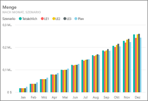
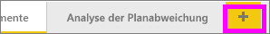
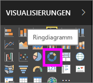
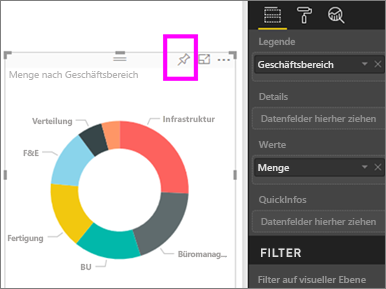
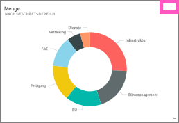
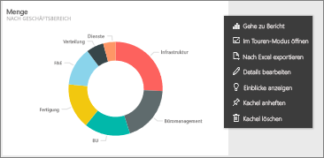
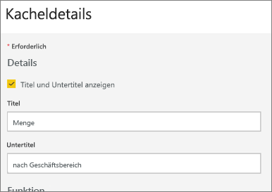
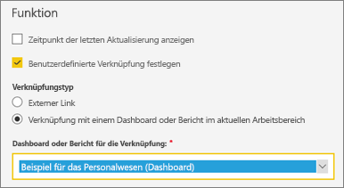
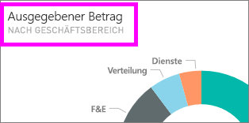
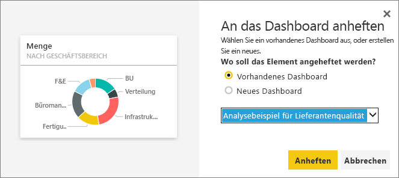

# Bearbeiten oder Entfernen einer Dashboardkachel

## *Dashboardbesitzer* und *Dashboardnutzer*
Wenn Sie ein Dashboard erstellen oder besitzen, stehen Ihnen viele Optionen zum Ändern des Aussehens und Verhaltens der Kacheln auf diesem Dashboard zur Verfügung. Verwenden Sie die folgenden Einstellungen und Strategien, um die Funktionen für die *Nutzung* des Dashboards durch Ihre Kollegen zu entwerfen.  Wird beim Auswählen einer Kachel der zugrunde liegende Bericht, eine benutzerdefinierte URL oder ein anderes Dashboard geöffnet? Vielleicht [fügen Sie eine Kachel hinzu, auf der ein Video oder Streamingdaten angezeigt werden](service-dashboard-add-widget.md)? Oder Sie möchten eventuell sogar [eine Kachel erstellen, die interaktive Slicer enthält](service-dashboard-pin-live-tile-from-report.md). Als *Ersteller* stehen Ihnen viele Optionen zur Verfügung. 

<iframe width="560" height="315" src="https://www.youtube.com/embed/lJKgWnvl6bQ" frameborder="0" allowfullscreen></iframe>

In diesem Artikel werden folgende Themen behandelt:

* [Erstellen einer Visualisierung und Anheften der Visualisierung an ein Dashboard](#create)
* [Verschieben einer Kachel](#move)
* [Ändern der Größe einer Kachel](#resize)
* [Umbenennen einer Kachel](#rename)
* [Hinzufügen eines Links zu einer Kachel](#hyperlink)
* [Anheften einer Kachel an ein anderes Dashboard](#different)
* [Löschen einer Kachel](#delete)
  
  > [!TIP]
  > Um die Visualisierung auf der Kachel selbst zu ändern, löschen Sie die Kachel, und fügen Sie eine neue [Dashboard-Kachel](consumer/end-user-tiles.md) hinzu.

  
## Voraussetzungen
Um die Schritte des Tutorials durchzuführen, öffnen Sie den Power BI-Dienst (nicht Power BI Desktop), und [laden Sie das Analysebeispiel für IT-Ausgaben herunter](sample-it-spend.md). Wenn die Erfolgsmeldung angezeigt wird, wählen Sie **Zum Dashboard wechseln** aus.

- - -

## Erstellen einer neuen Visualisierung und Anheften der Visualisierung an das Dashboard
1. Wählen Sie aus dem Dashboard „Analysebeispiel für IT-Ausgaben“ die Kachel „Betrag“ aus, um den Bericht zu öffnen.

    

2. Öffnen Sie den Bericht in der Bearbeitungsansicht, indem Sie auf der oberen Menüleiste **Bericht bearbeiten** auswählen.

3. Fügen Sie eine neue Berichtsseite hinzu, indem Sie das Pluszeichen (+) am unteren Rand des Berichts auswählen.

    

4. Wählen Sie im Bereich „FELDER“ **Fakt > Betrag** und **Geschäftsbereich > Geschäftsbereich** aus.
 
5. Wählen Sie im Bereich „VISUALISIERUNGEN“ das Ringdiagrammsymbol aus, um die Visualisierung in ein Ringdiagramm zu konvertieren.

    

5. Wählen Sie das Anheftsymbol aus, und heften Sie das Ringdiagramm an das Dashboard „Analysebeispiel für IT-Ausgaben“ an.

   

6. Wenn die Erfolgsmeldung angezeigt wird, wählen Sie **Zum Dashboard wechseln** aus. Sie werden aufgefordert, die Änderungen zu speichern. Wählen Sie **Speichern**.

- - -

## Verschieben der Kachel
Suchen Sie die neue Kachel auf dem Dashboard. Wählen Sie die Kachel aus und halten Sie sie, um sie auf eine neue Position im Dashboardbereich zu ziehen.

- - -

## Ändern der Größe der Kachel
Sie können Kacheln in vielen unterschiedlichen Größen erstellen – von 1 x 1 Kacheleinheiten bis zu 5 x 5. Wählen Sie den Ziehpunkt (in der unteren rechten Ecke) aus, und ziehen Sie diesen, um die Größe der Kachel zu ändern.

- - -
## Das Menü mit den Auslassungspunkten (...)

1. Wählen Sie die Auslassungspunkte in der rechten oberen Ecke der Kachel aus. 
   
   

2. Zeigen Sie auf die Kachel „Konto“, und wählen Sie die Auslassungspunkte aus, um die Optionen anzuzeigen. Die verfügbaren Optionen variieren je nach Kacheltyp.  Beispielsweise unterscheiden sich die für eine Live-Kachel verfügbaren Optionen von den Optionen, die für eine Standardvisualisierungskachel verfügbar sind. Zudem verfügen Sie für ein Dashboard, das für Sie freigegeben wurde (Sie sind nicht der Besitzer), über weniger Optionen.

   

3. Wählen Sie **Details bearbeiten** aus, um das Fenster „Kacheldetails“ zu öffnen. 

    Ändern Sie den Titel und das Standardverhalten der Kachel.  Sie können z.B. festlegen, dass bei Auswahl einer Kachel durch einen *Nutzer* nicht der zum Erstellen dieser Kachel verwendete Bericht, sondern ein neues Dashboard angezeigt wird.  
   

### Umbenennen der Kachel
Ändern Sie am oberen Rand des Fensters „Kacheldetails“ den **Titel** in **Ausgegebener Betrag**.

### Ändern des Standardhyperlinks
Standardmäßig gelangen Sie durch Auswählen einer Kachel zu dem Bericht, in dem die Kachel erstellt wurde, oder zu Q&A (sofern die Kachel in Q&A erstellt wurde). Um eine Webseite, ein anderes Dashboard oder einen anderen Bericht (in demselben Arbeitsbereich), einen SSRS-Bericht oder andere Onlineinhalte zu verlinken, fügen Sie einen benutzerdefinierten Link hinzu.

1. Wählen Sie unter der Überschrift „Funktionalität“ **Benutzerdefinierte Verknüpfung festlegen** aus.

2. Wählen Sie **Verknüpfung mit einem Dashboard oder Bericht im aktuellen Arbeitsbereich** aus, und wählen Sie dann in der Dropdownliste ein Dashboard aus.  In diesem Beispiel habe ich das Dashboard „Beispiel für Personalwesen“ ausgewählt. Wenn Ihr Arbeitsbereich dieses Beispiel noch nicht enthält, können Sie es hinzufügen und dann zu diesem Schritt zurückkehren, oder Sie können ein anderes Dashboard auswählen. 

    

3. Klicken Sie auf **Übernehmen**.

4. Auf der Kachel wird der neue Titel angezeigt.  Und wenn Sie die Kachel auswählen, wird in Power BI das Personalwesen-Dashboard geöffnet. 

    

### Heften Sie die Kachel an ein anderes Dashboard an.
1. Wählen Sie im Dropdownmenü mit den Auslassungspunkten **Kachel anheften**  aus.
2. Entscheiden Sie, ob Sie ein Duplikat dieser Kachel an ein vorhandenes oder ein neues Dashboard anheften möchten. 
   
   
3. Wählen Sie **Anheften**aus.

### Löschen der Kachel
1. Um eine Kachel dauerhaft aus einem Dashboard zu entfernen, wählen Sie im Dropdownmenü mit den Auslassungspunkten **Kachel löschen**  aus. 

2. Durch Löschen einer Kachel wird nicht die zugrunde liegende Visualisierung gelöscht. Öffnen Sie den zugrunde liegenden Bericht, indem Sie die Kachel „Betrag“ auswählen. Öffnen Sie die letzte Seite im Bericht, um sich zu vergewissern, dass die ursprüngliche Visualisierung nicht aus dem Bericht gelöscht wurde. 

- - -
## Nächste Schritte
[Dashboardkacheln in Power BI](consumer/end-user-tiles.md)

[Dashboards in Power BI](consumer/end-user-dashboards.md)

[Power BI – Grundkonzepte](consumer/end-user-basic-concepts.md)

Weitere Fragen? [Wenden Sie sich an die Power BI-Community](http://community.powerbi.com/)

